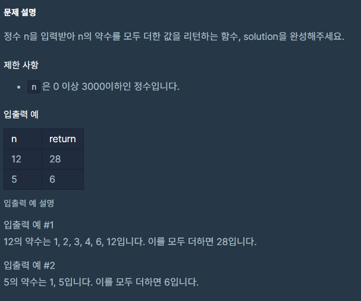
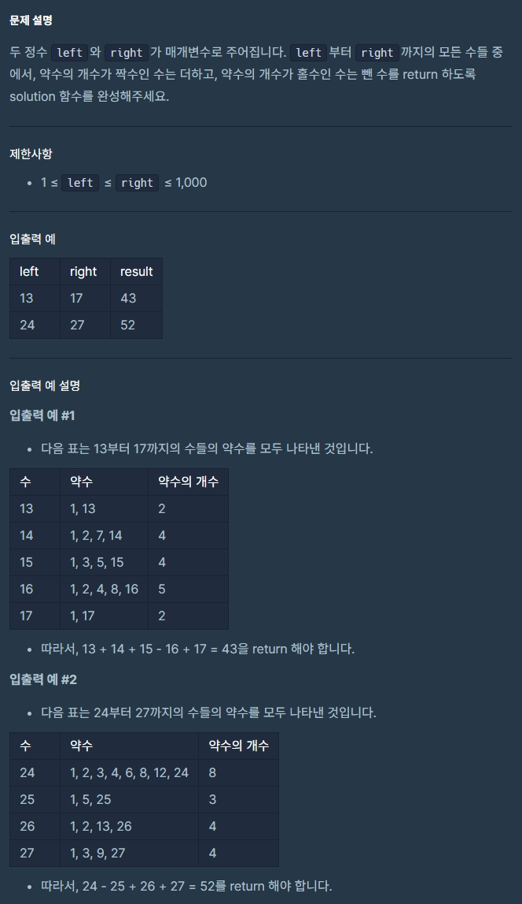
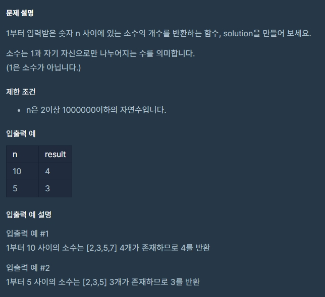
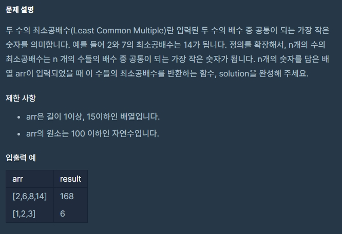

프로그래머스에서 자바스크립트 알고리즘 문제를 풀다보면 간간히 접하게 되는 수학관련 문제들이 있다.
그 중 자연수와 관련된(약수, 소수, 최대공약수, 최소공배수) 문제들이 있었는데 이에 대한 이론을 정리하고 프로그래머스 코딩테스트 연습에 나오는 문제들을 풀어보면서 정확한 개념을 터득하고자 정리해 보았다. <br>
(문제 - 약수의 합, 약수의 개수와 덧셈, 소수 만들기, 소수 찾기, 최대공약수와 최소공배수, N개의 최소공배수)
<br><br>

## 1. 약수

**약수란 무엇인가?** <br>
&nbsp;&nbsp;&nbsp;&nbsp;<u>어떤 수를 나머지가 없이 나누어떨어지게 하는 수를 그 수의 약수라고 한다.</u> <br>
&nbsp;&nbsp;&nbsp;&nbsp;예를 들면 8을 1, 2, 4, 8로 나누면 나머지가 없다. 이때 1, 2, 4, 8을 8의 약수라고 한다.<br><br>

**1. 약수의 합** <br>

<div style="text-align: left; display:inline-block;">



</div><br><br>

**문제풀이**

```js
function solution(n) {
  let answer = 0;

  for (let i = 0; i <= n; i++) {
    if (n % i === 0) answer += i;
  }

  return answer;
}
```

<un>
<small class="from">https://programmers.co.kr/learn/courses/30/lessons/12928?language=javascript</small> <br>

**2. 약수의 개수와 덧셈**

<div style="text-align: left; display:inline-block;">



</div><br><br>

**문제풀이**

```js
function solution(left, right) {
  let answer = 0;

  for (let i = left; i <= right; i++) {
    let count = 0;
    for (let j = 1; j <= i; j++) {
      if (i % j === 0) count++;
    }
    if (count % 2) answer -= i;
    else answer += i;
  }

  return answer;
}
```

<small class="from">https://programmers.co.kr/learn/courses/30/lessons/77884?language=javascript</small>
<br><br>

## 2. 소수

**소수란 무엇인가?** <br>
&nbsp;&nbsp;&nbsp;&nbsp;<u>소수는 1보다 큰 정수이며, 1과 자기 자신으로만 나누어지는 수다. (나머지가 0인 경우)</u> <br>
&nbsp;&nbsp;&nbsp;&nbsp;1, 2, 4, 5를 예를 들어보자. 1은 1보다 큰 정수가 아니다. <br>
&nbsp;&nbsp;&nbsp;&nbsp;2는 1과 2이외의 자연수로 나눌 수 없으므로 소수다. <br>
&nbsp;&nbsp;&nbsp;&nbsp;4는 1과 4이외에도 2로 나누는 것이 가능하므로 소수가 아니다.<br>
&nbsp;&nbsp;&nbsp;&nbsp;5는 1과 5 이외의 자연수로 나눌 수 없으므로 소수다.<br><br>

**3. 소수 찾기**

<div style="text-align: left; display:inline-block;">



</div><br><br>

**문제풀이1**

```js
function solution(n) {
  let answer = 0;

  for (let i = 2; i <= n; i++) {
    let isPrime = true;
    for (let j = 2; j < i; j++) {
      if (i % j === 0) isPrime = false;
    }
    if (isPrime) answer++;
  }

  return answer;
}
```

으로 풀었으나 타임아웃이 발생했다. <br><br>
**문제풀이2 - 에라토스네테스의 체**

```js
function solution(n) {
  let arr = Array(n + 1)
    .fill(true)
    .fill(false, 0, 2);

  for (let i = 2; i * i <= n; i++) {
    if (arr[i]) {
      for (let j = i * i; j <= n; j += i) {
        arr[j] = false;
      }
    }
  }

  return arr.filter((e) => e).length;
}
```

<small class="from">풀이참고: <a href="https://velog.io/@jakeseo_me/%EC%BD%94%EB%94%A9%ED%85%8C%EC%8A%A4%ED%8A%B8-14-%EC%86%8C%EC%88%98-%EC%B0%BE%EA%B8%B0-%EC%97%90%EB%9D%BC%ED%86%A0%EC%8A%A4%ED%85%8C%EB%84%A4%EC%8A%A4%EC%9D%98-%EC%B2%B4" target="_blank">코딩테스트 #14 소수 찾기 (에라토스테네스의 체)</a></small> <br>
<a href="https://ko.wikipedia.org/wiki/%EC%97%90%EB%9D%BC%ED%86%A0%EC%8A%A4%ED%85%8C%EB%84%A4%EC%8A%A4%EC%9D%98_%EC%B2%B4" target="_blank">에라토스네테스의 체</a>는 각 수의 배수에 해당하는 수는 소수가 아니므로 지운다. 예를 들어 3, 6, 9가 있다면 6, 9는 3의 배수이므로 제외시키면 소수만 남는다. 체로 걸르듯 배수와 제곱수는 일단 소수가 아니므로 제거하는 작업이다.<br><br>

**문제풀이3 - Set**

```js
function solution(n) {
  const s = new Set();

  for (let i = 1; i <= n; i += 2) {
    s.add(i);
  }
  s.delete(1);
  s.add(2);

  for (let j = 3; j < Math.sqrt(n); j++) {
    if (s.has(j)) {
      for (let k = j * 2; k <= n; k += j) {
        s.delete(k);
      }
    }
  }

  return s.size;
}
```

프로그래머스 해설에서 본 문제풀이로 set을 이용한 풀이다.

<small class="from">https://programmers.co.kr/learn/courses/30/lessons/12921?language=javascript</small><br><br>

**4. 소수 찾기**

<div style="text-align: left; display:inline-block;">


</div><br><br>

**문제풀이**

```js
function solution(numbers) {
  let answer = 0;

  let n = numbers.split('');
  let nums = new Set();
  combi(n, '');

  function combi(a, s) {
    if (s.length > 0) {
      if (nums.has(Number(s)) === false) {
        nums.add(Number(s));
        if (chkPrime(Number(s))) answer++;
      }
    }
    if (a.length > 0) {
      for (var i = 0; i < a.length; i++) {
        var t = a.slice(0);
        t.splice(i, 1);
        combi(t, s + a[i]);
      }
    }
  }

  function chkPrime(num) {
    if (num < 2) return false;
    if (num === 2) return true;
    for (var i = 2; i <= Math.sqrt(num); i++) {
      if (num % i === 0) return false;
    }
    return true;
  }

  return answer;
}
```

<small class="from">https://programmers.co.kr/learn/courses/30/lessons/42839?language=javascript</small><br><br>

**5. 소수 만들기**

<div style="text-align: left; display:inline-block;">


</div><br><br>

**문제풀이**

```js
function solution(nums) {
  let cnt = 0;

  for (let i = 0; i < nums.length - 2; i++) {
    for (let j = i + 1; j < nums.length - 1; j++) {
      for (let w = j + 1; w < nums.length; w++) {
        if (isPrime(nums[i] + nums[j] + nums[w])) cnt++;
      }
    }
  }

  return cnt;
}

// 소수 판별 함수
function isPrime(n) {
  for (var i = 2; i <= Math.sqrt(n); i++) {
    if (n % i === 0) return false;
  }
  return true;
}
```

<small class="from">https://programmers.co.kr/learn/courses/30/lessons/12977?language=javascript</small><br><br>

## 3. 최대공약수

**6. 최대공약수와 최소공배수**

<div style="text-align: left; display:inline-block;">


</div><br><br>

**문제풀이1 - 프로그래머스(유클리드 호제법)**

```js
function solution(n, m) {
  let answer = [];

  const greatest = (a, b) => {
    if (b === 0) return a;
    return greatest(b, a % b);
  };

  const least = (a, b) => (a * b) / greatest(a, b);

  return [greatest(n, m), least(n, m)];
}
```

<br>

**문제풀이2 - 프로그래머스**

```js
function greatestCommonDivisor(a, b) {
  return b ? greatestCommonDivisor(b, a % b) : Math.abs(a);
}
function leastCommonMultipleOfTwo(a, b) {
  return (a * b) / greatestCommonDivisor(a, b);
}
function gcdlcm(a, b) {
  return [greatestCommonDivisor(a, b), leastCommonMultipleOfTwo(a, b)];
}
```

<br>

**문제풀이3 - 프로그래머스**

```js
function gcdlcm(a, b) {
  let r;
  for (let ab = a * b; (r = a % b); a = b, b = r) {}
  return [b, ab / b];
}
```

<small class="from">https://programmers.co.kr/learn/courses/30/lessons/12940?language=javascript</small><br><br>

## 4. 최소공배수

**7. N개의 최소공배수**

<div style="text-align: left; display:inline-block;">



</div><br><br>

**문제풀이1 - 프로그래머스**

```js
function nlcm(num) {
  return num.reduce((a, b) => (a * b) / gcd(a, b));
}

function gcd(a, b) {
  return a % b ? gcd(b, a % b) : b;
}
```

<br>

**문제풀이2 - 프로그래머스**

```js
function nlcm(num) {
  let answer = 0;

  function gcd(a, b) {
    if (!b) return a;
    return gcd(b, a % b);
  }

  function lcm(a, b) {
    return (a * b) / gcd(a, b);
  }

  answer = num.reduce(function (a, b) {
    let min = Math.min(a, b);
    let max = Math.max(a, b);
    return lcm(min, max);
  });

  return answer;
}
```

<small class="from">https://programmers.co.kr/learn/courses/30/lessons/12953?language=javascript</small><br>

```toc

```
