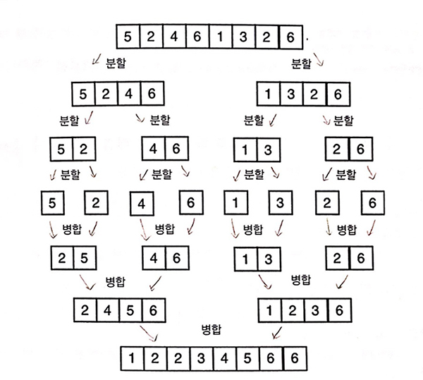
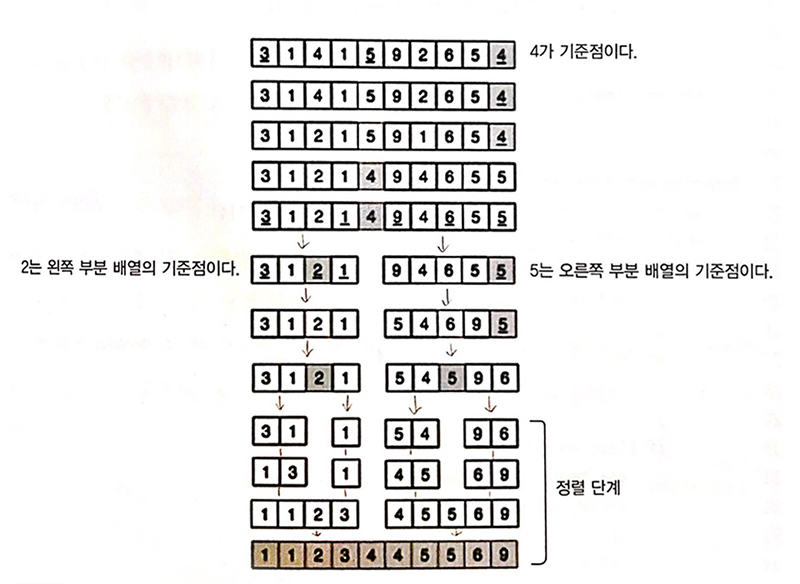

정렬된 배열에서 요소를 찾는 것이 정렬되지 않는 배열에서 찾는 것보다 빠르고 쉽다. <br>
정렬 알고리즘을 사용해 메모리에서 배열을 정렬하거나 정렬된 배열을 파일에 기록할 수 있다.<br>

ArrayList함수를 만들어 정렬/검색 대상 데이터를 저장한다.<br>
(각 알고리즘에 대한 설명은 검색하면 너무 자세하게 나와있기 때문에 코드 위주의 포스팅을 했다.)

```js
function ArrayList() {
  let array = [];

  this.insert = (...item) => {
    array.push(...item);
  };

  this.toString = () => {
    return array.join();
  };

  // 인덱스를 교환하는 헬퍼 함수
  const swap = (index1, index2) => {
    const aux = array[index1];
    array[index1] = array[index2];
    array[index2] = aux;
  };
}
```

<br>

## 1. 버블정렬

가장 간단한 정렬 알고리즘이다. <br>
버블정렬은 전체 배열을 순회하면서 인접한 두 원소를 비교하고 그 결과에 따라 두 원소의 위치를 서로 바꾼다. <br>
버블정렬은 모든 값을 비교하기 때문에 정렬 알고리즘들 중에서 가장 최악이라고 할 수 있다.

<div class="blockquote">
    시간 복잡도 : O(n²) &nbsp;&nbsp;&nbsp;&nbsp; 공간 복잡도 : O(1)
</div>


<small class="from">출처 : <a href="https://m.blog.naver.com/justant/20204028286F" target="_blank">https://m.blog.naver.com/justant/20204028286</a></small><br>

```js

function ArrayList() {
  let array = [];
  ...

  // 버블 정렬
  this.bubbleSort = () => {
    const length = array.length;
    // 첫 번째 요소부터 마지막 원소까지 순회
    for (let i = 0; i < length; i++) {
      // 첫 번째 요소부터 끝에서 두 번째 요소까지 순회
      for (let j = 0; j < length - 1 - i; j++) {
        // 현재 요소기 다음 원소보다 크다면 서로 위치를 바꾼다.
        if (array[j] > array[j + 1]) {
          swap(j, j + 1);
        }
      }
    }
  };
}

const array = new ArrayList();
array.insert(5, 1, 9, 7, 2, 3);
console.log(array.toString()); // 5,1,9,7,2,3
array.bubbleSort();
console.log(array.toString()); // 1,2,3,5,7,9

/*
[ 5, 1, 9, 7, 2, 3 ]
[ 1, 5, 9, 7, 2, 3 ]
[ 1, 5, 7, 9, 2, 3 ]
[ 1, 5, 7, 2, 9, 3 ]
[ 1, 5, 7, 2, 3, 9 ]
--------------------
[ 1, 5, 2, 7, 3, 9 ]
[ 1, 5, 2, 3, 7, 9 ]
--------------------
[ 1, 2, 5, 3, 7, 9 ]
[ 1, 2, 3, 5, 7, 9 ]
*/
```

<br>

## 2. 삽입정렬

배열의 모든 요소를 앞에서부터 차례대로 검색하면서 정렬된 요소와 비교한다. <br>
정렬되지 않은 요소들을 배열의 자신의 위치를 찾아 이동(삽입)시킨다.<br>
(두번째 요소부터 정렬을 시작한다.)<br>

<div class="blockquote">
    시간 복잡도 : O(n²) &nbsp;&nbsp;&nbsp;&nbsp; 공간 복잡도 : O(1)
</div>
<br>

<small class="from">출처 : <a href="https://m.blog.naver.com/justant/20204025251" target="_blank">https://m.blog.naver.com/justant/20204025251</a></small><br>

```js
// 삽입정렬
this.insertionSort = () => {
  const length = array.length;
  let j;
  let temp;

  // 2번째 요소부터 끝까지 배열을 순회
  for (let i = 1; i < length; i++) {
    j = i;
    temp = array[i];

    // j가 0보다 크고 직전 인덱스의 요소가 인덱스 i의 요소보다 크면
    while (j > 0 && array[j - 1] > temp) {
      // 직전 인덱스의 원소를 i로 옮기고
      array[j] = array[j - 1];
      //j를 1만큼 감소
      j--;
    }
    // 제자리를 찾아 원소 삽입
    array[j] = temp;
  }
};
const array = new ArrayList();
array.insert(5, 1, 3, 7, 2, 9);
console.log(array.toString()); // 5,1,3,7,2,9
array.insertionSort();
console.log(array.toString()); // 1, 2, 3, 4, 5

/*
[ 5, 1, 3, 7, 2, 9 ]
[ 1, 5, 3, 7, 2, 9 ]
[ 1, 3, 5, 7, 2, 9 ]
[ 1, 2, 3, 5, 7, 9 ]
*/
```

<br>

## 3. 선택정렬

가장 작은 요소를 찾아서(선택해서) 해당 요소를 배열의 현 위치에 삽입하는 방식이다.<br> \*삽입정렬과 비슷지만 가장 작은 요소를 찾아서 정렬하는것이 다르다.

<div class="blockquote">
    시간 복잡도 : O(n²) &nbsp;&nbsp;&nbsp;&nbsp; 공간 복잡도 : O(1)
</div>
<br>

<small class="from">출처 : <a href="https://m.blog.naver.com/justant/20203018572" target="_blank">https://m.blog.naver.com/justant/20203018572</a></small><br>

```js
// 선택정렬
this.selectionSort = () => {
  const length = array.length;
  // 최솟값을 가진 원소의 인덱스를 담을 변수 선언
  let indexMin;

  // 배열을 순회하면서 i+1번째로 작은 값을 찾는다.
  for (let i = 0; i < length - 1; i++) {
    // 최솟값을 가진 원소의 인덱스를 i라고 가정
    indexMin = i;
    for (let j = i; j < length; j++) {
      // i에서 length까지 j 인덱스 원소 값을 현재까지의 최솟값과 비교
      if (array[indexMin] > array[j]) {
        // 작다면 현재 최솟값을 원소 값으로 갱신
        indexMin = j;
      }
    }
    // 안쪽 for문을 벗어 날때 i+1번째로 작은 값이 결정되며 indexMin와 다르면 원소의 위치를 교환한다.
    if (i !== indexMin) {
      swap(i, indexMin);
    }
  }
};

const array = new ArrayList();
array.insert(5, 1, 3, 7, 2, 9);
console.log(array.toString()); // 5,2,4,6,1,3,2,6
array.selectionSort();
console.log(array.toString()); // 1,2,2,3,4,5,6,6

/*
[ 5, 1, 3, 7, 2, 9 ]
[ 1, 5, 3, 7, 2, 9 ]
[ 1, 2, 3, 7, 5, 9 ]
[ 1, 2, 3, 7, 5, 9 ]
[ 1, 2, 3, 5, 7, 9 ]
[ 1, 2, 3, 5, 7, 9 ]
*/
```

<br>

## 4. 병합정렬

각 하위 배열이 하나의 요소가 존재할 때까지 배열을 하위 배열로 나눈다. <br>
그 후, 각 하위 배열을 정렬된 순서로 연결(병합)하여 정렬된 하나의 배열을 만든다.

<div class="blockquote">
    시간 복잡도 : 평균 O(n log₂ n) &nbsp;&nbsp;&nbsp;&nbsp; 공간 복잡도 : O(n))
</div>

<br>

```js
// 병합정렬
this.mergeSort = () => {
  array = mergeSortRec(array);
};

// 병합정렬 헬퍼 함수
const mergeSortRec = (array) => {
  const length = array.length;

  // 배열 크기가 1이면 재귀 호출을 중단한다.
  if (length === 1) return array;

  // 크기가 2개 이상이라면, 더 작게 나눈다. -> 중간 지점을 찾아 좌/우측으로 분할 한다.
  const mid = Math.floor(length / 2);
  const left = array.slice(0, mid);
  const right = array.slice(mid, length);

  console.log(left, right);

  /*
    [ 5, 2, 4, 6 ] [ 1, 3, 2, 6 ]
    [ 5, 2 ] [ 4, 6 ]
    [ 5 ] [ 2 ]
    [ 4 ] [ 6 ]
    [ 1, 3 ] [ 2, 6 ]
    [ 1 ] [ 3 ]
    [ 2 ] [ 6 ]
  */

  // merge함수를 호출해 잘게 쪼개진 배열들이 최종 정렬된 배열이 될때까지 반복한다.
  return merge(mergeSortRec(left), mergeSortRec(right));
};

const merge = (left, right) => {
  let result = [];
  let il = 0;
  let ir = 0;

  while (il < left.length && ir < right.length) {
    if (left[il] < right[ir]) {
      result.push(left[il++]);
    } else {
      result.push(right[ir++]);
    }
  }

  while (il < left.length) {
    result.push(left[il++]);
  }

  while (ir < right.length) {
    result.push(right[ir++]);
  }
  console.log(result);
  /*
    [ 2, 5 ]
    [ 4, 6 ]
    [ 2, 4, 5, 6 ]
    [ 1, 3 ]
    [ 2, 6 ]
    [ 1, 2, 3, 6 ]
    [ 1, 2, 2, 3, 4, 5, 6, 6 ]
  */

  return result;
};

const array = new ArrayList();
array.insert(5, 2, 4, 6, 1, 3, 2, 6);
console.log(array.toString()); // 5,2,4,6,1,3,2,6
array.mergeSort();
console.log(array.toString()); // 1,2,2,3,4,5,6,6
```

<br>

## 5. 퀵정렬

기준점을 지정한 다음 해당 기준점을 기준으로 배열을 나눈다. <br>
모든 요소가 정렬될 때까지 이 나누는 과정을 반복한다. <br>
기준점은 분할 부분의 첫 번째 요소와 중간, 마지막 요소의 중간 값을 얻어 기준점을 얻는다. <br>
가장 이상적인 기준점은 가운데 값이다.

<div class="blockquote">
    시간 복잡도 : 평균 O(n log₂ n), 최악의 경우 O(n²) &nbsp;&nbsp;&nbsp;&nbsp; 공간 복잡도 : O(log₂ n)
</div>
<br>

<br>

```js
// 퀵정렬
this.quickSort = () => {
  quick(array, 0, array.length - 1);
};

const quick = (array, left, right) => {
  let index;
  if (array.length > 1) {
    index = partition(array, left, right);
    if (left < index - 1) {
      quick(array, left, index - 1);
    }
    if (index < right) {
      quick(array, index, right);
    }
  }
};

const partition = (array, left, right) => {
  // 배열의 중간 원소
  let pivot = array[Math.floor((right + left) / 2)];
  let i = left;
  let j = right;

  while (i <= j) {
    while (array[i] < pivot) i++;
    while (array[j] > pivot) j--;
    if (i <= j) {
      swapQuickSort(array, i, j);
      i++;
      j--;
    }
  }
  return i;
};

const swapQuickSort = (array, index1, index2) => {
  const aux = array[index1];
  array[index1] = array[index2];
  array[index2] = aux;
};

const array = new ArrayList();
array.insert(3, 1, 4, 1, 5, 9, 2, 6, 5, 4);
console.log(array.toString()); // 3,1,4,1,5,9,2,6,5,4
array.quickSort();
console.log(array.toString()); // 1,1,2,3,4,4,5,5,6,9
```

<br>

### 정렬 JS 알고리즘 전체코드

```js
function ArrayList() {
  let array = [];

  this.insert = (...item) => {
    array.push(...item);
  };

  this.toString = () => {
    return array.join();
  };

  // 프라이빗 헬퍼 함수들
  // 인덱스를 교환하는 헬퍼 함수
  const swap = (index1, index2) => {
    const aux = array[index1];
    array[index1] = array[index2];
    array[index2] = aux;
  };

  // 병합정렬 헬퍼 함수
  const mergeSortRec = (array) => {
    const length = array.length;

    if (length === 1) return array;

    const mid = Math.floor(length / 2);
    const left = array.slice(0, mid);
    const right = array.slice(mid, length);

    return merge(mergeSortRec(left), mergeSortRec(right));
  };

  const merge = (left, right) => {
    let result = [];
    let il = 0;
    let ir = 0;

    while (il < left.length && ir < right.length) {
      if (left[il] < right[ir]) result.push(left[il++]);
      else result.push(right[ir++]);
    }

    while (il < left.length) {
      result.push(left[il++]);
    }

    while (ir < right.length) {
      result.push(right[ir++]);
    }

    return result;
  };

  // 퀵합정렬 헬퍼 함수
  const quick = (array, left, right) => {
    let index;
    if (array.length > 1) {
      index = partition(array, left, right);
      if (left < index - 1) {
        quick(array, left, index - 1);
      }
      if (index < right) {
        quick(array, index, right);
      }
    }
  };

  const partition = (array, left, right) => {
    // 배열의 중간 원소
    let pivot = array[Math.floor((right + left) / 2)];
    let i = left;
    let j = right;

    while (i <= j) {
      while (array[i] < pivot) i++;
      while (array[j] > pivot) j--;
      if (i <= j) {
        swapQuickSort(array, i, j);
        i++;
        j--;
      }
    }
    return i;
  };

  const swapQuickSort = (array, index1, index2) => {
    const aux = array[index1];
    array[index1] = array[index2];
    array[index2] = aux;
  };

  // 버블 정렬
  this.bubbleSort = () => {
    const length = array.length;
    for (let i = 0; i < length; i++) {
      for (let j = 0; j < length - 1 - i; j++) {
        if (array[j] > array[j + 1]) {
          swap(j, j + 1);
        }
      }
    }
  };

  // 삽입정렬
  this.insertionSort = () => {
    const length = array.length;
    let j;
    let temp;

    for (let i = 1; i < length; i++) {
      j = i;
      temp = array[i];
      while (j > 0 && array[j - 1] > temp) {
        array[j] = array[j - 1];
        j--;
      }
      array[j] = temp;
    }
  };

  // 선택정렬
  this.selectionSort = () => {
    const length = array.length;
    let indexMin;

    for (let i = 0; i < length - 1; i++) {
      indexMin = i;
      for (let j = i; j < length; j++) {
        if (array[indexMin] > array[j]) {
          indexMin = j;
        }
      }
      if (i !== indexMin) {
        swap(i, indexMin);
      }
    }
  };

  // 병합정렬
  this.mergeSort = () => {
    array = mergeSortRec(array);
  };

  // 퀵정렬
  this.quickSort = () => {
    quick(array, 0, array.length - 1);
  };
}
```

<div class="from add">
    <ul>
        <li>- 참고 &nbsp;&nbsp; 자바스크립트로하는 자료 구조와 알고리즘(배세민)</li>
        <li style="padding-left: 40px;">자바스크립트 자료 구조와 알고리즘(로이아니 그로네)</li>
    </ul>
</div><br>

```toc

```
