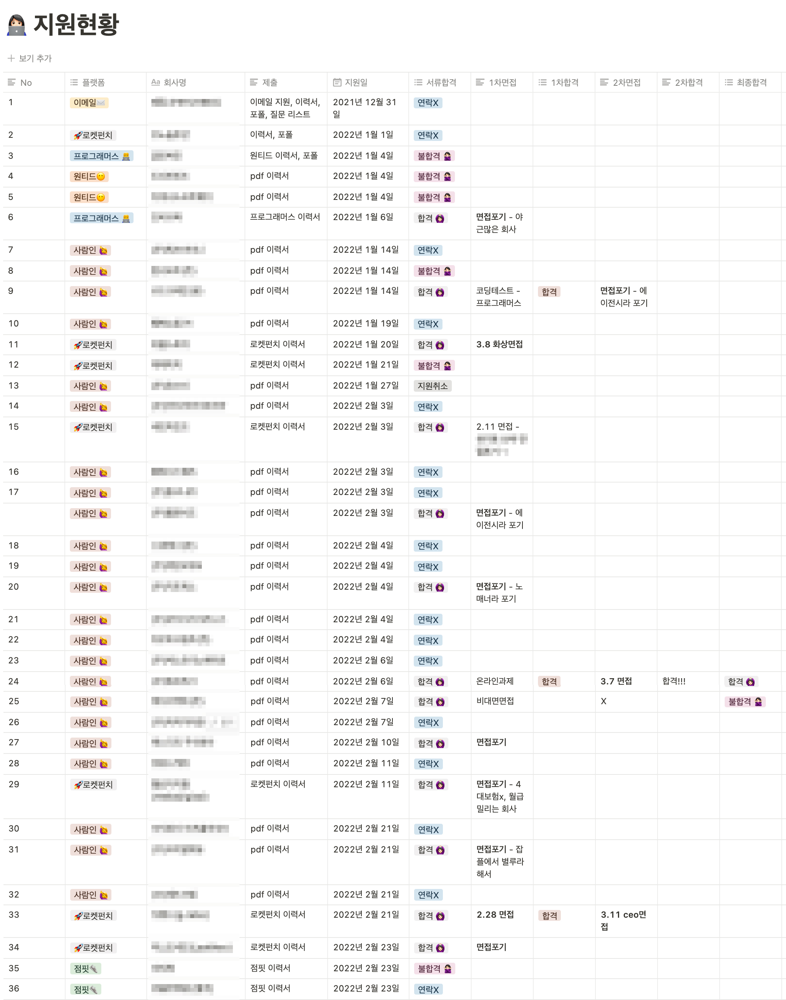

> 2달동안의 구직활동을 마치고, 마침내 신입 프론트엔드 개발자로 합격했다. <br>
> 그동안 내가 많은 개발자분들의 블로그를 통해 도움을 받은 것 처럼, 내 글이 프론트엔드 개발자로 취업을 희망하는 신입개발자들에게 도움이 되길 바라는 마음으로 글을 썼다.

<br>

1월부터 신입 프론트엔드 개발자로 구직을 시작했다. <br>
하지만 며칠에 한번씩 한꺼번에 지원했었고, 본격적으로 구직을 시작한건 2월 부터다. 나는 36곳을 지원했고 총 13군데를 서류합격했다. (나쁘지 않은 33%정도의 승률) <br>
2번의 코딩테스트, 3번의 과제 테스트, 4번의 면접(대면, 비대면)을 봐서 2개의 회사에 최종 합격했다. <br><br>
부끄럽지만 나란 사람이란,<br>

1. 27살에 의류학과 석사 졸업
2. 국비학원을 다닌 후, 29살에 퍼블리셔로 취업
3. 에이전시 근무 및 프리랜서로 대략 **4년간의 퍼블리셔 경력** 보유<br>
   (즉, **비전공자출신에 IT 경력은 있지만 개발직군 경력은 전무한 상황**)
4. 현재 나이는 30대 중반
5. 방통대 컴퓨터과학과 3학년으로 편입했으나 휴학중
6. 5개의 자격증 (정처기, 컴퓨터그래픽스운용기능사, 웹디자인기능사, 컴활 2급, GTQ 1급) <br>
   정처기는 퍼블리셔로 일하면서 땄고 나머지는 국비학원을 다니면서 독학해서 땄다. <br>
   (많은 사람들이 자격증은 필요없다고 하지만 정처기는 우대하는 곳도 많기때문에 따면 좋고, 그 외의 것들은 질문을 받았을때 저런 자격증이 있어 할줄 안다로 대답하기도 했다.)
   <br><br>

## 포트폴리오, 지원 팁

포트폴리오는 노션으로 만들었고 이력서는 pdf로 만들어서 제출했다. <br>

포트폴리오는 개인프로젝트 3개 팀프로젝트 1개를 넣었는데 **팀 프로젝트는 필수라고 생각한다.** 특히 인성관련해서 팀 프로젝트 진행시를 예시로 들면서 설명할 수 있어 유리하다. (나 같은 경우는 okkr에서 사이드프로젝트 팀원구하는 글을 보고 신청했다.) <br>

잡코리아, 로켓펀치, 원티드, 사람인, 점핏, 프로그래머스를 통해 지원했고 원티드는 거의 경력위주로 뽑는 것 같아 초기에만 지원했다. 나의 경우 로켓펀치와 잡코리아에서 지원한 곳에 연락이 많이 왔다. <br> 특히 로켓펀치나 프로그래머스 같은 경우는 이력서를 등록해놓고 셀프구직중을 해놓으면 기업에서 면접제의를 받기도 하니까 정성스럽게 준비해놓자 😆 (실제로 여러곳에서 면접 제의를 받았다.)
<br>

초기에는 여기저기 넣었는데 막상 서류전형에 합격하면 에이전시가 많았다. 에이전시를 비추하는 개발자가 많았기 때문에 면접을 포기한 경우가 발생했다. <br>
이후에는 잡플로 확인하면서 거른회사도 많았다. 별점 1점대 회사도 많고 4대보험도 안들어주는 회사도 있다더라.. (개인적으로 3점대 이상의 회사를 추천한다.)<br>
화상면접인데 당일오전까지도 시간을 안알려주고 면접시간 10분전에 들어오라고 한 회사도 있어서 그런 회사는 걸렀다. (사실 그때 머리도 안감도 눈꼽도 안떼고 있었다.) <br>

잡플을 100% 맹신해선 안되지만 어느정도 맞는다고 생각한다. 실제로 잡플후기대로 면접에서 매우 좋은 경험을 느낀 회사도 있었다. <br><br>

 <br>

## 면접 질문

나는 퍼블리셔로 4년을 일했고, 에이전시 특성상 많은 클라이언트들을 만나기도 했다. 그래서 퍼블리셔 경력질문도 많았고 협업에 대한 질문이 많았다. <br><br>

### Frontend

- HTTP란 뭔가요?
- GET과 POST의 차이는 무엇인가요?
- REST API란 무엇인가요?
- 브라우저 렌더링 과정을 설명해주세요. <br>
  → 설명 후, CSSOM의 작동원리는 뭔가요? (대답못했음)
- CORS란 뭔가요?
- 시멘틱 마크업이란 뭔가요?
- css 박스모델이 뭔가요?
- CSR과 SSR은 뭔가요? 장점과 단점, 차이점은 뭔가요?
- SPA는 뭔가요? 단점은?
- Webpack, Babel, Polyfill 이란 뭔가요? <br>
  → preset-env가 뭔가요? <br>
  → 번들 사이즈를 줄이려면 어떻게 하나요? <br>
  → 일반 js파일 5개를 쓸때 파일의 크기가 더 작을때가 있는데 왜 번들은 하는지?
- prettier, eslint를 사용해 봤나요?
- Package Manager는 어떤 걸 사용하나요?
- 프론트엔드 개발자에게 중요한점은 무엇인가요? <br>
  → 협업능력은 꼭 말해야한다. <s>(디자이너-백엔드 사이에서 치이니까)</s> <br>
  → 혼자 일하는게 아니기 때문에 협업능력을 최우선하는 회사가 많다.
- 코딩을 하면서 에러를 만난다면 어떻게 해결하나요? 힘들었던 점은?
- 오픈소스에 기여해보신적이 있나요? <br>
  → 퍼블리셔였으니까 css같은 거라도..
  <br><br>

### Javascript

- 클로저란 뭔가요?
- 프로토타입 체인이란 뭔가요?
- 호이스팅이란 뭔가요?
- 실행컨텍스트란 뭔가요?
- 비동기와 동기란 뭔가요? 둘의 차이점은?
- 콜백 vs Promise vs async await란? <br>
  → Promise의 3가지 상태는 뭔가요? <br>
  → await 키워드는 무엇을 의미하나요?
- 화살표 함수란 뭔가요?
- use strict이 뭔가요? 왜 사용하나요?
- 자바스크립트가 불안전한 언어라고 하셨는데 왜 그런가요? <br>
  → 내가 설명을 하면서 이렇게 말했더니 나온 질문이다. <br> 나는 var가 재할당/재언선 되거나 컴파일 단계에서 오류를 뿜어내지 않는 등의 이유로 설명을 드렸고 납득하신 것 같았다.
- 타입스크립트를 사용해봤나요? <br>
  → 나는 공부를 시작한지 얼마되지 않았다고 대답하니 별다른 질문은 없었고 인강으로 공부중이라고 말씀드리니 인강은 몇시간정도냐고 물어보셨다. 😅 <br><br>

### React

- 리액트를 공부한 이유는 뭔가요?
- 리액트에서 상태가 변경될때가 2가지 있는데 어떤 상황에서 변경되나요?
- useMemo와 useCallback에 대해 아나요? <br>
  → 메모제이션은 무엇인가요?
- React.memo란 무엇이고 사용해보셨나요?
- 리액트 동시성을 사용해보셨나요? (동시성 관련되서 말씀하셨는데 이 질문은 이해를 잘 못했다.)
- 리액트에서 어떻게 성능최적화를 하나요? 해보셨나요?
- hook이란 무엇인가요?
- 커스텀훅을 사용해 봤나요?
- HOC란?
- useEffect란 무엇인가요?
- useRef의 기능은 무엇인가요?
- Redux란 무엇인가요? 사용한 이유와 단점은 무엇인가요?<br>
  → 왜 리덕스를 사용했나요? <br>
  → Redux-saga의 메서드 관련 질문 <br>
  → Redux-persist 쓴 이유 <br>
  → MobX나 Recoil등을 사용해 본적이 있나요? <br>
- Styled-components 관련 질문 <br><br>

### 인성 및 그외

- 자기소개를 해주세요. (무조건 준비)
- 저희 회사에 지원한 동기가 뭔가요? <br>
  → 다른 회사도 많은데 우리회사를 지원한 동기는? <br>
  → 나같은 경우는 해당 회사의 소개 페이지에서 인상깊었던 부분을 말씀드렸더니 그게 우리 회사가 추구하는 방식이라고 매우 좋아하셨다. **지원회사에 대한 조사는 정말정말 필수다.** 회사 관련되서 이런걸 봤고 이래서 지원했다 이러시면 좋아하신다.
- 본인의 장점과 단점은 뭔가요? <br>
  → 나의 단점은 성격이 급해져서 사소한 실수를 했던적이 있다고 했다. (실서비스에서 문제가 된적은 없다.) <br>
  → 그럼 자신의 단점을 어떻게 극복할건가요? 라는 질문이 따라왔다. (난 나의 단점을 솔직하게 말씀드렸고 단점을 극복하기 위헤 어떻게 노력하는지 말씀드렸다.)
- 주변에서 본인을 어떤 사람이라고 하나요?
- 일하면서 중요하게 생각하는게 무엇인가요?
- 일하고 싶지 않은 동료는 어떤 스타일인가요?
- 동료와 의견이 충돌했을때 어떻게 해결하나요?<br>
  → 팀 프로젝트 시 어려웠던 적이 있나요?
- 프로젝트에서 어떤 업무를 당담하셨나요?
- 본인은 리더형인가요 팔로워형인가요?
- 패디과에서 퍼블리셔가 된 이유가 뭔가요? 퍼블리셔에서 개발자가 되려는 이유는? <br>
  → 아마 나처럼 비전공자 출신들은 한번쯤은 물어볼만한 질문이다.
- 자신의 가치관은 무엇인가요?
- 애자일 방법으로 개발을 해보셨나요?
- 자신이 만든 서비스를 사용해 본적이 있나요?
- 입사 후 우리 회사에서 어떤 개발자가 되고 싶나요?
- 자신은 10년후에 어떤 사람(개발자)가 되고 싶나요?
- 프론트엔드 공부는 어떤식으로 하나요?
- 현재 무엇을 공부하고 있나요?
- 우리 회사 서비스에서 어떤 부분이 기억에 남나요? <br>
  → 또는 아쉬운 부분이 있나요?
- 새로운 기능을 개발한다고 했을 때 어떤 걸 개발하고 싶나요?<br>
  → 또는 개발했던 것 중 기억에 남는 기능은?
- 버전관리 시스템은 git을 사용해 보셨고.. <br>
  → 나의 깃 주소를 보내드렸기 때문에 면접관님의 독백이 되버린 질문 ㅎㅎ
- 퍼블리셔로 재직했을 때 프로젝트는 현재도 서비스되고 있나요?
- UI/UX에 관심이 많은 것 같은데 우리 회사는 기능 위주이기 때문에 디자인적으로 크게 꾸미거나 그런게 없는데 어떻게 하실건가요? <br>
  → 아마 내가 패디과를 졸업하고 퍼블을 했었고 포폴 프로젝트를 엄청 꾸며서 나온 질문같다. <br>
  → 그 안에서의 최대한의 멋부림을 부린다고 말씀드렸다. (면접관님이 애니메이션 중요하죠라며 웃으셨다.)
- SQL과 NoSQL의 차이점은 뭔가요? <br>
  → 내 포트폴리오 중 한개가 mongoDB를 썼기때문에 나온 질문이다.
- SQL을 공부한적이 있나요? <br>
  → 정처기 공부할 때 조금해봤다고 말씀드렸다.
- 디자인툴 (포토샵 등)을 사용할 줄 아시나요? <br>
  → GTQ 자격증이 있어 포토샵, 일러스트레이터를 다룰 수 있다고 말씀드렸다.
- 회사에 궁금한점은?
  <br><br>

이 외에도 신입으로써 대답하기 힘든 deep 질문도 많았고 거의 대답을 못했지만 예상하신 듯 했다. <br><br>

## 면접 TIP

1. **꼭 면접말하기 연습을 하고 갔으면 좋겠다.** <br>
   읽고 외우기만 하는것과 아는 내용을 말로 설명하는 건 천지차이다. 물론 이해를 해야 설명할 수 있기때문에 이해는 필수다. <br>
2. 솔직히 신입의 기술면접은 거기서 거기다. **관건은 인성면접이다.** <br>
   어떤 질문이 나올지도 모르고 기업이 추구하는 정확한 인재형을 파악해야하기 때문이다.
   (그렇다고, 기술면접 소홀히 준비하면 광탈이다. 기술은 기본적으로 깔고 인성도 되야 뽑힐확률이 높다. 기술면접은 꼭 말하기 연습을 해야한다.)
3. **나란사람이 추구하는 키워드를 결정한다.** <br>
   내가 정한 나의 키워드는 '협업능력 및 소통'이다. 인성면접에서 퍼블리셔 경험을 풀어서 얘기하기도 하고 키워드를 중심으로 강조했고 대부분의 기업에서 좋게 봐주셨다.
4. **스타트업은 자기일만 하는 사람을 좋아하지 않는다.** (지극히 개인적인 생각)<br>
   대기업은 정해진 자기일만 열심히 하면 되지만 스타트업은 그렇지 않다. 다른 사람이 잘되야 나도 잘되고 그래야 기업이 커진다. <br>
   요즘에는 워라벨이 잘 되어있는 회사도 많지만 그렇지 않는 회사도 여전히 존재한다.<br>
   스타트업의 그런 특성을 잘 파악하고 지원을 해야 지원자도 면접자도 시간낭비하는 일을 줄일 수 있다. <br>
5. **면접 분위기가 좋으려면 면접준비를 절대 소홀히 하지 마라.** <br>
   처음 본 면접은 부끄럽지만 준비가 덜 되어 있었고 서류 합격한 회사의 인원이 4명정도인걸 알게 되어 면접을 포기할까 고민했었다. 그래도 화상면접이고 경험도 할겸 면접을 봤는데 확실히 회사에 대한 간절함이 떨어져서였을까 준비가 많이 부족했었다. 면접 분위기가 나쁘진 않았지만 화기애애할 정도는 아니었다. <br>
   이후 면접 본 회사들은 합격하길 간절하게 원했기 때문에 열심히 준비를 했고 면접시간동안 분위기가 나쁘지 않았다. <br>
   회사에 대한 나의 관심도도 높아 자료조사도 철저히 하고 기술면접 준비도 열심히 했기 때문이다. <br><br>

```toc

```
