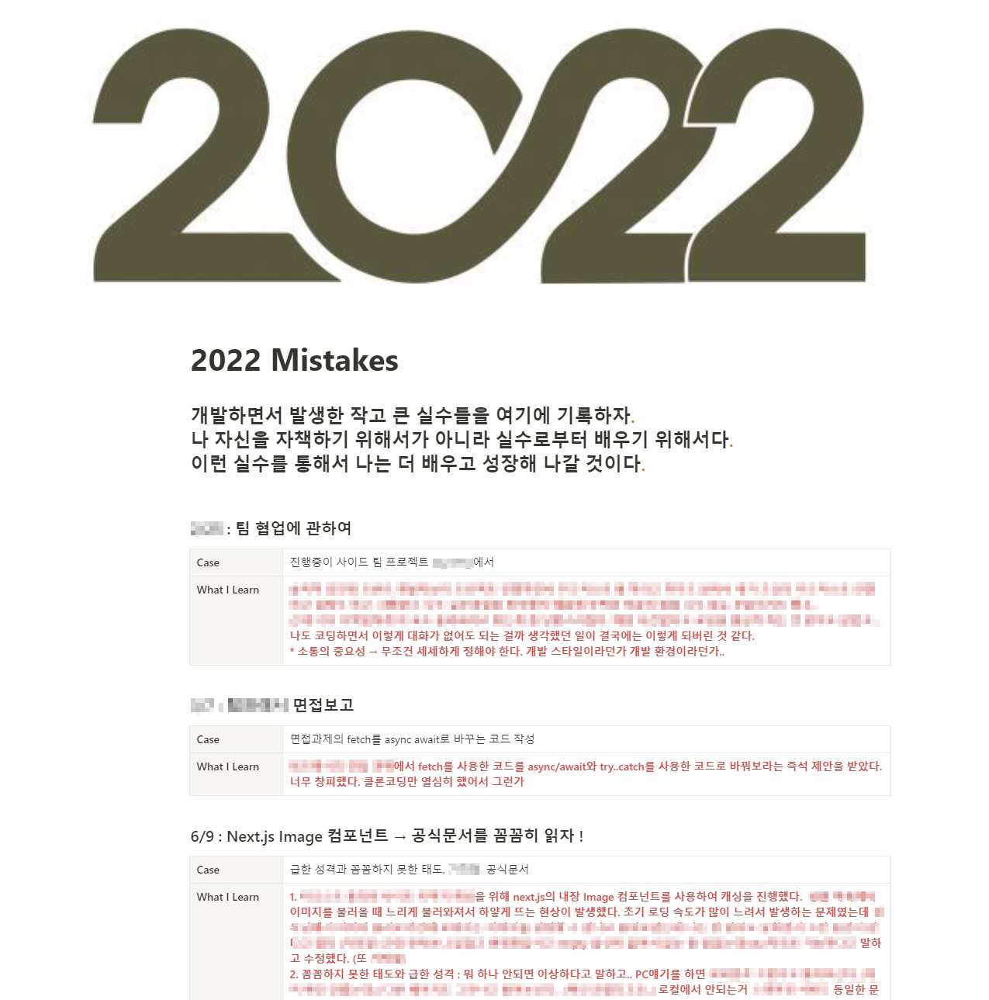
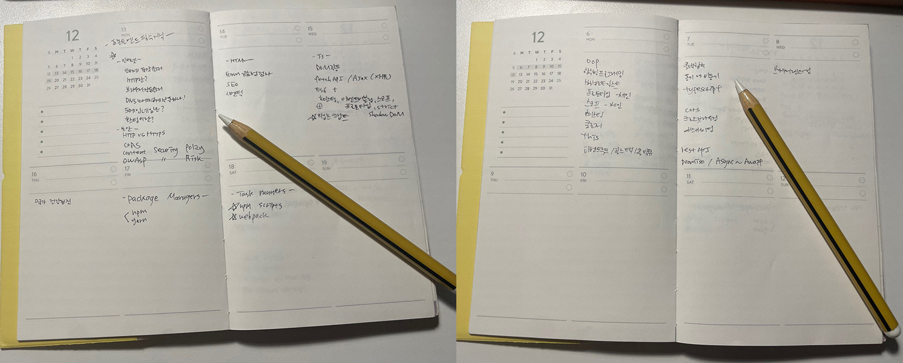
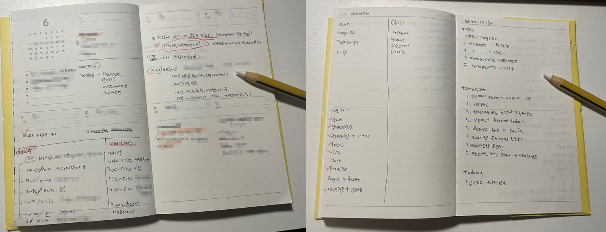

나는 나이많은 비전공자 개발자이기 때문에 항상 어떻게 해야 더 빨리 더 효율적으로 좋은 개발자가 될 지 고민하고 있다. 개발자는 평생 공부해야 하는 직업이기 때문에 입사 전 월요일에는 뭐 공부하고 주말에는 뭐 공부하자라는 식으로 세세한 계획을 세웠었다. 현실은 출퇴근 여행자라 긴 출퇴근 시간에 완벽하게 적응하지 못했고 퇴근하면 4시간 정도후에 잠들어야 한다. (워라벨 붕괴) 또한 출퇴근 길에 공부를 하려고 했으나, 지하철 소음에 적응하지 못해 공부에 집중이 되지 않고 있어 공부에 진척이 없어 초초한 마음이 생겼다. 😨 (이건 익숙해지면 시간이 해결해 줄 거라고 믿는다.)  

스타트업 개발자로 일하면서 개발만 잘하는 것이 아닌 사람과 사람사이의 커뮤니케이션이 중요하다는 것을 다시 한번 깨닫게 되었다. 우리 회사 대표님왈) 개발팀 PM님은 개발도 잘하지만 타 부서의 일에 대한 지식도 높아 커뮤니케이션 능력이 뛰어나고 공감능력도 좋아 두루두루 잘 어울리는 사람이라고 하셨다.  

PM님은 어린아이 아빠신데 육아도 하시고 직장생활도 잘하시는 체력과 마인드, 정신력?이 대단하다고 생각했다. 아직 근로계약서에 잉크도 안마른 신입이 보기에 정말 대단해 보인다. 특히 사소한걸 여쭤봐도 굉장히 친절하셔서 덤벙거리는 내가 질문을 할 때 굉장히 감사하다. 🙏    

입사한지 이제 2주를 넘겼지만 이렇게 출퇴근 시간에 집중하지 못하고 퇴근후에 공부하지 못하는 내가 답답하고 초조한 마음에 어떻게 하면 더 성장하는 개발자가 될 수 있을까 고민하던 차에 평소 즐겨보는 드림코딩 엘리님의 영상중 <a href="https://www.youtube.com/watch?v=T7y6Hl0YZ14" target="_blank">성장하는 개발자 (시니어 개발자, 테크 리더로 성장한 개발 노트공개) 📓🖋</a>라는 영상을 다시 보고 마음을 잡아보는 계기를 가지려고 한다. (예전에 봤었다.)  

영상에서는 총 5가지를 제안하고 있다. <bt>

1. 실수를 통해 배우고 성장하자
2. 멘토를 찾아라 - 멘토찾기는 어렵기 때문에 좀 더 지켜봐야 겠다.
3. 피드백을 받아라 - 아직 일한지 얼마 되지 않아 받을 피드백이 없을 것 같다.
4. 성장 다이어리를 통해 방향 설정
5. 일관성, 엄청난 컴파운딩 효과 - 별거 아닌 것처럼 보이는 작은 것들이 매일매일 모이면 엄청난 효과를 가지고 오는것으로 포기하지 않고 매일 꾸준히 하면 엄청나져 있을 것!!

이 중, 나에게 적용할 수 있는게 무엇인지 생각해 보았고 총 2가지를 실천해 보기로 마음먹었다.   

## 1. 실수를 통해 배우고 성장하자

- 실수는 누구나 할 수 있지만 대부분의 사람들은 내가 어떤 실수를 했는지 모르고 지나가거나 또는 너무 부끄러워서 빨리 잊어버리려고만 한다.  
- 실수를 통해서 내가 어떻게 더 개선해 볼 수 있을지 생각해 보고 또 그 실수를 통해서 배워 가겠다는 도전적인 마음가짐이 있다면 더 빠르게 성장할 수 있다.  
- ⭐ 아무리 급하더라도 정확하게 문제를 분석하고 문제를 해결한 다음에는 꼼꼼하게 문제를 검증하는 시간을 가져야 겠다. (성격 급한 나에게 정말 필요한 요소)

 

  
내가 노션에 기록한 실수들이다. 일을 시작하기 전부터 쓴건데 그땐 혼자개발공부를 할 때라 딱히 실수 인지도 몰랐던 부분이 많아 기록이 많이 없다. (요즘은 일하면서 매일 반성한다 😂)   

## 2. 성장 다이어리를 통해 방향 설정

영상에서는 내가 원하는 것을 명확하게 찾는 것과 다른 사람과의 대화를 통해서 인상이 깊거나 가슴을 뛰게 만드는 그런 순간들을 기록해 둔다고 하셨는데 내가 종이 다이어리에 기록하는 것과 비슷하기 때문에 <u>평소 기술관련 계획이나 스케줄 관리 기록 등</u>이 나의 성장다이어리라고 생각되었다.

  
  

위의 2가지와 꾸준한 스터디를 통해 개발자의 소양을 기른다면 5번의 컴파운딩 효과로 인해 꾸준히 성장하는 주니어 개발자가 될 수 있다고 믿는다.  
오랜만에 하는 포스팅도 새로운 계기가 된 것 같다. (꾸준히 올리자..)  
앞으로 내 실수를 통해 깨우침을 느끼고 성장 다이어리로 내 성장력의 방향성과 원동력을 끌어올려봐야 겠다.
  
