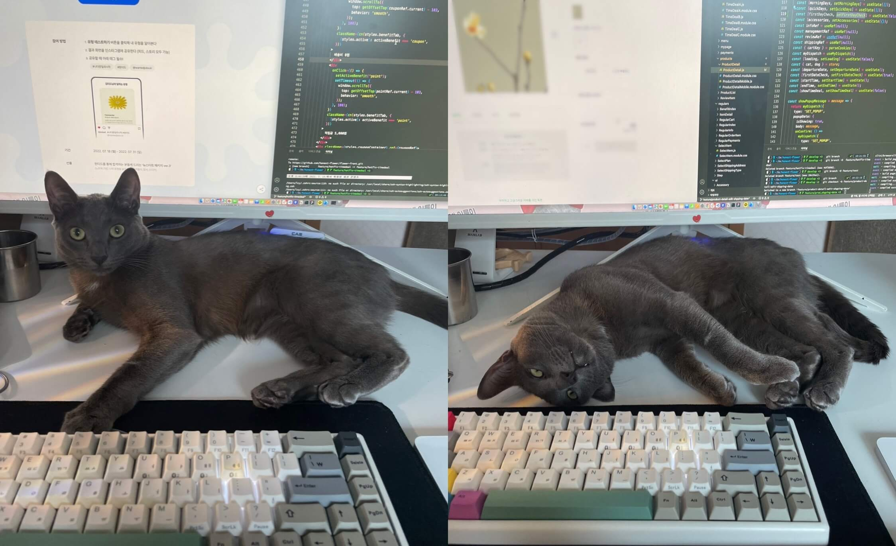
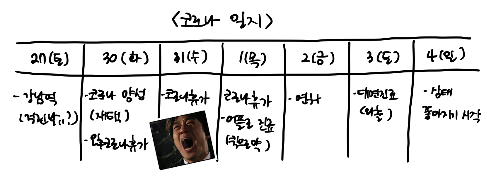
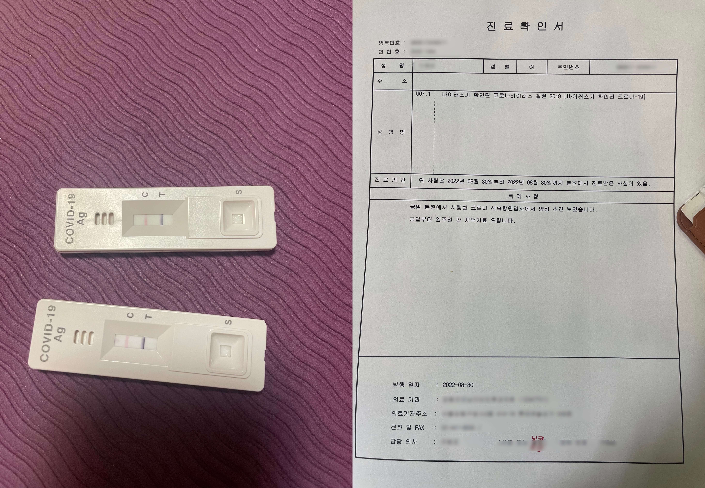
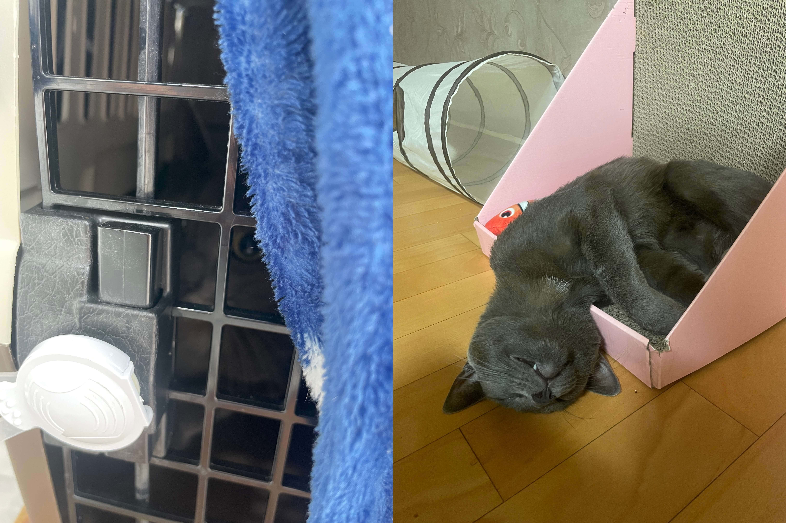

인생에서 제일 길었던 한해가 지나갔다. **2022년.** 다사다난했던 한해. 많은 일들이 있었던 만큼 매우 긴 한해였다.
프론트엔드 개발자가 되겠다고 연초부터 면접을 보러 다녔었는데 아주 오래전 이야기가 된것 같은 느낌.. 길고도 험난했던 해인만큼 2022년 회고록을 쓰며 안좋았던 기억들을 모두 훌훌 털어내고 새로운 2023년을 준비해보려고 한다.
<u>2022년의 가장 큰 이슈는 3가지</u>다. 3가지 모두 취업 후 하반기에 일어났는데 인생에서 가장 긴 6개월이었다. (부들부들)  

## 1. 퍼블리셔에서 프론트엔드 개발자로

이전에 올렸던 포스팅에서 (<a href="/diary/2022-03-09/" target="_blank">[diary] 프론트엔드 신입 면접 준비하기</a>)처럼 나는 올해 프론트엔드 개발자로 커리어 전환에 성공했다. 취업까지도 여러 스토리가 존재한다.. 
면접 본 회사중 느낌이 좋았고 가고 싶던 회사가 있었는데 거의 2시간 30분 정도의 면접시간 동안 분위기도 좋았고 기술질문에도 대답을 잘했었고 집도 가까워서 엄청 기대했는데 탈락해서 한동안 멘탈이 나갔었다. (지금 생각해보면 회사는 경력자를 뽑을 생각이었는데 회사가 급성장하던 시기라 인적 데이터를 쌓기위해 면접을 계속 본것같다는 생각이 든다. 면접 2시간 30분은 뭐냐고 😡)  
정신차리고 면접보러 다니다가 2번째로 마음에 드는 회사에 합격했다. (이 회사도 이력서-1차 온라인 면접-2차 과제면접- 3차과제면접까지 합격까지의 프로세스가 시간적으로 굉장히 길었던 회사다.) 한달후에 입사하기로 해서 한달동안 신나게 놀다가 출근했는데 투자취소로 회사가 어떻게 될지 모르는 상황이 생겨버렸었다. 대표님은 이런 상황인데 입사하고 싶으면 입사해도 되지만 회사가 없어질수도 있다고 하셨는데 저런 얘기를 듣고 어떻게 입사하지..?라는 생각과 내 한달은 뭐였지 라는 생각이 마구마구 들기 시작했다. 그러다가 본인 친구회사가 개발자를 뽑고 있는데 나를 굉장히 좋게 봐서 추천하고 싶으니 이력서 넘겨도 괜찮냐고 여쭤봐주셔서 OK했고 면접보고 들어온 회사가 지금의 회사다. (면접보기에 지쳐있어서 합격하자마자 바로 OK) 

퍼블리셔에서 독학해서 프론트엔드 개발자가 된지 6개월정도 지났다. 스타트업 회사의 인하우스 개발자로 취업했는데 처음 취업 당시에 필자 포함 총 4명의 개발자가 있었다. 개발자가 여러명이라서 입사한 이유가 가장 컸는데 입사하고 2개월이 지났을때 2명의 개발자가 그만두는 상황이 발생했다. 입사한지 얼마안되서 개발자가 절반으로 줄어버린 상황이 너무 슬펐다. 사수랑 둘만하는 상황이 되버림과 동시에 입사한지 3개월도 안되서 아예 새로운 프러덕션 서비스의 프론트 전체페이지를 감당해야 하는 일까지 생겨버려 심적으로 부담이 커지기 시작했다.  
특히 출퇴근 시간이 길기 때문에 체력적으로도 힘에 부치기 시작했다. (왕복 2시가 40분..) 제일 싫어하는 지하철을 타야한다는 스트레스때문에 정신적으로 힘들던 때에 새로운 프로젝트가 시작되면서 재택근무가 주 1회 → 3회로 늘어났고 프로젝트는 어찌어찌 완성되어 출시일이 얼마안남았고 2주전에 사수와 6개월 리뷰를 거치면서 연봉이 인상되어 지금은 즐거운 마음으로 다니고 있다. (다니려한다..)

 

## 2. 코로나 감염

2022년 8월 30일 화요일. 어찌 잊으랴. 코로나 확진된 날이다.  
걸리기 전주 토요일에 아주아주 오랜만에 외출해서 강남에서 여러명의 지인들과 저녁을 먹고 맥주를 마신날이 있었는데 그때 코로나에 걸렸던 것 같다. 나는 코로나에 안걸리는 슈퍼항체인가라고 내심 자부심이 있었는데 그냥 외출을 안해서 코로나에 안걸렸던게 아닐까 생각된다 🤣  
토요일 외출 → 월요일 출근 (동료 한분과 둘이 먹었는데 다행히 안걸리심) → 화요일 재택 (마침 재택이었는데 점심시간 지나고 몸상태가 너무 이상해서 자가키트 해봤는데 2개다 양성으로 떠서 병원에 신속항원검사하러 갔는데 양성판정..) 양성떠도 나는 무증상자겠지 라는 생각을 했지만 확정 당일 저녁부터 열이 오르고 목이 아프고 기침이 멈추질 않는 등 화-금요일까지 (코로나휴가+연차1일) 일은 아예 못하고 끙끙 앓았다. 집에 반려묘와 식구 1명이 있어 방에서 혼자 격리하며 항상 마스크를 끼고 소독약을 손에 들고 다니면서 강박적으로 뿌렸던 것 같다. 식구 1명은 내가 아프다고 반려묘를 돌봐줄 위인이 아니기에 아픈몸을 이끌고 반려묘 케어도 하느라 힘들었던 것 같다.  
특히 4일째에 다시 열이 오르면서 나아질 기미가 없고 목은 아프다 못해 목소리가 아예 안나오는 상황이 되버려서 격리중에 어쩔수 없이 병원을 방문하는 상황이 생겼었다. 중간에 어플로 진료보고 약 처방하는 것까지 해봤는데 효과가 전혀 없었다. 격리중 대면 진료는 정해진 병원으로 대중교통 이용하지 않고 도보나 자차 이용하면 가능하다 해서 자차 이용해 병원과 약국을 방문했다. 화~토까지 미친듯이 아프다가 토요일에 대면진료해서 처방받은 약이 효과가 있었는지 일요일부터 상태가 좋아져서 월요일에는 재택근무가 가능한 상태가 되었다. 

내가 건강해야 반려묘도 돌볼 수 있다는걸 깨달았던 경험이다... 이후 면연력을 위해 유산균과 비타민 등 면역력에 좋다는 음식을 챙겨먹으려고 노력하고 있다.

 

## 3. 어린 반려묘의 만성신부전 판정

2022년 6월 18일 토요일. 아직 2살이 되지 않은 어린 고양이가 급성 신부전으로 입원한 날이다.  
건강하던 반려묘가 입원 한달전부터 가끔씩 토를 하기 시작했다. 고양이가 토하는건 흔히 있는 일이기 때문에 대수롭지 않게 생각했다. 그런데 입원 며칠전에 녹색토를 했다. 고양이 토색깔로 대충 어떤 증상인지 유추해 볼 수 있는데 녹색토는 담즙과 관련된 것으로 건강에 이상이 있다는 신호라고 했다. 병원에 데리고 갈지 많은 고민을 했던 것 같다. 고민한 이유는 토한거 빼곤 평소보다 넘치는 활력과 에너지 때문이었는데 괜히 데려갔다가 별일 아닌데 스트레스만 줄까봐 며칠을 고민하다 별일 아니더라도 내 마음이 편하고자 지인과의 약속전에 병원에 데리고 갔다. 병원에서도 별 이상은 없는것 같다고 했지만 내가 혈액검사를 요구했고 혈검결과는 급성신부전. 응급상황으로 당장 입원해서 공격적으로 수액을 맞추면서 수치를 떨어뜨려야 하는 상황이었다. 입원하지 않으면 위험하다고.. 별일 아니겠지 했던 마음과 더 빨리 데려가지 못한 상황에 마음이 무너져 내렸었다. 병원에서는 그래도 빨리 데리고 온거라며 위로해주셨고 나는 바로 입원에 동의했고 집에 오는길에 지인에서 상황을 알리고 약속 취소 후 주말동안 눈이 부르트도록 울기만 했다. (그때를 생각하면서 글쓰는 지금도 눈물이 난다.)  
주말내내 울다가 월요일 오전에 병원에 전화했었는데 아이가 얌전하고 애교도 많지만 머물고 있는 자리에서 꺼내려고만 하면 하악질 하고 난리라 꺼내서 혈검을 할수가 없으니 보호자가 오면 그때 꺼내서 혈검해서 퇴원 여부를 결정하자고 하셨었다. 최대한 빨리 퇴근해서 병원 문닫기 1시간전에 도착했는데 아직도 꺼낼수가 없으니 보호자분이 꺼내실수 있겠냐고 하셔서 이름을 불러주며 손을 내밀었더니 아주 얌전하게 안겨서 나와줬다.. 병원 관계자분들이 엄마 알아보고 가만히 있는거 보니 엄마 되게 좋아하는것 같다고 해서 또 눈물이.. 혈검했는데 다행히 수액처지가 잘되서 수치는 떨어졌지만 초음파상 신장모양이 이상하고 담석이 있어 선천적으로 신장이 안좋은 아이 같으니 계속 지켜보고 다시 내원하기로 했다.  
퇴원 후 가끔씩 토를 할때마다 심장이 철렁해서 병원에 델꾸 갔었는데 단기간에 자주 가다보니 아이도 스트레스가 심하고 막상 가보면 별일이 아니었었다. 그러기를 반복하다 나중에 혈검을 해보니 만성신부전이 되버렸다고.. 선천적으로 신장이 안좋은 애니까 보호자 책임은 아니라고 했지만 내가 잘못케어해서 아픈 것 같아 지금도 너무 미안한 마음이다.  
신부전 판정이후로 좋아하던 간식들은 신장에 좋지않아 줄 수 없고 좋아하지 않던 간식형태의 신부전 간식만 줘야해서 너무 불쌍하고 미안한 마음이다.

 

5월말 취업 → 6월 반려묘 신부전 입원 → 8월말 집사 코로나 확진  
코로나 이후로 2개월정도 미각을 잃고 (현재까지도 100% 돌아오지 않았다) 체력을 잃고 기억력도 잃었다. 코로나 걸리기 전에는 출근전 새벽에 일어나서 개발공부도 하고 그랬는데 코로나 이후로 모든 패턴이 무너졌다. 체력이 안되니 잠을 자도 많이 피곤하고 퇴근하면 골아떨어지고 아침에 일어나기 힘들어서 개발 공부를 할 수 없었다. 기억력도 나빠져서 업무에 지장이 생기기도 했었다. (이건 6개월 리뷰할때 사수한테 말하면서 사과했었는데 막상 사수는 대수롭지 않게 생각했었던 것 같다.) 거의 3개월을 골골거리고 방황하다 이건 아니다 싶어 무너진 페이스 복구를 위해 새로운 사이드 프로젝트 모임에 들어가고 다시 인강도 듣기 시작하는 등 페이스 복구를 위해 노력하는 중이다. 그 일환중의 하나가 다시 개발블로그를 열심히 하는 것!!!  

### 기술적으로 배운 점

#### 1. Next.js

개발자가 되기위해 독학했을때는 React를 위주로 공부했었기 때문에 SSR을 고려해본적이 없다. 취업하고 Next.js를 많이 쓴다는걸 알게 되었고 실제로 회사에서도 사용하고 있으며 아예 새로운 프로젝트를 내손으로 만들어 보기도 하면서 Next.js를 알 수 있는 계기가 되었다. (다만 서버 자체를 다루진 않기때문에 프론트에 한정된 기술만 배운 것 같아 스스로 nodejs를 공부해서 다루는 공부가 필요할 것 같다.)

#### 2. Typescript

처음 입사했을때 Next.js로 되어있긴 했지만 Typescript를 사용하고 있진 않았다. 사수가 새로운 프로젝트에서 원하는 스택을 마음껏 써보라고 해서 Typescript를 실제로 사용해 볼 수 있게 되었다. (이것도 독학해서 사용하긴 하는데 엄청 한정적으로 사용하는 것 같아서 깊은 공부가 필요할 것 같다.)

#### 3. React-Query + Recoil

회사의 기존 프로젝트는 SWR과 axios를 사용하고 있었는데 React-Query를 아주 많은 곳에서 사용한다는 글을 발견하고 새 프로젝트에 사용해보고 싶어 인강을 보면서 공부해 새 프로젝트에서 사용하고 있다. 마찬가지로 깊은 공부가 필요하다고 생각되는게 유튜브 보면서 낙관적 업데이트가 뭔지 아냐는 영상을 봤는데 난 몰랐다.. deep하게 공부해야 될 것 같다.  
Recoil은 React-Query와 같이 쓰기에 가벼워서 추천한다는 글을 보고 무작정 사용하기로 결정했는데 코드가 React스럽고 배우기 쉬워서 굉장히 만족하면서 쓰고 있다. (Redux-saga 어후..)

#### 4. 기획자/디자이너/백엔드 개발자 소통 → 새로운 자극

퍼블리셔 시절에도 개발자나 디자이너와의 소통을 하긴했었지만 중간지점에 머물러 작업물을 개발자에게 넘겨줘 개발자가 완성하는 페이지를 보고 최종 결과물을 봤었다면 개발자의 포지션이 된 지금은 최종 결과물을 만들고 제일 빨리 테스트해보는 사람이 되었다. 퍼블리셔 시절에서 내가 제일 싫었던 점은 결과물을 완성해도 상대적으로 내 노력이 낮게 평가된다는 점이었다. 결국 완성은 개발자의 손에 달린거고 클라이언트와 소통도 개발자가 했었기 때문에.. 이점이 너무 싫었기 때문에 개발자가 되기로 결심했고 지금은 최종 점검자로써 만족스럽게 일을 하고 있다. (실제로 안되요. 가능합니다 등 나의 의견을 피력할 수 있다는 점이 매우 만족스럽다.)

 

## 2023년 목표

- 사이드 프로젝트 완성하기
- 알고리즘 공부
- Next.js 13 + React 18 공부
- React Native 공부하기
- CS 관련 책 공부하기 (최소한 한번 읽기라도 하기)
- 반려묘 별탈없이 건강하기 (더 나빠지지 않기)
- 집사도 코로나 걸리지 않고 건강하기
- 다이어트 (작년보다 5Kg이 쪘어요 🥲 - 최소 3키로는 빼기)
- 주식/부동산/경제 관련 책보면서 공부하기 (경제문맹 탈출하기)
- 독서 30권 이상
