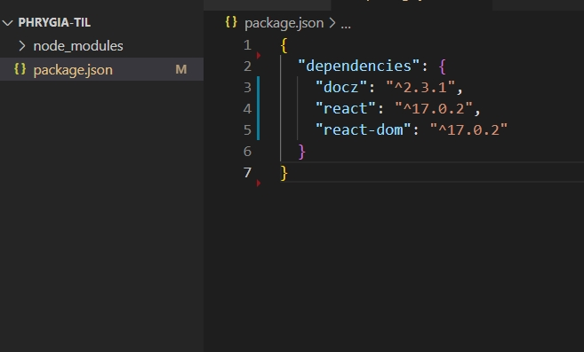
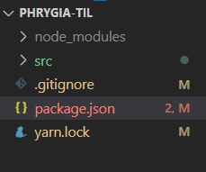

최근 비전공자를 위한 개발자 취업 인강을 듣고 있다. 그곳에서 TIL에 대한 용어를 처음 알게되었다. <br><br>

# TIL ?

TIL이란 `Today I Learned`의 약자로 오늘 내가 배운것이라는 뜻이다. <br>
한국에서는 개발자들 사이에서 많이 쓰이는 용어이지만 외국에서는 SNS상에서 자주 쓰이는 약어라고 한다. <br>
개발자들은 자신의 기술 블로그를 운영하기 때문에 TIL을 따로 운영하지는 분들은 많지 않은것 같다.<br>
(어떻게 생각하면 기술 블로그 = TIL과 비슷한 느낌이랄까.. 🤔) <br>

나는 기술블로그를 운영하지고 있지만 많은 포스팅을 올리지 못하고 있기 때문에 TIL 페이지를 따로 생성할 지 고민을 했다.<br>
TIL을 <u>자기가 배운 내용을 매일 하나씩 쌓으면서 만드는 나만의 지식 사전</u>으로 생각해 보기로 했다. <br>
추후에 동일한 문제가 발생하였을때 해결하지 못한다면 자기반성 및 습득하지 못한 지식을 정리하기에 도움이 될 것 같았기 때문에 TIL 페이지를 생성하기로 결정하였다.<br>

**TIL 참고 예시**
- <a href="http://milooy.github.io/TIL/" target="_blank">진유림(milooy)님의 TIL 저장소</a>
- <a href="https://github.com/cheese10yun/TIL" target="_blank">김남윤(Cheese10Yun)님의 TIL 저장소</a>
- <a href="https://github.com/HomoEfficio/dev-tips" target="_blank">HomoEfficio님의 문제해결 저장소</a>
- <a href="https://github.com/namjunemy/TIL" target="_blank"> 김남준(namjunemy)님의 TIL 저장소</a>
- <a href="https://github.com/wayhome25/wayhome25.github.io" target="_blank"> 초보몽키(wayhome25)의 TIL 저장소</a>

<br>

어떻게 만들기 고민하다가 vue 개발자분이 <a href="https://vuepress.vuejs.org/" target="_blank">vuepress</a>를 이용해서 문서화 시킨 페이지가 생각이 났고 나도 그렇게 만들어 보고 싶어 검색을 했다.<br>
react에서 vuepress와 비슷한 <a href="https://www.docz.site/" target="_blank">Docz</a> <a href="https://docusaurus.io/" target="_blank">Docusaurus</a>가 검색되었다. 둘다 설치해본 결과 Docusaurus는 블로그 느낌이 강해서 Docz를 선택했다.

그런데 docz 설치하면서 많은 어려움이 있었다. 공식사이트에서 설치하란데로 설치하고 파일을 만들었는데 계속 오류가 발생했다. 구글링을 해보았지만 오래전에 포스팅된 내용들만 존재했고 그조차도 제대로 작동하지 않았다. <br> 
공식 페이지의 `npx create-docz-app docz-app-basic`나 `yarn create docz-app docz-app-basic`는 오류가 나면서 설치조차 되지 않았다. 몇시간을 삽질하고 겨우 설치한 docz 설치법을 시작하겠다. <br><br>

## docz 설치

빈 폴더를 생성하고 라이브러리를 설치한다.

```js
yarn add docz react react-dom
// or
npm install docz react react-dom
```
<br>

 

처음 설치파일이 node_modules와 package.json 밖에 없다. (여기서 당황하기 시작)<br> 
package.json 을 열어봐도 실행 문구도 없다.<br>
공식 문서를 보니 package.json에 scripts를 추가하라고 되어있다.<br> 

```js
{
  "name": "next-gen-documentation",
  "scripts": {
    "docz:dev": "docz dev",
    "docz:build": "docz build",
    "docz:serve": "docz build && docz serve"
  },
  "dependencies": {
    "docz": "latest",
    "react": "",
    "react-dom": ""
  }
}
```
<br>

***index.mdx**
```md
---
name: Hello world
route: /
---

# Hello world

Hello, I'm a mdx file!
```

설정 후 공식 문서에 나와있는 파일을 추가해 보았다. <br>
공식 문서에는 `You can just create your .mdx files and put them anywhere in your project.` 아무곳에서 만들어도 된다고 해서 최상단에 index.mdx파일을 추가하고 프로젝트를 시작해보았다.

```js
yarn docz:dev
// or 
yarn docz dev
// or
npm run docz:dev
```
<br>

 
두번째로 당황하기 시작 😅 추가한 페이지는 나타나지 않을 뿐더러 페이지 전체가 깨져있다.<br>


## github 배포

 

느낀점 : 
1. 공식 문서를 꼼꼼히 읽어보자. 
2. 영어 공부를 시작하자.
