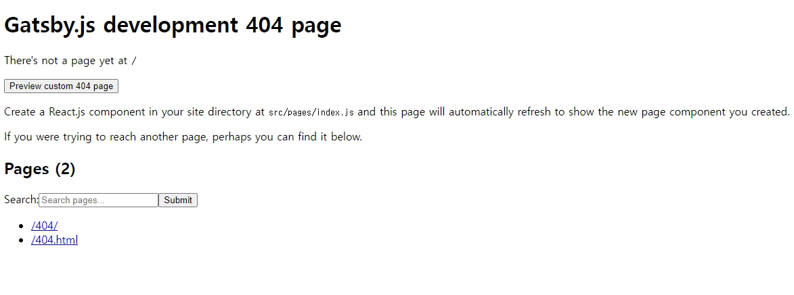
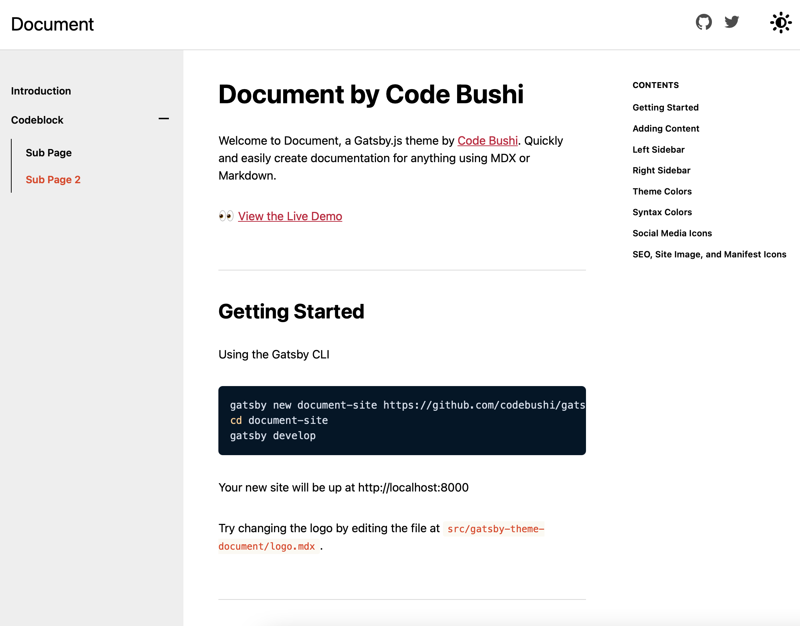
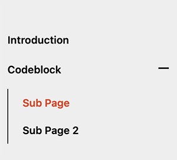
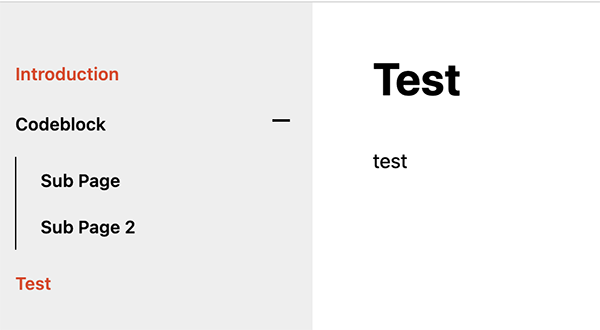
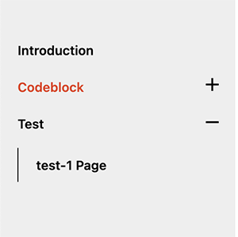

최근 비전공자를 위한 개발자 취업 인강을 듣고 있다. 그곳에서 TIL에 대한 용어를 처음 알게되었다. <br><br>

# TIL ?

TIL이란 `Today I Learned`의 약자로 오늘 내가 배운것이라는 뜻이다. <br>
한국에서는 개발자들 사이에서 많이 쓰이는 용어이지만 외국에서는 SNS상에서 자주 쓰이는 약어라고 한다. <br>
개발자들은 자신의 기술 블로그를 운영하기 때문에 TIL을 따로 운영하지는 분들은 많지 않은것 같다.<br>
(어떻게 생각하면 기술 블로그 = TIL과 비슷한 느낌이랄까.. 🤔) <br>

나는 기술블로그를 운영하지고 있지만 많은 포스팅을 올리지 못하고 있기 때문에 TIL 페이지를 따로 생성할 지 고민을 했다.<br>
TIL을 <u>자기가 배운 내용을 매일 하나씩 쌓으면서 만드는 나만의 지식 사전</u>으로 생각해 보기로 했다. <br>
추후에 동일한 문제가 발생하였을때 해결하지 못한다면 자기반성 및 습득하지 못한 지식을 정리하기에 도움이 될 것 같았기 때문에 TIL 페이지를 생성하기로 결정하였다.<br>

**TIL 참고 예시**

- <a href="http://milooy.github.io/TIL/" target="_blank">진유림(milooy)님의 TIL 저장소</a>
- <a href="https://github.com/cheese10yun/TIL" target="_blank">김남윤(Cheese10Yun)님의 TIL 저장소</a>
- <a href="https://github.com/HomoEfficio/dev-tips" target="_blank">HomoEfficio님의 문제해결 저장소</a>
- <a href="https://github.com/namjunemy/TIL" target="_blank"> 김남준(namjunemy)님의 TIL 저장소</a>
- <a href="https://github.com/wayhome25/wayhome25.github.io" target="_blank"> 초보몽키(wayhome25)의 TIL 저장소</a>

<br>

어떻게 만들기 고민하다가 vue 개발자분이 <a href="https://vuepress.vuejs.org/" target="_blank">vuepress</a>를 이용해서 문서화 시킨 페이지가 생각이 났고 나도 그렇게 만들어 보고 싶어 검색을 했다.<br>
react에서 vuepress와 비슷한 <a href="https://www.docz.site/" target="_blank">Docz</a> <a href="https://docusaurus.io/" target="_blank">Docusaurus</a>가 검색되었다. 둘다 설치해본 결과 Docusaurus는 블로그 느낌이 강해서 Docz를 선택했다. 하지만 Docz는 페이지를 생성할때 마다 404 에러가 뜨면서 page에 파일이 없다는 에러가 발생했다. <br>


물론 내가 해결을 못하는 거겠지만 Docz 여러 테마를 설치해봤지만 계속 에러가 발생했다. 😭 <br>
공식사이트에서 설치하란데로 설치하고 파일을 만들었는데 계속 오류가 발생했다. 구글링을 해보았지만 오래전에 포스팅된 내용들만 존재했고 그조차도 제대로 작동하지 않았다. <br>
공식 페이지의 `npx create-docz-app docz-app-basic`나 `yarn create docz-app docz-app-basic`는 오류가 나면서 설치조차 되지 않았다.<br>
하루넘게 해결이 되지 않아 다른 방법을 찾기 시작했다. (docz의 공식 github 페이지에서 설치하라고 하는 코드를 입력해도 오류가 나는걸 보면 자체 업데이트 문제인거 같기도 하다.)<br>

vuepress는 vue 기반의 정적 사이트 생성기이다. 그럼 react 기반의 정적 사이트로 유명한건 뭐가있지? <br>
바로 내가 지금 글을 쓰는 블로그에도 이용되고 있는 `gatsby`이다 !<br>

우선 gatsby가 설치되어 있지 않다면 글로벌로 설치하자. <br>

```js
// gatsby 글로벌 설치
npm install -g gatsby-cli
```

<br>

## gatsby document 설치 (테마 설치)



살펴보기 : <a href="https://gatsby-theme-document.netlify.app" target="_blank"> gatsby-theme-document demo</a><br><br>

내가 선택한 테마는 <a href="https://github.com/codebushi/gatsby-theme-document" target="_blank">gatsby-theme-document</a> 이다. 문서관련 테마는 많지는 않았고 그나마 깔끔해 보이는 이 테마를 선택했다. <br>

```js
gatsby new document-site https://github.com/codebushi/gatsby-theme-document-example
cd document-site
gatsby develop
```

<br>

## gatsby 파일 생성하기

**\*기본구조**

```bash
root
└── content
  ├── index.mdx #homepage "/"
  ├── codeblock.mdx #codeblock "/codeblock"
  └── codeblock
    └── subpage.mdx #subpage under codeblock "/codeblock/subpage"
    └── subpage-2.mdx #subpage under codeblock "/codeblock/subpage-2"
```

<div style="text-align: left; display:inline-block;">



</div>

test 파일을 생성해 보자. <br>
우선 content안에 test.mdx 파일을 생성한다.<br>
content바로 밑에 파일을 생성하는건 introduction처럼 상위에 나타나는 파일이다.<br>

\*test.mdx

```md
---
title: 'Test'
description: 'test page'
---

test
```

파일을 생성하면 다음과 같이 생성된다.

<div style="text-align: left; display:inline-block;">



</div>

하위에 파일을 생성하고 싶다면 test.mdx와 이름이 같은 `test` 폴더를 생성하면 된다. <br>
이렇게 하면 자동으로 /test/하위 파일명 으로 url이 생성된다. <br>

\*test/test-1.mdx

```md
---
title: 'test-1 Page'
description: 'This is the meta description for this page'
---

test -1 page
```

test 폴더에 test-1.mdx을 추가하였더니 해당 파일의 title로 subpage가 생성되었다. <br>

<div style="text-align: left; display:inline-block;">



</div>
<br>

나는 github페이지로 배포하기위해 gh-pages를 설치했고 배포했다. <br>
나는 이걸 보고 설정했다. 설명이 자세하다 :) <a href="https://dailyco.tech/share/gatsby-blog-deploy/" target="_blank">https://dailyco.tech/share/gatsby-blog-deploy/</a> <br>
브랜치를 하나 추가하고 gh-pages를 설치하고 package.json에 "deploy" 속성을 추가하면 된다.

나처럼 <a href="https://phrygia.github.io" target="_blank">https://phrygia.github.io</a>를 사용중이라 다른 레포지토리를 쓰고 싶다면 gatsby-config.js에 설정해주면 된다.

```js
pathPrefix: `/phrygia-TIL`, // 레포지토리명
```

성공적으로 배포가 완료되었다. <a href="https://phrygia.github.io/phrygia-TIL/" target="_blank">phrygia TIL</a> <br>

1일 1커밋보다 1일 1배움을 실천하자 !

<br>
