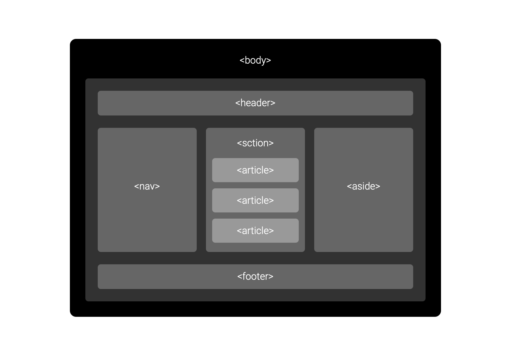
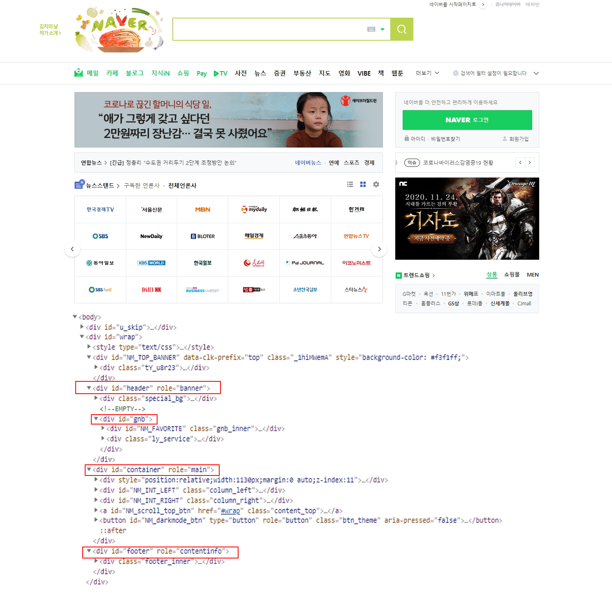
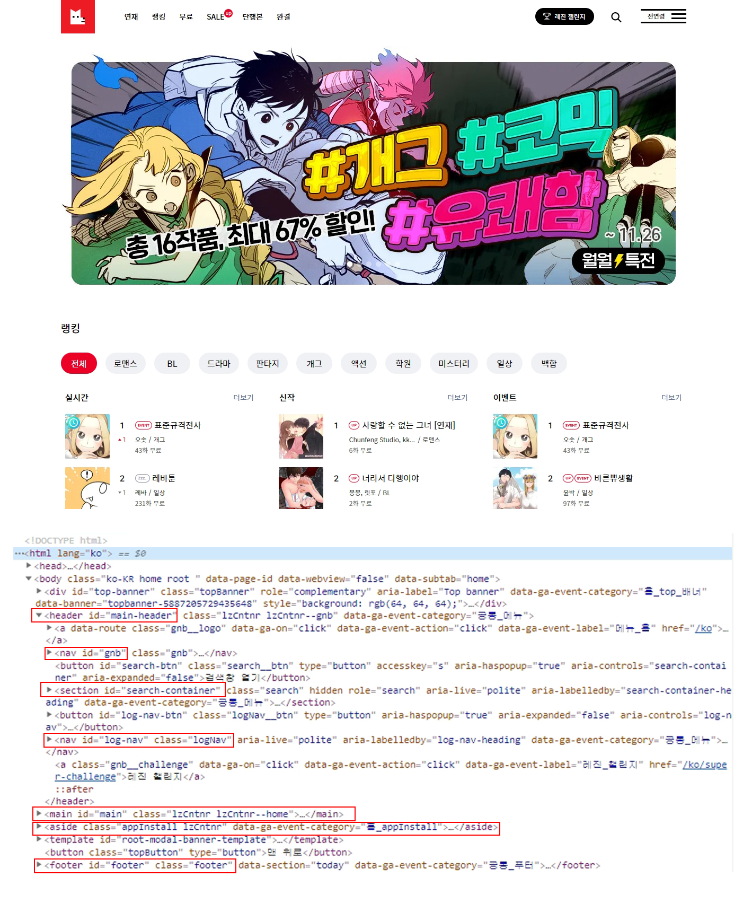

<br>

> "HTML is the World Wide Web's core markup language. Originally, HTML was primarily designed as a language for semantically describing scientific documents." <br><br>
> <i>- "HTML은 World Wide Web의 핵심 markup 언어이다. 원래 HTML은 과학적인 문서를 `의미를 담아 기술하는 언어`로 설계되었다."</i> <br><br>
> "Elements, attributes, and attribute values in HTML are defined (by this specification) to have certain meanings (semantics)"<br><br> 
> <i>- "HTML의 요소와 속성 및 속성 값은 `특정한 의미를 가지도록 정의`되었다."</i>

<br>
<small class="from">출처 : <a href="https://www.w3.org/TR/2016/REC-html51-20161101/introduction.html" target="_blank">W3C Recommendation</a></small>

<br><br>

## Semantic Tag
### 시맨틱 태그란?
흔히들 HTML5 시대에서 가장 큰 변화는 시맨틱 태그라고 말한다. semantic은 사전적인 의미로 '의미의, 의미론적인'라는 의미를 가지고 있다. 
HTML5 이전의 웹사이트는 거의 모든 태그를 `<div>`를 사용하여 코딩하였다. &#60;div&#62;로 작성된 사이트는 문서의 구조와 의미를 알아보기 힘들었고 검색 엔진이 태그의 기능을 분별할 수 없어 자료를 수집하기에 효율적인 사이트가 되지 못했다.<br>
마케팅 및 다양한 분야에서 중요해진 검색엔진에 대응하고 검색 결과가 상위에 노출되기 위해서 검색 엔진 최적화(SEO: Search Engine Optimization)가 중요해졌다. 검색엔진의 로봇(Robot)이 전세계의 웹사이트에 방문하여 웹사이트 정보를 수집하여, 검색 키워드에 대응하는 인덱싱을 만든다. 이때의 인덱싱은 웹사이트의 Hml코드로 만들어 지며, 효율적인 검색 키워드를 만들기 위해서는 웹사이트 구조를 시맨틱하게 작성하는 것이 중요하다.
<br>
`<div> <span>`등의 태그는 컨텐츠가 아무 의미를 가지고 있지 않으며 의미가 없는 태그이다. 이를  **Non-Semantic elements**라고 하며, 컨텐츠의 의미를 명확하게 정의하는 `<form> <table> ` 등의 태그를 **Semantic elements**라고 한다.<br><br><br>

### HTML5에 추가된 시맨틱 태그



- `<header>` : 머리말을 나타내는 요소이다.
- `<nav>` : 메뉴 영역(네비게이션)을 나타내는 요소이다.
- `<aside>` : 좌우측의 사이드 영역을 나타내는 요소이다.
- `<section>` : 제목별로 나눌 수 있는 문서의 콘텐츠 영역을 구성하는 요소이다.
- `<article>` : 콘텐츠 영역에서 개별 콘텐츠를 나타내는 요소이다.
- `<footer>` : 꼬리말을 나타내는 요소이다.

이 외에도 &#60;figure&#62; &#60;main&#62; &#60;mark&#62; &#60;details&#62; 등의 태그가 있다.<br><br><br>

## 시맨틱 태그의 장점

**<span style="color:#99f">Non-Semantic elements</span> - Naver**<br><br>

<br><br>

**<span style="color:#99f">Semantic elements</span> - 레진 코믹스**<br><br>



<br>위의 두 사이트를 보면, <br>

```html
<!-- Naver -->
<div id="header">
    <div id="gnb">
        ... 
    </div>
</div>

<!-- 레진 코믹스 -->
<header id="main-header">
    <nav id="gnb">
        ...
    </nav>
</header>
```

로 코딩되어 있는 것을 확인 할 수 있다. 위의 코드는 같은 결과물을 출력하지만 아무 의미를 가지고 있지 않는 &#60;div&#62; 태그를 사용하는 것보다 "header"라는 컨텐츠의 의미를 담고있는 &#60;header&#62; 태그를 사용함으로써 컨텐츠를 더욱 명확하게 파악 할 수 있다.<br><br>

1. **코드의 가독성을 높이고 의미를 명확하게 해준다.**
2. **코드 관리가 쉽다. (협업 및 유지보수 등에서 유용하다.)**
3. **검색 엔진 최적화(SEO)에 유리하다.**

<br>
<div class="from add">- 참고 
    <ul>
        <li><a href="https://www.w3schools.com/html/html5_semantic_elements.asp" target="_blank">https://www.w3schools.com/html/html5_semantic_elements.asp</a></li>
    <ul>
</div>

```toc

```
