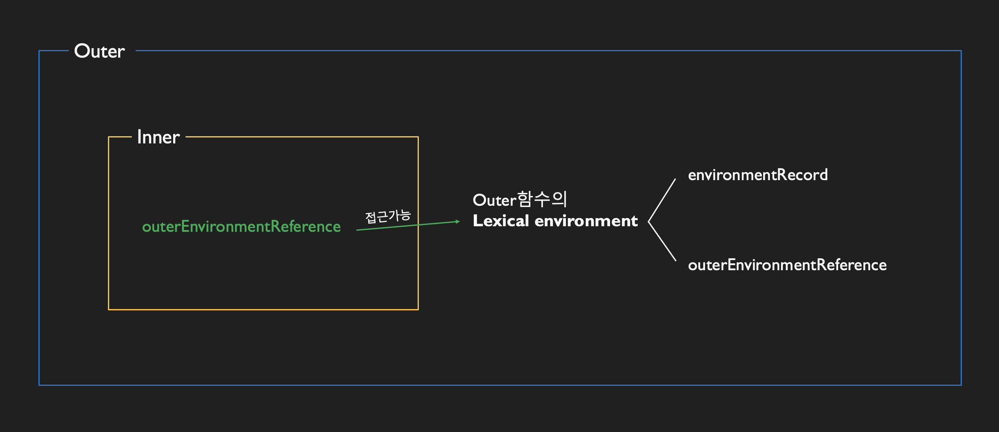

<br>
<small class="from" style="text-align:right;">사진 출처 : <a href="https://www.pinterest.co.kr/pin/439734351121493066/" target="_blank">https://www.pinterest.co.kr/pin/439734351121493066/</a></small><br>

클로저(closure)는 자바스크립트 고유의 개념이 아니라 함수형 프로그래밍 언어에서 등장하는 보편적인 특성이다. 개념이 아니기 때문에 ECMAScript 명세서에도 클로저의 정의를 다루지 않고 있어 클로저에 대한 다양한 정의와 설명이 존재한다.<br><br>

> _`자신을 내포하는 함수의 컨텍스트에 접근할 수 있는 함수` - 더글라스 크록포드 (자바스크립트 핵심 가이드) <br>`함수가 특정 스코프에 접근할 수 있도록 의도적으로 그 스코프에서 정의하는 것` - 에딘 브라운 (러닝 자바스크립트)<br> `함수를 선언할 때 만들어지는 유효범위가 사라진 후에도 호출할 수 있는 함수` - 존 레식 (자바스크립트 닌자 비급)<br> `이미 생명 주기상 끝난 외부 함수의 변수를 참조하는 함수` - 송형주 고형준 (인사이드 자바스크립트)<br> `자유변수가 있는 함수와 자유변수를 알 수 있는 환경의 결합` - 에릭 프리먼 (Head First Javascript programming)<br>  `로컬 변수를 참조하고 있는 함수 내의 함수` - 야마다 요시히로 (자바스크립트 마스터북)<br> `자신이 생성되 때의 스코프에서 알 수 있었던 변수들 중 언젠가 자신이 실행될 대 사용할 변수들만을 기억하여 유지시키는 함수` - 유인동 (함수형 자바스크립트 프로그래밍)<br> `클로저는 함수와 함수가 선언된 어휘적 환경의 조합이다` - MDN_ <br>

이처럼 많은 설명과 정의가 존재하지만 막상 그 의미를 이해하기는 쉽지않다. MDN에서는

<div class="blockquote">
    "A closure is the combination of a function and the lexical enviroment within which that function was declared" <br>
</div>
<p>라고 소개한다. 직역하면 "클로저는 함수와 그 함수가 선언될 당시의 lexical enviroment의 상호관계에 따른 현상" 정도가 된다.</p> <br>



그림에서처럼 Outer내부에서 선언된 내부함수 Inner의 실행 컨텍스트가 활성화된 시점에는 Inner의 outerEnvironmentReference가 참조하는 대상인 Outer의 LexicalEnviroment에 접근이 가능하다. Outer함수에서는 Inner함수에 선언한 변수에 접근할 수 없지만 Inner함수에서는 Outer에서 선언한 변수에 접근이 가능하다. (스코프 체인) Inner함수에서 Outer함수의 변수를 참조하는 경우에 한해서 LexicalEnviroment의 상호관계에 의미가 생긴다.<br><br>

**예제 1**

```js
    var outer = function() {
        var a = 1;
        var inner = function() {
            console.log(++a;)
        };
        inner();
    }
    outer();   //  2
```

<br>
<p>위의 예제에서 outer함수에서 변수 a를 선언했고, outer함수의 내부함수인 inner 함수에서 a의 값을 1만큼 증가시킨 다음 출력한다. </p>

1. inner 함수 내부에서는 변수 a를 선언하지 않았기 때문에 environmentRecord에서 값을 찾지 못한다.
2. inner 함수의 outerEnvironmentReference에 지정된 상위 컨텍스트의 outer의 LexicalEnviroment에 접근해서 a를 찾는다.
3. console.log(++a)가 실행되면서 2가 출력된다.
4. outer 함수의 실행컨텍스트가 종료되면 LexicalEnviroment에 저장된 식별자들 (a, inner)에 대한 참조를 지운다.
5. 자신을 참조하는 변수가 하나도 없게 되면서 가비지 컬렉터의 수집 대상이 된다.
   <br><br>

**예제 2**

```js
var outer = function () {
  var a = 1;
  var inner = function () {
    return ++a;
  };
  return inner;
};
var outer2 = outer();
console.log(outer2()); //  2
console.log(outer2()); //  3
```

<br>

예제2는 예제1과 다르게 inner 함수 자체를 반환했다.

1. outer 함수의 실행 컨텍스트가 종료될 때 outer2 변수는 outer의 실행 결과의 inner 함수를 참조한다.
2. console.log(outer2())를 호출하면 반환된 함수인 inner가 실행된다.
3. inner 함수의 실행 컨텍스트의 environmentRecord에는 수집할 정보가 없다. (실행종료 상태이기 때문에)
4. inner 함수는 내부 함수이기 때문에 outer-EnvironmentReference에는 inner 함수가 선언된 위치의 LexicalEnviroment가(outer 함수의 LexicalEnviroment가) 참조복사 된다.
5. 스코프 체이닝에 따라 outer에서 선언한 변수 a에 접근해서 1만큼 증가시킨 값인 2를 반환하고, inner 함수의 실행 컨텍스트가 종료된다.
6. 다시 console.log(outer2())를 호출하면 a의 값을 증가시킨 값인 3을 반환한다.

<br>
*inner 함수의 실행 시점에는 outer 함수는 이미 실행 종료된 상태이지만 outer함수의 LexicalEnviroment에 접근이 가능하다. 그 이유는 가비지 컬렉터가 어떤 값을 참조하는 변수가 있다면 수집 대상에 포함하지 않기 때문이다.

종합해보면 **클로저란 어떤 함수 A에서 선언한 변수 a를 참조하는 내부함수 B를 외부로 전달할 경우 A의 실행 컨텍스트가 종료된 이후에도 변수 a가 사라지지 않는 현상**을 말한다. (가비지 컬렉팅되지 않기 때문에)
<br><br><br>

## 클로저와 메모리 관리

'메모리 누수'라는 표현은 어떤 값의 참조 카운트가 0이 되지 않아 가비지 컬렉터의 수거 대상이 되지 않는 경우에 발생한다. 클로저는 어떤 필요에 의해 의도적으로 함수의 지역변수가 메모리를 소모하도록 함으로써 발생한다. 그 필요성이 사라진 시점에 참조 카운트를 0으로 만들어 주면 가비지 컬렉터가 수거하고 메모리 누수를 막을 수 있다. (참조 카운트를 0으로 만드는 방법은 식별자에 기본형 데이터(null, undefined)를 할당하면 된다.)<br><br>

```js
// setInterval에 의한 클로저의 메모리 해제
(function () {
  var a = 0;
  var intervalId = null;
  var inner = function () {
    if (++a >= 10) {
      clearInterval(intervalId);
      inner = null; // inner 식별자의 함수 참조를 끊음
    }
    console.log(a);
  };
  intervalId = setInterval(inner, 1000);
})();
```

<br>

## 클로저 활용방법

1. 콜백 함수 내부에서 외부 데이터를 사용하고자 할 때
2. 접근 권한 제어(정보은닉)
3. 부분 적용 함수
4. 커링 함수

<small class="from add">참고 : 코어 자바스크립트(정재남)</small><br>

```toc

```
