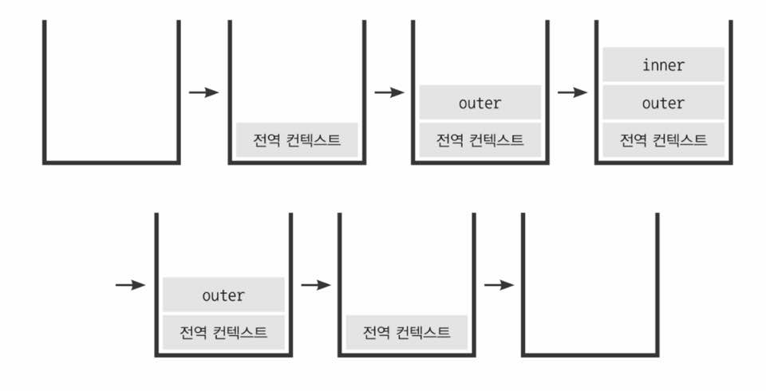
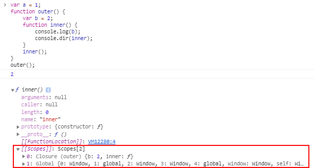

## 1. 실행 컨텍스트

실행 컨텍스트(execution context)는 **실행할 코드에 제공할 환경 정보들을 모아놓은 객체**로 호이스팅, this 바인딩 등의 정보가 담긴다. 자바스크립트는 어떤 실행 컨텍스트가 활성화되는 시점에 선언된 변수를 위로 끌어올리고(호이스팅), 외부 환경 정보(Lexical Environmen)를 구성하고, this 값을 설정하는 등의 동작을 수행한다.

- 동일한 환경의 코드 실행 시 필요한 환경 정보를 모아 컨텍스트를 구성
- 콜 스택(call stack)에 쌓아올림 - 스택구조
- 컨텍스트와 관련있는 가장 위의 코드를 실행 (순서 보장)
  <br><br><br>


<small class="from">이미지 출처 : <a href="https://ko.wikipedia.org/wiki/%EC%8A%A4%ED%83%9D" target="_blank">위키백과</a></small>

<br><br>흔히 실행 컨텍스트를 생성하는 방법은 함수를 실행하는 방법이다. (= **함수가 실행될 때** 실행 컨텍스트가 만들어진다.)

```js
var a = 1;
function outer() {
  function inner() {
    console.log(a); // undefined
    var a = 3;
  }
  inner();
  console.log(a); // 1
}
outer();
console.log(a); // 1
```

<br>


<small class="from">이미지 출처 : 코어 자바스크립트(정재남)</small><br><br>

1. 자바스크립트 파일이 열리는 순간 전역 컨텍스트가 활성화 되며 콜스택에 담긴다.
2. outer() 함수가 호출되면 자바스크립트 엔진이 outer에 대한 환경 정보를 수집해서 outer 실행 컨텍스트를 생성하고 콜스택에 담는다.
3. outer의 실행컨텍스트가 콜스택에서 최상단에 위치해 있으며 전역 컨텍스트에 관련된 실행은 일시 중지된다.
4. outer 실행 컨텍스트와 관련된 코드 내부 코드들이 순차적으로 실행된다.
5. outer내부의 inner()로 inner함수가 실행되면서 inner함수의 실행 컨텍스트가 콜스택의 가장 위에 담긴다.
6. outer 컨텍스트에 관련된 실행은 일시 중지된다.
7. inner 함수 내부의 코드들이 순차적으로 실행된다.
8. inner 내부의 console.log(a)를 출력하고 나면 inner 함수의 실행이 종료되면서 inner 실행 컨텍스트가 콜 스택에서 제거된다.
9. outer의 컨텍스트가 중단된 다음 줄부터 이어서 실행된다.
10. outer의 console.log(a)를 출력하고 나면 outer 함수의 실행이 종료되면서 outer 실행 컨텍스트가 콜 스택에서 제거된다.
11. 전역 컨텍스트의 console.log(a)출력하고 나면 전역 공간에는 실행할 코드가 없기때문에 전역 컨텍스트가 제거된다.
12. 콜스택에는 아무것도 남지 않으며 종료된다.
    <br><br><br>

**\*한 실행 컨텍스트가 콜 스택의 맨 위에 쌓이는 순간이 곧 현재 실행할 코드에 관여하게 되는 시점이다. 실행 컨텍스트에 담기는 객체는 개발자가 코드를 통해 확인 할 수 없으며 다음과 같은 정보들이 담긴다.**

1. **VariableEnvironment** : 현재 컨텍스트 내의 식별자들에 대한 정보 + 외부 환경 정보, 선언 시점의 LexicalEnvironment의 스냅샷으로, 변경 사항은 반영되지 않음
2. **LexicalEnvironment** : 처음에는 VariableEnvironment와 같지만 변경 사항이 실시간으로 반영됨 - `호이스팅`
3. **ThisBinding** : this 식별자가 바라봐야 할 대상 객체
   <br><br><br><br>

## 2. 스코프

스코프(scope)는 사전적 의미로 `범위`라는 뜻을 가지고 있다. 의미 그대로 식별자에 대한 유효범위를 뜻한다. 자바스크립트는 **전역 스코프(global scope)**와 **지역 스코프(local scope)** 2가지 타입을 가지고 있다.

```js
/* 예제 1 */
var a = 1;
function scope() {
  // 함수 스코프
  var b = 2;
  console.log(a); // 1
  console.log(b); // 2
}
console.log(a); // 1
console.log(b); // b is not defined
```

<br>

scope함수의 외부에서 선언한 전역변수 a는 scope함수의 외부뿐 아니라 함수 내부에서도 접근이 가능하다. scope함수의 내부에서 선언한 변수 b는 오직 scope함수의 내부에서만 접근할 수 있다. 변수 a를 <u>전역 스코프(global scope)</u>, b를 <u>지역 스코프(local scope)</u>라고 한다.<br>
위의 예시처럼 전역 스코프는 어느곳에서 호출해도 해당 변수에 접근이 가능하지만, 지역 스코프는 선언된 함수의 내부에서만 접근이 가능하다.

```js
/* 예제 2 */
var a = 1;
var truth = true;
if (truth) {
  var b = 2;
  console.log(a); // 1
  console.log(b); // 2
}
console.log(a); // 1
console.log(b); // 2    ← ???
```

<br>

그런데 예제1과 다르게 예제 2에서는 if문 안에서 정의한 변수b가 외부에서 접근이 가능하다. 위의 예제와의 차이점은 뭘까? <br>
그건 예제 1은 **함수 스코프 (function scope)**이고 예제 2는 **블록 스코프 (block scope)**라는 점이다. ES5까지의 자바스크립트는 전역공간을 제외하면 오직 <u>함수에 의해서</u> 스코프가 생성된다. 블록 스코프인 if문에서는 변수를 선언하면 전역변수가 되기 때문에 예제 2에서의 변수 b는 전역 스코프라고 할 수 있다. 즉 스코프는 **함수가 정의될 때** 결정된다.

**\*ES6부터는 블록에 의한 스코프가 가능해졌다. 블록스코프 내부에서 var가 아닌 let, const변수를 사용하거나 strict 모드를 이용하면 블록 스코프 사용이 가능하다.**
이러한 '변수의 유효범위'를 안에서부터 바깥으로 차례로 검색해나가는 것을 `스코프 체인(scope chain)`이라고 한다. <br><br><br>

## 3. 스코프 체인

스코프가 [[scope]] 프로퍼티로 각 함수 내에서 연결리스트 형식으로 관리되는데 이 스코프간의 상하관계를 **스코프 체인**이라고 한다. LexicalEnvironment의 두 번째 수집 자료인 outerEnvironmentReference는 현재 호출된 함수가 선언될 당시(과거)의 LexicalEnvironment를 참조한다.

```js
var a = 1;
function one() {
  var b = 2;
  function two() {
    var c = 3;
    function three() {
      console.log(a); // 1
      console.log(b); // 2
      console.log(c); // 3
    }
    three();
  }
  two();
}
one();
```

<br>

one함수 내부에 two함수를 선언하고 또 그 내부에 three함수를 선언한 경우,

1. three함수의 outerEnvironmentReference는 two함수의 LexicalEnvironment를 참조한다.
2. two함수의 outerEnvironmentReference는 one함수의 LexicalEnvironment를 참조한다.
3. one함수의 outerEnvironmentReference는 전역 컨텍스트의 LexicalEnvironment를 참조한다.

이처럼 outerEnvironmentReference는 연결리스트 형태를 띄며 '선언 시점의 LexicalEnvironment'를 계속 찾아 올라간다. 세 함수의 outerEnvironmentReference는 오직 자신이 선언된 시점의 LexicalEnvironment만 참조하고 있기 때문에 가장 가까운 요소부터 위로 차례대로만 접근할 수 있다. <br>
이런 구조적 특성 덕분에 여러 스코프에서 동일한 식별자를 선언한 경우에는 **무조건 스코프 체인 상에서 가장 먼저 발견된 식별자에만 접근 가능**하다.

```js
var a = 1;
function outer() {
  var b = 2;
  function inner() {
    console.log(b); // 2
    console.dir(inner);
  }
  inner();
}
outer();
```

<br>

크롬 브라우저에서 스코프 체인 중 현재 실행 컨텍스트를 제외한 상위 스코프 정보들을 개발자 도구 console을 통해 간단하게 확인할 수 있다. <br>
위의 예제에서 console.dir(inner)로 출력한 결과물은 다음과 같다. <br><br>

 <br>

inner함수의 상위 스코프 정보들을 확인할 수 있다. inner함수에는 outer함수의 LexicalEnvironment가 담겨있는데 outer함수에는 LexicalEnvironment가 담겨있다. 때문에 체인을 통해 inner함수에서 전역 컨텍스트까지 접근할 수 있는것을 확인 할 수 있다.<br>

<small class="from add">참고 : 코어 자바스크립트(정재남), <a href="https://developer.mozilla.org/ko/" target="_blank">MDN</a></small><br>

```toc

```
