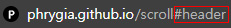

마케팅이 활성화 되면서 원페이지 및 랜딩페이지의 수가 급증했다. 옛날의 웹페이지라고 하면 복잡하고 전문적인 느낌이었지만 최근에는 일반사용자도 쉽게 만들 수 있는 플랫폼이 많이 생기면서 그 수는 계속 증가하고 있다. 한페이지에 많은 내용들을 담다보면 스크롤이 길어지면서 집중력이 떨어지고 이탈률이 높아진다. 이탈률을 낮춰주는데 도움이 되는 기능 중 한가지가 바로 특정영역으로 스크롤을 이동시켜 원하는 부분에 집중할 수 있도록 해주는 것이다. 이 기능을 구현하는 대표적인 두 가지 방법은 a태그가 가지고 있는 anchor기능과 html 속성인 data를 활용하는 방법이다.<br><br>

## a- anchor

anchor란 사전적 의미로 `배의 닻`을 뜻한다. 웹에서는 **사용자가 지정한 부분에 닻을내려 특정 영역의 링크를 만드는 기능**이라고 생각하면 쉬우며 주로 목차로 많이 사용한다. <br>
html태그만으로 쉽게 작성이 가능하다는 점에서 사용성이 좋다.

<div class="blockquote">
    &lt;a <b>href</b>="#아이디명"&gt;&lt;/a&gt;
</div>

```html
<!-- a href anchor -->
<nav>
  <ul>
    <li><a href="#header">header</a></li>
    <li><a href="#main">main</a></li>
    <li><a href="#footer">footer</a></li>
  </ul>
</nav>

<!-- element id -->
<section>
  <header id="header"></header>
  <main id="main"></main>
  <footer id="footer"></footer>
</section>
```

<br>
<p>a태그의 href 속성에 #id만 입력해주면 쉽게 사용할 수 있지만 단점이 있다. 첫번째는 해당영역으로 바로 이동되어 부드러운 스크롤 효과가 없다는 점이다.</p>
<div style="text-align: left; display:inline-block;">



</div>

두번째는 url 주소에 #id명의 해쉬가 생성되는데 자바스크립트 history.back()이나 history.go(-1)를 이용하여 뒤로가기를 구현했다면 해쉬로 인해 2번 클릭해야 한다는 문제가 발생한다. 하지만 해쉬를 이용해 history를 조작할 수 있다는 점에서도 해쉬는 장점이 될 수 있기 때문에 적절한 순간에 사용하면 매우 유용한 기능이다. <br><br><br>

## data-\*

HTML5 특정 요소와 연관되어 있지만 확정된 의미는 갖지 않는 데이터에 대한 확장 가능성을 염두에 두고 디자인되었다고 한다.
데이터를 표기하는 표준이 없어 표준으로 사용할 수 있도록 개선되었으며 자바스크립트에서 dataset이나 getAttribute 메서드로 쉽게 접근할 수 있기때문에 매우 유용한 기능이다. 어느 엘리멘트에나 data-로 시작하는 속성은 무엇이든 사용할 수 있다. (div, button, a등 모든 태그)

<div class="blockquote">
    &lt;button <b>data-target</b>="#아이디명"&gt;&lt;/button&gt;
</div>

```html
<!-- button에 data-target을 선언하여 -->
<nav>
  <ul>
    <li><button data-target="#header">header</button></li>
    <li><button data-target="#main">main</button></li>
    <li><button data-target="#footer">footer</button></li>
  </ul>
</nav>

<!-- element id -->
<section>
  <header id="header"></header>
  <main id="main"></main>
  <footer id="footer"></footer>
</section>
```

<br>

```js
//button에 click 이벤트 - 모든 버튼에 이벤트를 걸어야 하기 때문에 for loop이용
const buttons = document.querySelectorAll('button');
for (const button of button) {
  button.addEventListener('click', function () {
    //선택된 button의 dataset.target명의 offsetTop을 구하는 변수를 선언한다.
    const scrollPosition = document.querySelector(this.dataset.target).offsetTop;

    //scroll을 offsetTop으로 이동시킨다.
    window.scrollTo({ top: scrollPosition, behavior: 'smooth' });
  });
}
```

<br>
<p>한가지 버튼에 이벤트를 건다면 querySelector로 바로 이벤트를 걸면 되지만 button들에 이벤트를 걸기위해 querySelectorAll과 for loop를 이용하여 버튼들에 이벤트를 걸었다. data는 js에서 dataset.target으로 접근 가능하기 때문에 쉽게 구현이 가능하다.</p>

<div class="blockquote">
    window.scrollTo({top: '', behavior: 'smooth'});
</div>
<p>scrollTo는 화면의 스크롤을 이동시켜주는 js메서드로, 위치는 top/left를 사용할 수 있다.
behavior은 스크롤 효과를 지정하는 속성으로 auto/instant/smooth를 사용할 수 있다. (defefault: auto)</p>
<br><br>

**앵커기능은 js코드없이 html만으로 사용성이 쉽지만 url에 해쉬 붙는다는 장단점이 있다. data속성을 활용한 방법은 js코드로 구현해야 하지만 dataset으로 쉽게 접근 가능하다는 장단점이 있다. 상황에 따라 다르겠지만 나라면 해쉬를 이용하여 히스토리 조작할때만 빼고 data속성을 사용하여 구현할 것 같다. 부드럽게 이동하고 url적으로 깔끔하기 때문에 (a도 스크립트를 쓰면 가능은하다.)**

<br><br>

<div class="from add">참고 : <a href="https://developer.mozilla.org/ko/docs/Learn/HTML/Howto/%EB%8D%B0%EC%9D%B4%ED%84%B0_%EC%86%8D%EC%84%B1_%EC%82%AC%EC%9A%A9%ED%95%98%EA%B8%B0" target="_blank">MDN</a></div>

<br>

```toc

```
