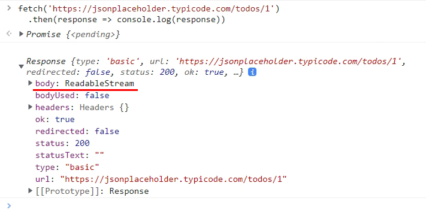

자바스크립트는 비동기 처리를 위한 하나의 패턴으로 콜백 함수를 사용한다. 하지만 비동기에서 사용되던 콜백 패턴은 계속되는 콜백으로 인해 콜백 지옥(Callback Hell)에 빠질 확률이 높다. 콜백 지옥에 빠지면 코드의 가독성이 떨어지고 비동기 처리 중 발생한 에러를 처리하는데 많은 노력이 필요하며 여러 개의 비동기 처리를 한번에 처리하는 데도 한계가 있다. <br>
Es6에서는 비동기 처리를 위한 패턴으로 프로미스(Promise)를 도입했다. 프로미스는 전통적인 콜백 패턴이 가진 단점을 보완하며 비동기 처리 시점을 명확하게 표현할 수 있어 비동기 처리가 간결하다는 장점이 있다.<br>
또한 프로미스는 HTTP 요청 전송이 가능한 Web API인 fetch함수를 지원한다. 이 포스팅에서는 Promise 뿐만 아니라 콜백과 fetch에 관해서도 간단하게 다룬다. <br><br>

## 콜백 함수(Callback Function)란?

콜백 함수란 파라미터(인자)에 함수를 전달받아 해당 함수의 내부에서 실행하는 함수다. 콜백 지옥에 빠지는 대표적인 사례는 비동기 처리 로직을 위해 콜백 함수를 연속해서 사용했을 때이다. <br><br>
비동기 처리를 위한 콜백 패턴의 가장 큰 문제점은 에러 처리가 어렵다는 점이다.

```js
// 콜백을 사용한 Get 비동기 요청
const get = (url, callback) => {
  const xhr = new XMLHeepRequest();
  xhr.open('GET', url);
  xhr.send();

  xhr.onload = () => {
    if (xhr.status === 200) {
      callback(JSON.parse(xhr.response));
    } else {
      console.error(`${xhr.status} ${xhr.statusText}`);
    }
  };
};

get('/step1', (a) => {
  get(`/step2/${a}`, (b) => {
    get(`/step3/${b}`, (c) => {
      get(`/step4/${c}`, (d) => {
        console.log(d);
      });
    });
  });
});
```

**\*콜백 지옥이란?** 비동기 프로그래밍 중 함수의 매개변수로 전달하는 콜백함수가 중첩되는 현상을 말한다. <br><br>

## 프로미스 (Promise) 생성

- Promise 생성자 함수를 new 연산자와 호출하여 생성한다.
- Promise 생성자 함수는 비동기 처리를 수행할 콜백 함수를 인수로 전달받는다.
- 전달받은 인수는 resolve(성공), reject(실패)가 있다.

```js
// Promise 생성
const promise = new Promise((resolve, reject) => {
  // 비동기 작업 수행

  if (/* 비동기 성공 */) {
    resolve('성공 결과');
  } else { /* 비동기 실패 */
    reject('실패 이유');
  }
});
```

```js
// Promise를 사용한 Get 비동기 요청
const promiseGet = (url) => {
  return new Promise((resolve, reject) => {
    const xhr = new XMLHttpRequest();
    xhr.open('GET', url);
    xhr.send();

    xhr.onload = () => {
      if (xhr.status === 200) {
        // 성공 resolve 호출
        resolve(JSON.parse(xhr.response));
      } else {
        // 실패 - reject로 에러 처리
        reject(new Error(xhr.status));
      }
    };
  });
};

promiseGet('https://~~~');
```

<br>

## 프로미스 상태 (Promise state)

**Promise는 비동기 처리 상태와 처리 결과는 관리하는 객체다.**<br>

<table class="ph_tbl">
  <tr>
    <th>promise 상태</th>
    <th>의미</th>
    <th>상태 변경 조건</th>
    <th></th>
  </tr>
  <tr>
    <th>pending</th>
    <td>비동기 처리가 아직 수행되지 않은 상태 <b>(기본)</b></td>
    <td>프로미스가 생성된 직후 기본 상태</td>
    <td>- ststus : pending <br> - result : undefined</td>
  </tr>
  <tr>
    <th>fulfilled</th>
    <td>비동기 처리가 수행된 상태 <b>(성공)</b></td>
    <td>resolve 함수 호출</td>
    <td>- ststus : fulfilled <br> - result : value</td>
  </tr>
  <tr>
    <th>rejected</th>
    <td>비동기 처리가 수행된 상태 <b>(실패)</b></td>
    <td>reject 함수 호출</td>
    <td>- ststus : rejected <br> - result : error</td>
  </tr>
</table>

<br>

## 프로미스 후속 처리 메서드

프로미스의 처리 상태가 변화하면 이에 따른 후속 처리를 해야 한다. 후속 메서드는 then, catch, finally를 제공한다. <br>
**프로미스의 비동기 처리 상태가 변화하면 후속 처리 메서드에 인수로 전달한 콜백 함수가 선택적으로 호출된다.** <br>
모든 후속 처리 메서드는 프로미스를 반환하며, 비동기로 동작한다. <br>
또한 모든 후속 처리 메서드는 언제나 프로미스를 반환한다.

### 1. Promise.prototype.then

then 메서드는 두 개의 콜백 함수를 인수로 전달받는다. <br>

1. 비동기 처리가 성공했을 때(fulfilled) 호출 : 프로미스의 비동기 처리 결과를 인수로 전달받음
2. 비동기 처리가 실패했을 때(rejected) 호출 : 프로미스릐 에러를 인수로 전달받음

```js
// fulfilled
new Promise((resolve) => resolve('fulfilled')).then(
  (v) => console.log(v),
  (e) => console.error(e),
); // fulfilled

// rejected
new Promise((_, reject) => reject(new Error('rejected'))).then(
  (v) => console.log(v),
  (e) => console.error(e),
); // Error: rejected
```

### 2. Promise.prototype.catch

catch 메서드는 비동기 처리에서 발생한 에러를 처리할 수 있다. <br>
한 개의 콜백 함수를 인수로 전달받으며 rejected 상태인 경우만 호출된다. <br>

\*then(undefined, onRejected) : then 메서드의 두 번째 콜백 함수는 첫 번째 콜백 함수에서 발생한 에러를 캐치하지 못하고 코드가 복잡해져 가독성이 좋지 않다. catch 메서드를 모든 then 메서드를 호출한 이후에 호출하면 비동기 처리에서 발생한 모든 에러뿐만 아니라 then 메서드 내부에서 발생한 에러까지 모두 캐치할 수 있기때문에 에러 처리시에 catch 메서드를 사용하자

```js
// rejected
new Promise((_, reject) => reject(new Error('rejected'))).catch((e) => console.log(e)); // Error: rejected
```

### 3. Promise.prototype.finally

finally 메서드는 한 개의 콜백 함수를 인수로 전달받으며 프로미스의 성공과 실패에 관계없이 무조건 한 번만 호출된다. <br> 따라서 finally 메서드는 프로미스의 상태와 상관없이 공통적으로 수행해야 할 처리 내용이 있을 때 유용하다.

```js
new Promise(() => {}).finally(() => console.log('finally')); // finally
```

<br>

```js
// Promise 후속처리 메서드를 사용한 Get 비동기 요청
const promiseGet = (url) => {
  return new Promise((resolve, reject) => {
    const xhr = new XMLHttpRequest();
    xhr.open("GET", url);
    xhr.send();

    xhr.onload = () => {
      if (xhr.status === 200) {
        // 성공 resolve 호출
        resolve(JSON.parse(xhr.response));
      } else {
        // 실패 - reject로 에러 처리
        reject(new Error(xhr.status));
      }
    };
  });
};

promiseGet("https://~~~")
  .then(res => console.log(res))
  .catch(err = > console.error(err))
  .finally(() => conosle.log('Finish!'));
```

<br>

## 프로미스 체이닝(Promise Chaining)

then, catch, finally 후속 처리 메서드는 언제나 프로미스를 반환하므로 연속적으로 호출할 수 있는데 이를 프로미스 체이닝이라 한다. <br>
프로미스 체이닝을 통해 비동기 처리 결과를 전달받아 후속 처리를 하므로 비동기 처리를 위한 콜백 패턴에서 발생하던 콜백 헬이 발생하지 않지만, 프로미스도 콜백 패턴을 사용하므로 콜백 함수를 사용한다. <br>
(\*콜백패턴은 가독성에 좋지 않기 때문에 async await를 사용하면 좋다.)

```js
promiseGet(`${url}/posts/1`)
  .then(({ userId }) => promiseGet(`${url}/users/${userId}`)) // 인수 : post가 1인 id값
  .then((userInfo) => console.log(userInfo)) // 인수 : post의 userId로 취득한 user 정보
  .catch((err) => console.error(err)); // 에러가 발생하지 않으면 호출되지 않는다.
```

<br>

## 프로미스의 정적 메서드

Promise는 주로 생성자 함수로 사용되지만 함수도 객체이므로 메서드를 가질 수 있다.

### 1. Promise.resolve / Promise.reject

- 이미 존재하는 값을 래핑하여 프로미스를 생성하기 위해 사용한다. <br>
- Promise.resolve 메서드는 인수로 전달받은 값을 resolve하는 프로미스를 생성한다.<br>
- Promise.reject 메서드는 인수로 전달받은 값을 reject 하는 프로미스를 생성한다.<br>

```js
// resolve
const resolvedPromise = Promise.resolve([1, 2, 3]);
resolvedPromise.then(console.log); // [1, 2, 3]

// reject
const resolvedPromise = Promise.reject(new Error('Error'));
resolvedPromise.catch(console.log); // Error: Error
```

### 2. Promise.all

- 여러 개의 비동기 처리를 모두 병렬 처리할때 사용한다.
- 모든 프로미스가 fulfilled 상태가 되는 것을 기다린다.
- 하나라도 rejected 상태가 되면 에러를 reject하는 새로운 프로미스를 반환한다.
- 인수로 이터러블을 전달하여 사용한다.
- 인수로 전달받은 이터러블의 요소가 프로미스가 아닌 경우 Promise.resolve 메서드를 통해 프로미스로 래핑한다.

```js
const requestData1 = () => new Promise((resolve) => setTimeout(() => resolve(1), 3000));
const requestData2 = () => new Promise((resolve) => setTimeout(() => resolve(2), 2000));
const requestData3 = () => new Promise((resolve) => setTimeout(() => resolve(3), 1000));

// 세 개의 비동기 처리를 순차적으로 처리
const res = [];
requestData1()
  .then((data) => {
    // 3초 소요
    res.push(data);
    return requestData2();
  })
  .then((data) => {
    // 2초 소요
    res.push(data);
    return requestData3();
  })
  .then((data) => {
    // 1초 소요
    res.push(data);
    console.log(res); // [1, 2, 3] => 약 6초 소요
  })
  .catch(console.error);
```

프로미스를 순차적으로 비동기를 처리한다. 앞선 처리가 완료되면 다음 비동기 처리를 수행한다.<br>
하지만 위 예제에서 사용된 3개의 비동기 처리는 서로 의존하지 않고 개별적으로 수행된다. 즉, 앞선 비동기 처리 결과를 다음 비동기 처리가 사용하지 않는다. 따라서 위 예제의 경우 세 개의 비동기 처리를 순차적으로 처리할 필요가 없다. <br>
Promise.all을 사용하여 여러 개의 비동기를 모두 병렬 처리하는 코드로 수정해보자

```js
const requestData1 = () => new Promise((resolve) => setTimeout(() => resolve(1), 3000));
const requestData2 = () => new Promise((resolve) => setTimeout(() => resolve(2), 2000));
const requestData3 = () => new Promise((resolve) => setTimeout(() => resolve(3), 1000));

// 세 개의 비동기 처리를 순차적으로 처리
const res = [];
requestData1()
  .all([requestData1(), requestData2(), requestData3()])
  .then(console.log) // [1, 2, 3] => 약 3초 소요
  .catch(console.error);
```

### 3. Promise.race

- 가장 먼저 fulfilled 상태가 된 프로미스의 처리 결과를 resolve 하는 새로운 프로미스를 반환한다.
- 프로미스를 요소로 갖는 배열 등의 이터러블을 인수로 전달받는다.
- 하나라도 rejected 상태가 되면 에러를 reject하는 새로운 프로미스를 반환한다.

```js
Promise.race([
  new Promise((resolve) => setTimeout(() => resolve(1), 3000)), // 1
  new Promise((resolve) => setTimeout(() => resolve(2), 2000)), // 2
  new Promise((resolve) => setTimeout(() => resolve(3), 1000)), // 3
])
  .then(console.log) // 3
  .catch(console.log);
```

### 4. Promise.allSettled

- 프로미스를 요소로 갖는 배열 등의 이터러블을 인수로 전달받는다.
- 전달받은 프로미스가 모두 settled 상태(비동기 처리가 수행된 상태, 즉, fufilled 또는 rejected 상태)가 되면 처리 결과를 배열로 반환한다.
- ES11에 도입되었으며 익스플로러에서는 지원하지 않는다.

```js
Promise.allSettled([
  new Promise((resolve) => setTimeout(() => resolve(1), 2000)),
  new Promise((_, reject) => setTimeout(() => reject(new Error('Error!')), 1000)),
]).then(console.log);
/*
[
    {status: "fufilled", value: 1},
    {status: "rejected", reason: Error: Error! at <anonymous>},
]
*/
```

<br>

## 마이크로태스크 큐

브라우저 및 node.js에서 제공하는 Task Queue(Callback Queue)는 마이크로 태스크큐(Event Queue)와 매크로 태스크큐(Job Queue)로 나뉜다. <br>
요청 API에 따라 마이크로태스크 큐를 사용하거나, 매크로태스크 큐를 사용한다. <br>
이벤트 루프는 마이크로태스크 큐의 모든 태스크들을 처리한 다음, 태스크 큐의 태스크들을 처리한다. 따라서, Promise의 콜백함수가 setTimeout()의 콜백함수보다 먼저 처리된다. <br>

<div class="blockquote">
<b>매크로 큐</b>: setTimeout, setInterval, setImmediate, requestAnimationFrame, I/O, UI 렌더링 <br>
<b>마이크로 큐</b>: process.nextTick, <u>Promises</u>, Object.observe, MutationObserver
</div>

<br>

```js
setTimeout(() => console.log(1), 0); // 1

Promise.resolve()
  .then(() => console.log(2)) // 2
  .then(() => console.log(3)); // 3
```

위의 예제에서 1 → 2 → 3의 순서로 출력될 것 처럼 보이지만 실제로는 2 → 3 → 1의 순으로 출력된다. 그 이유는 프로미스가 마이크로태스크 큐에에 저장되기 때문이다. <br>
마이크로태스크 큐에는 프로미스의 후속 처리 메서드의 콜백 함수가 일시 저장된다. 그 외의 비동기 함수의 콜백 함수나 이벤트 핸들러는 매크로 큐에 일시 저장된다. <br>
**마이크로태스크 큐의 우선순위가 매크로 큐보다 높기때문에** 이벤트 루프는 마이크로태스크 큐에서 대기하고 있는 Promise를 더 먼저 가져와 실행한다. <br>

<br>

## fetch

fetch 함수는 XMLHttpRequest 객체와 마찬가지로 HTTP 요청 전송 기능을 제공하는 클라이언트 Web API다. <br>
프로미스를 지원하기 때문에 비동기 처리를 위한 콜백 패턴의 단점에서 자유롭다는 장점이 있다. <br>
비교적 최근에 추가된 API이기 때문에 익스플로러를 제외한 대부분의 브라우저에서 사용할 수 있다.

<div class="blockquote">const promise = fetch(url, [, options])</div>

**fetch 함수는 HTTP 응답을 나타내는 Response 객체를 래핑한 Promise 객체를 반환한다.**

<br>

```js
fetch('https://jsonplaceholder.typicode.com/todos/1')
  .then((response) => response.json()) // 1. resolve한 Response 객체를 전달 받을 수 있다.
  .then((json) => console.log(json)); // 2
```



1. fetch 요청을 보냈을때 fulfilled한 상태가 된다면, then을 통해 Response 객체를 전달 받을 수 있다. Response.prototype에는 HTTP 응답을 나타내는 다양한 프로퍼티를 제공한다.
2. fetch 함수가 반환된 프로미스의 MIME 타입이 appliaction/json인 응답 몸체를 사용하려면 Response.prototype.json 메서드를 사용하면 된다. <br> (많은 코드에서 response.json()을 사용하는 이유가 이거였구나!)
   \*Response.prototype.json : Response 객체에서 HTTP 응답 몸체 (response.body)를 취득하여 역직렬화 한다.
   <br>

**\*MIME 타입이란?** &nbsp;클라이언트에게 전송된 문서의 다양성을 알려주기 위한 메커니즘 <br>
&nbsp;&nbsp;→ 더 자세히 공부하기 : <a href="https://developer.mozilla.org/ko/docs/Web/HTTP/Basics_of_HTTP/MIME_Types" target="_blank">HTTP MIME 타입</a> <br>
**\*역직렬화(Deserialization)란?** &nbsp;string 타입의 JSON 데이터를 자바스크립트 객체로 변환하는 것 - JSON.parse() <br>
&nbsp;&nbsp;↔ 직렬화(Serialization) : 자바스크립트 객체를 string 타입의 JSON 데이터로 변환하는 것 - JSON.stringify()

```js
// fetch로 GET, POST, PATCH, DELETE 요청하기
const request = {
  get(url) {
    return getch(url);
  },
  post(url, payload) {
    return fetch(url, {
      method: 'POST',
      headers: { 'content-Type': 'application/json' },
      body: JSON.stringify(payload),
    });
  },
  patch(url, payload) {
    return fetch(url, {
      method: 'PATCH',
      headers: { 'content-Type': 'application/json' },
      body: JSON.stringify(payload),
    });
  },
  delete(url) {
    return fetch(url, { method: 'DELETE' });
  },
};

// GET
request
  .get('https://jsonplaceholder.typicode.com/todos/1')
  .then((response) => response.jons())
  .then((todos) => console.log(todos))
  .catch((err) => console.error(err));
// {userId: 1, id: 1, title: "delectus aut autem", completed: false}

// POST
request
  .post('https://jsonplaceholder.typicode.com/todos', {
    userId: 1,
    title: 'Javascript',
    completed: false,
  })
  .then((response) => response.jons())
  .then((todos) => console.log(todos))
  .catch((err) => console.error(err));
// {userId: 1, id: 1, title: "Javascript", completed: false, id: 201}

// PATCH
request
  .patch('https://jsonplaceholder.typicode.com/todos/1', {
    completed: true,
  })
  .then((response) => response.jons())
  .then((todos) => console.log(todos))
  .catch((err) => console.error(err));
// {userId: 1, id: 1, title: "delectus aut autem", completed: true}

// DELETE
request
  .delete('https://jsonplaceholder.typicode.com/todos/1')
  .then((response) => response.jons())
  .then((todos) => console.log(todos))
  .catch((err) => console.error(err));
// {}
```

<br>

<div class="from add">
    <ul>
        <li>참고: 모던 자바스크립트 Deep Dive</li>
    </ul>
</div>

<br>

```toc

```
