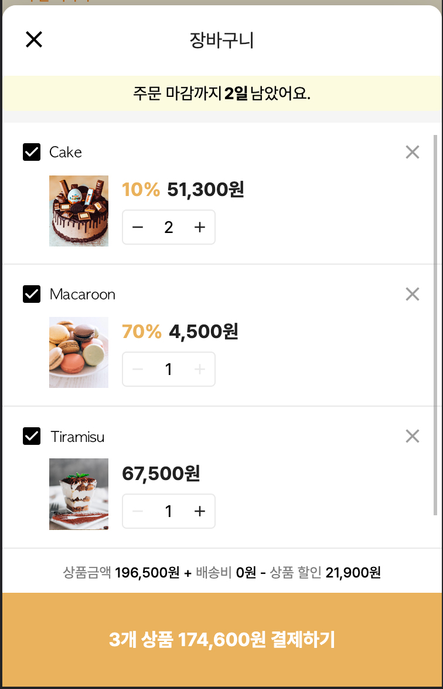

회사에서 개발하던 중 선택된 상품의 배열에서 각 상품의 `store_key`와 `quantity`를 추출해서 결제페이지로 넘겨주는 로직을 개발하고 있었다.

<div style="max-width: 350px">



</div>

**\*api 값**


**\*api에서 추출하려는 값**

```js
// { store_key: quantity } 형식
{ 99ngh08: 2, 5gxyt1q: 1, 3ifu0ie: 1 }
```

<br>

우선 장바구니 상품들중 선택한 상품을 id로 필터하고 map으로 store_key키만 추출한 다음 reduce안에서 다시 filter해서 해당 상품의 수량을 붙여서 코딩을 했다..<br>
(진짜 부끄럽고 지저분하고 개발자답지 못한 코드.. 🤪)
<br><br>

**\*기존코드**

```js
// listItems [선택한 상품의 정보 배열값]
const filteredKey = listItems
  .filter((item) => checkedIds.includes(item.id))
  .map((item) => item.store_key)
  .reduce((acc, cur) => {
    const arr: { [key: string]: number } = acc;

    arr[cur] = listItems.filter((v) => v.store_key === cur)[0]?.quantity;

    return arr;
  }, {});
```

개발하고 나서 코드가 너무 말이 안되는것 같아서 배열을 객체로 바꾸는 법을 검색해서 새로운 코드를 적용해 보았다.

```js
const filteredArray = listItems
  .filter((item) => checkedIds.includes(item.id))
  .map((item) => [item.store_key, item.quantity]);
/*
filteredArray 출력결과
[
  ['99ngh08', 2],
  ['5gxyt1q', 1],
  ['3ifu0ie', 1],
];
*/

const arrayToObject = Object.fromEntries(filteredArray);
/*
arrayToObject 출력결과
{ 99ngh08: 2, 5gxyt1q: 1, 3ifu0ie: 1 }
*/
```

OMG.. 훨씬 깔끔한 코드가 완성됐다. (개인적으로 reduce가 들어가는 순간 깔끔함이 사라진다고 생각하는 사람..) <br><br><br>

## Obejct.fromEntries ?

<div class="blockquote">
    Object.fromEntries(iterable)
</div>  
Object.fromEntries() 메서드는 키-값(key-value) 요소를 갖고 있는 Array를 객체로 바꿔준다. <br>
매개변수 : 반복 가능한 객체. Array, Map 등의 반복 규약을 구현한 객체

```js
// 인자로 배열 넘겨줄 때
const arr = [
  ['0', 'a'],
  ['1', 'b'],
  ['2', 'c'],
];
const obj = Object.fromEntries(arr);
console.log(obj); // { 0: "a", 1: "b", 2: "c" }

// 인자로 Map 넘겨줄 때
const entries = new Map(['foo', 'bar'], ['baz', 42]);
const obj = Object.fromEntries(entries);
console.log(obj); // { foo: "bar", baz: 42 }
```

<br>

## 이 외의 방법

### 1. Object.assign()

해당 포스트(<a href="https://phrygia.github.io/js/2021-09-21-object/" target="_blank">[javascript] Object.assign() & Object.create()</a>)에서는 {}에 대해서만 다뤘기 때문에 배열을 인자로 넘겨주면 자동으로 키값이 생성된다는 걸 몰랐다. 😳 <br>

<div class="blockquote">
    Object.assign(target, ...sources)
</div>  
source에 배열을 전달하면 0, 1, 2처럼 index가 자동으로 key값이 되고, 배열의 요소가 value인 객체가 생성된다.

```js
let arr = ['first', 'second', 'third'];
let obj = Object.assign({}, arr);
console.log(obj); // { 0: 'first', 1: 'second', 2: 'third' }

let arr2 = [
  { id: 1386, quantity: 1 },
  { id: 1385, quantity: 2 },
];
let obj2 = Object.assign({}, arr2);
console.log(obj2);
// { 0: { "id": 1386, "quantity": 1 }, 1: { "id": 1385, "quantity": 2 } }
```

<br>

### 2. Spread operator

Spread operator을 사용하면 배열을 객체로 변환할 수 있다. index가 자동으로 key값이 되고, 배열의 요소가 value인 객체가 생성된다.

```js
let arr = ['first', 'second', 'third'];
let obj = { ...arr };
console.log(obj); // { 0: 'first', 1: 'second', 2: 'third' }

let arr2 = [
  { id: 1386, quantity: 1 },
  { id: 1385, quantity: 2 },
];
let obj2 = { ...arr2 };
console.log(obj2);
// { 0: { "id": 1386, "quantity": 1 }, 1: { "id": 1385, "quantity": 2 } }
```

<br>

### 3. forEach()

Object.assign()이나 Spread operator를 사용하면 key는 자동으로 index가 된다. index가 아닌 특정 key를 사용하고 싶다면 forEach 반복문을 사용한다.

```js
let arr = [
  { id: 1386, quantity: 1 },
  { id: 1385, quantity: 2 },
];
let obj = {};

arr.forEach((elem, index) => {
  obj['key' + index] = elem;
});

console.log(obj);
// { key0: { "id": 1386, "quantity": 1 }, key1: { "id": 1385, "quantity": 2 } }
```

<br>

### 4. reduce()

내가 실무에서 사용했던 reduce.. forEach 사용.

```js
let arr = [
  { id: 1386, quantity: 1 },
  { id: 1385, quantity: 2 },
];

let obj = arr.reduce((acc, cur, index) => {
  return { ...acc, ['key' + index]: cur };
}, {});

console.log(obj);
// { key0: { "id": 1386, "quantity": 1 }, key1: { "id": 1385, "quantity": 2 } }
```

<br>

코딩하면서 비효율적으로 코딩한다고 느끼는 순간이 있고, 아직 기초지식이 많이 부족하다고 느낀다. 자바스크립트 Deep Dive를 열심히 공부해야 겠다..

<small class="from add">참고 : <a href="https://codechacha.com/ko/javascript-convert-array-to-object/" target="_blank">https://codechacha.com/ko/javascript-convert-array-to-object/</a><br>
<a href="https://developer.mozilla.org/ko/docs/Web/JavaScript/Reference/Global_Objects/Object/fromEntries" target="_blank">MDN</a>
</small><br>
