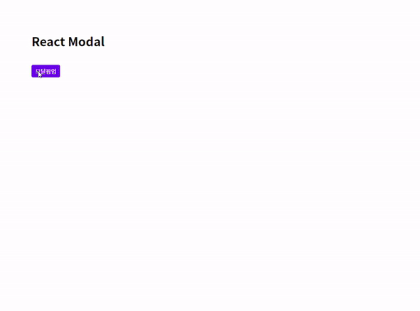

프로젝트를 진행할 때마다 모달창을 마주치는 일이 많다. 프론트엔드 프레임워크나 라이브러리를 사용하면 편리성이나 시간을 아낄 수 있기때문에 npm에 등록된 모듈을 사용하곤 했지만, 만들어진 모듈이 아닌 직접 만들어 재사용해 보기로 했다.
<br><br>

- **어떻게 만들까?**
1. &nbsp;재사용성 고려하기
2. &nbsp;Redux없이 만들기
3. &nbsp;함수형/클래스형 컴포넌트로 각각 만들기

<br>

## 1. 함수형으로 컴포넌트 만들기
<small class="from">-완성된 모습-</small>

 <br><br>

***파일구조** <br>
<div style="text-align: left; display:inline-block;">


</div>

재사용할 컴포넌트로 Modal.js 파일을 만들고, App.js에서 불러오도록 했다. <br><br><br>


**- CSS (함수형/클래스형 공통)**
```css
.modal {
    display: none;
    position: fixed;
    top: 0;
    right: 0;
    bottom: 0;
    left: 0;
    z-index: 99;
    background-color: rgba(0, 0, 0, 0.6);
}
.modal button {
    outline: none;
    cursor: pointer;
    border: 0;
}
.modal > section {
    width: 90%;
    max-width: 450px;
    margin:0 auto;
    border-radius: .3rem;
    background-color: #fff;
    /* 팝업이 열릴때 스르륵 열리는 효과 */
    animation: modal-show .3s;
    overflow: hidden;
}
.modal > section > header {
    position: relative;
    padding: 16px 64px 16px 16px;
    background-color: #f1f1f1;
    font-weight: 700;
}
.modal > section > header button {
    position: absolute;
    top: 15px;
    right: 15px;
    width: 30px;
    font-size: 21px;
    font-weight: 700;
    text-align: center;
    color: #999;
    background-color: transparent;
}
.modal > section > main {
    padding: 16px;
    border-bottom: 1px solid #dee2e6;
    border-top: 1px solid #dee2e6;
}
.modal > section > footer {
    padding: 12px 16px;
    text-align: right;
}
.modal > section > footer button {
    padding: 6px 12px;
    color: #fff;
    background-color: #6c757d;
    border-radius: 5px;
    font-size: 13px;
}
.modal.openModal {
    display: flex;
    align-items: center;
    /* 팝업이 열릴때 스르륵 열리는 효과 */
    animation: modal-bg-show .3s;
}
@keyframes modal-show {
    from {
        opacity: 0;
        margin-top: -50px;
    }
    to {
        opacity: 1;
        margin-top: 0;
    }
}
@keyframes modal-bg-show {
    from {
        opacity: 0;
    }
    to {
        opacity: 1;
    }
}
```
<br>

**- Modal.js**
```js
import React from 'react';
import "../../../assets/css/modal.css";

const Modal = ( props ) => {
    // 열기, 닫기, 모달 헤더 텍스트를 부모로부터 받아옴
    const { open, close, header } = props;

    return (
        // 모달이 열릴때 openModal 클래스가 생성된다.
        <div className={ open ? 'openModal modal' : 'modal' }>
            { open ? (  
                <section>
                    <header>
                        {header}
                        <button className="close" onClick={close}> &times; </button>
                    </header>
                    <main>
                        {props.children}
                    </main>
                    <footer>
                        <button className="close" onClick={close}> close </button>
                    </footer>
                </section>
            ) : null }
        </div>
    )
}
```
<br>

**- App.js**
```js
import React, { useState } from 'react';
import Modal from './commons/components/Modals/Modal';

function App() {
    // useState를 사용하여 open상태를 변경한다. (open일때 true로 만들어 열리는 방식)
    const [ modalOpen, setModalOpen ] = useState(false);

    const openModal = () => {
        setModalOpen(true);
    }
    const closeModal = () => {
        setModalOpen(false);
    }

    return (
        <React.Fragment>
            <button onClick={ openModal }>모달팝업</button>
            //header 부분에 텍스트를 입력한다.
            <Modal open={ modalOpen } close={ closeModal } header="Modal heading">

                // Modal.js <main> { props.children } </main>에 내용이 입력된다. 
                리액트 함수형 모달 팝업창입니다.
                쉽게 만들 수 있어요. 
                같이 만들어봐요!
            </Modal>
        </React.Fragment>
    )
}

export default App
```
<br><br><br>

## 2. 클래스형으로 컴포넌트 만들기
**- Modal.js (재사용 컴포넌트 - 자식)**
```js
import React, { useState } from 'react';
import Modal from '../../../commons/components/Modals/Modal';

export class Modal extends Component {
    render() {
        // 열기, 닫기, 모달 헤더 텍스트를 부모로부터 받아옴
        const { open, close, header } = this.props;

        return (
            <div className={ open ? 'openModal modal': 'modal' }>
                { open ? (  
                    <section>
                        <header>
                            { header }
                            <button className="close" onClick={close}> &times; </button>
                        </header>
                        <main>
                            {this.props.children}
                        </main>
                        <footer>
                            <button className="close" onClick={close}> close </button>
                        </footer>
                    </section>
                ) : null }
            </div>
        )
    }
}
```
<br>

**- App.js (부모 컴포넌트)**
```js
import React, { Component } from 'react';
import Modal from './commons/components/Modals/Modal';

export class ChatRooms extends App {
    this.state = {
        modalOpen: false,
    }

    openModal = () => {
        this.setState({ modalOpen: true })
    }
    closeModal = () => {
        this.setState({ modalOpen: false })
    }
    render() {
        return (
            <React.Fragment>
                <button onClick={ this.openModal }> 모달팝업</button>
                <Modal open={ this.state.modalOpen } close={ this.closeModal } title="Create a chat room">
                    // Modal.js <main> { this.props.children } </main>에 내용이 입력된다. 
                    리액트 클래스형 모달 팝업창입니다.
                    쉽게 만들 수 있어요. 
                    같이 만들어봐요!
                </Modal>
            </React.Fragment>
        )
    }
}
export default App
```
<br>

이로써 어디서든 Modal 컴포넌트를 가지고 와서 재사용할 수 있게 되었다. 모달은 워낙 기본적이고 중요한 부분은 아니라 만들어진 모듈을 사용할때가 많은데, 못만들어서 모듈을 이용하는 것과 만들줄 알지만 너무 할일이 많아서 모듈을 이용하는 건 매우 다르다고 생각되었다. 나는 어느쪽인가 생각해 보다가 만들어 보기로 했고, 생각보다 어렵지 않게 만들 수 있었다. 처음에는 함수형으로 만들었지만 클래스형 컴포넌트의 사용률이 더 높기 때문에 클래스형도 함께 만들어 봤다. 앞으로 작은 프로젝트이거나 커스텀이 필요해서 원하는 모듈이 없을때는 모달창을 직접 만들어 사용할 수 있을 것 같다.
<br><br><br>

```toc

```