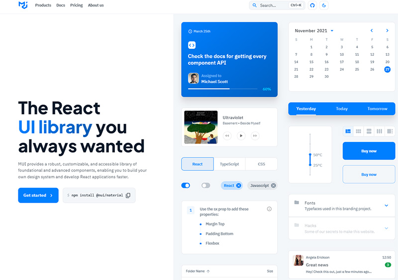
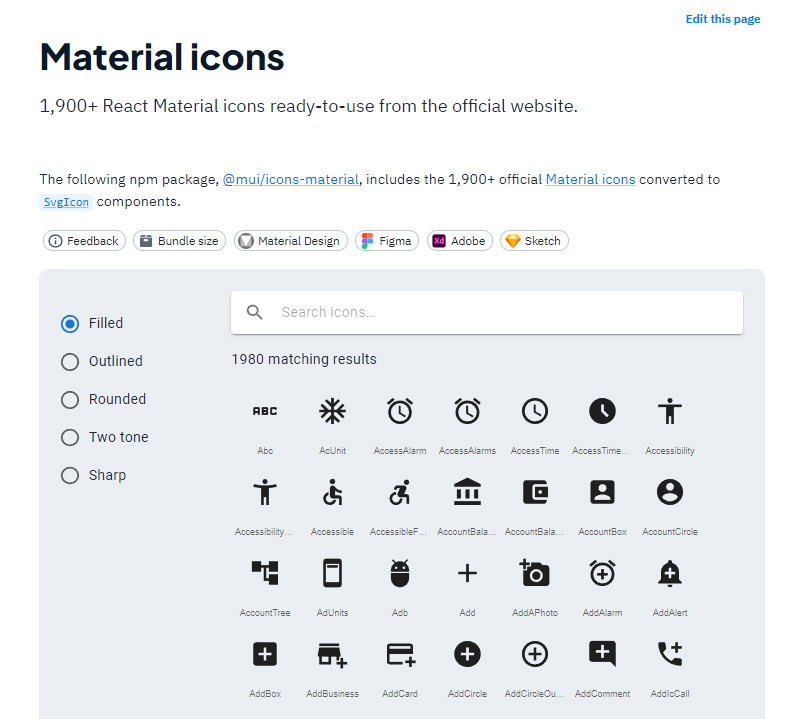
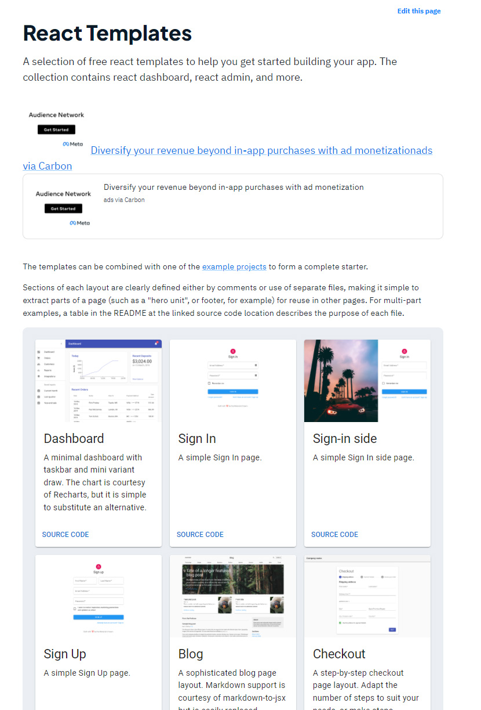
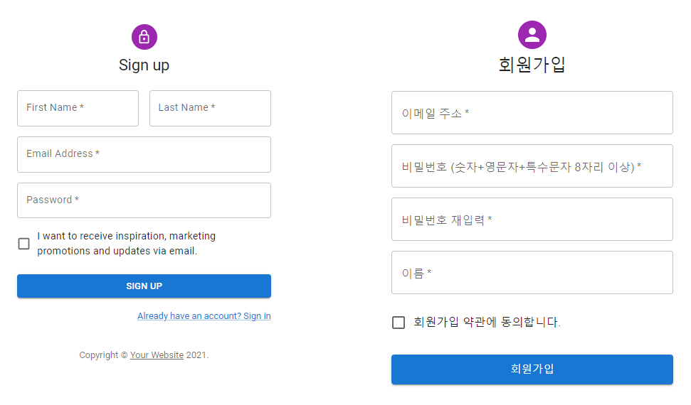
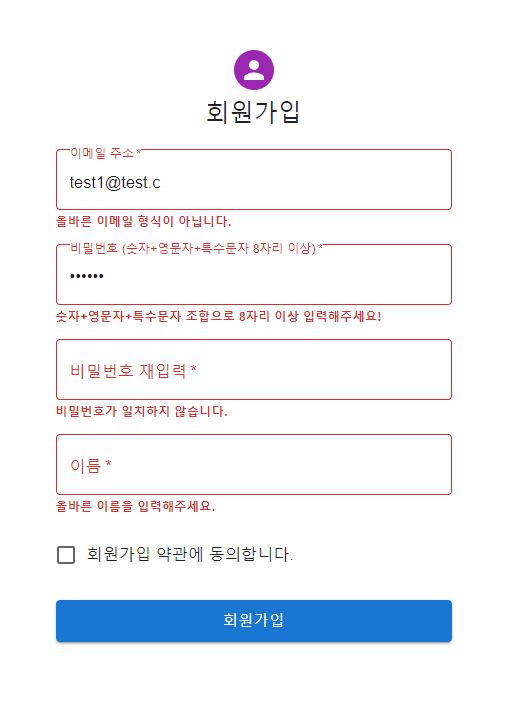
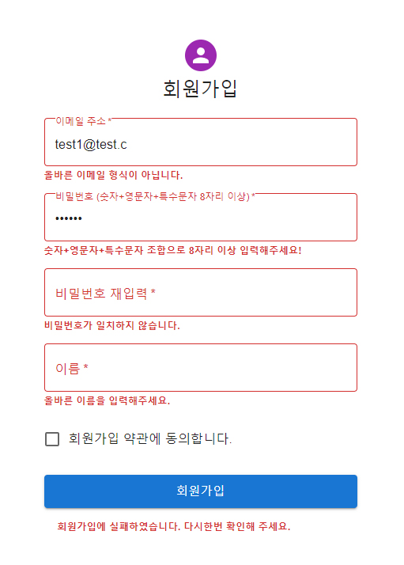

<br>
얼마전부터 사이드 프로젝트를 시작하였다. <br>
프로젝트 인원은 나포함 프론트엔드 개발자 2명, 백엔드 개발자 1명<br>
3명 다 디자인과는 거리가 먼 사람들이었다. <br><br>
사이드 프로젝트의 규모가 큰것도 아니라 디자이너를 구하기가 어려웠다. <br>
디자인적으로 어떻게 할 지 고민을 하다 필자가 사용해본 material ui의 Template를 보고 라이브러리 적용을 권유했고 다른 프론트엔드 개발자분이 사용에 OK해 프로젝트에 적용해 보기로 했다.<br><br>
PS. Material UI가 v5로 업데이트 되면서 MUI로 이름이 변경되었다. 처음에는 비슷한 사이트인지 알고 당황했으나 이름이 변경됐을 뿐! 😅<br><br>
Material-UI (MUI) 홈페이지 : <a href="https://mui.com/" target="_blank">https://mui.com/</a><br><br>

## 1. 설치하기

사용하기 전에 패키지를 설치해야 한다. <br>
npm, yarn 을 이용하여 설치 가능하다. (기본설치)<br>

```js
// with npm
npm install @mui/material @emotion/react @emotion/styled

// with yarn
yarn add @mui/material @emotion/react @emotion/styled
```

<br>
프로젝트에서 styled-components를 사용해서 스타일링 하기로 했다면 styled-components as a styling engine으로 설치한다. <br><br>

```js
// with npm
npm install @mui/material @mui/styled-engine-sc styled-components

// with yarn
yarn add @mui/material @mui/styled-engine-sc styled-components

```

<br><br>
Material에서는 다양한 svg 아이콘도 제공한다.<br>

<br>
Material icons : <a href="https://mui.com/components/material-icons/" target="_blank">https://mui.com/components/material-icons/</a><br>

```js
// with npm
npm install @mui/icons-material

// with yarn
yarn add @mui/icons-material

```

<br>

## 2. 기본 사용법

```js
import * as React from 'react';
import ReactDOM from 'react-dom';
import Button from '@mui/material/Button';

function App() {
  return <Button variant="contained">Hello World</Button>;
}

ReactDOM.render(<App />, document.querySelector('#app'));
```

사용할 컴포넌트를 import 한다. 원한다면 styled-components 등을 이용한 커스터 마이징이 가능하다.<br><br>

## 3. 템블릿 사용하기

<br>
필자는 회원가입쪽 개발을 맡았기 때문에 Sign Up 템플릿을 사용하기로 했다. <br>
Sign Up 하단의 <a href="https://github.com/mui-org/material-ui/tree/master/docs/src/pages/getting-started/templates/sign-up" target="_blank">SOURCE CODE</a>를 눌러 리액트 코드를 복사한다.<br><br>

## 4. 회원가입 (커스터 마이징)

<br>
기본 템플릿은 이름(First Name, Last Name), 이메일, 비밀번호로 구성되어 있다. <br>
필자는 이름을 한칸으로 줄이고 비밀번호 재입력을 추가하고 유효성 검사를 통해 회원가입을 만들었다.

**\*기본틀**

```js
import React, { useState } from 'react';
import {
  Avatar,
  Button,
  CssBaseline,
  TextField,
  FormControl,
  FormControlLabel,
  Checkbox,
  FormHelperText,
  Grid,
  Box,
  Typography,
  Container,
} from '@mui/material/';
import { createTheme, ThemeProvider } from '@mui/material/styles';

const Register = () => {
  const theme = createTheme();
  const [checked, setChecked] = useState(false);

  // 동의 체크
  const handleAgree = (event) => {
    setChecked(event.target.checked);
  };

  // form 전송
  const handleSubmit = (e) => {
    e.preventDefault();
  };

  return (
    <ThemeProvider theme={theme}>
      <Container component="main" maxWidth="xs">
        <CssBaseline />
        <Box
          sx={{
            marginTop: 8,
            display: 'flex',
            flexDirection: 'column',
            alignItems: 'center',
          }}
        >
          <Avatar sx={{ m: 1, bgcolor: 'secondary.main' }} />
          <Typography component="h1" variant="h5">
            회원가입
          </Typography>
          <Boxs component="form" noValidate onSubmit={handleSubmit} sx={{ mt: 3 }}>
            <FormControl component="fieldset" variant="standard">
              <Grid container spacing={2}>
                <Grid item xs={12}>
                  <TextField
                    required
                    autoFocus
                    fullWidth
                    type="email"
                    id="email"
                    name="email"
                    label="이메일 주소"
                  />
                </Grid>
                <Grid item xs={12}>
                  <TextField
                    required
                    fullWidth
                    type="password"
                    id="password"
                    name="password"
                    label="비밀번호 (숫자+영문자+특수문자 8자리 이상)"
                  />
                </Grid>
                <Grid item xs={12}>
                  <TextField
                    required
                    fullWidth
                    type="password"
                    id="rePassword"
                    name="rePassword"
                    label="비밀번호 재입력"
                  />
                </Grid>
                <Grid item xs={12}>
                  <TextField required fullWidth id="name" name="name" label="이름" />
                </Grid>
                <Grid item xs={12}>
                  <FormControlLabel
                    control={<Checkbox onChange={handleAgree} color="primary" />}
                    label="회원가입 약관에 동의합니다."
                  />
                </Grid>
              </Grid>
              <Button
                type="submit"
                fullWidth
                variant="contained"
                sx={{ mt: 3, mb: 2 }}
                size="large"
              >
                회원가입
              </Button>
            </FormControl>
          </Boxs>
        </Box>
      </Container>
    </ThemeProvider>
  );
};
export default Register;
```

<br>

### 유효성 검사하기



사실 유효성검사를 어떻게 작성할지 고민을 많이했다. <a href="https://react-hook-form.com/" target="_blank">react hook form</a>을 사용할지 정규식을 활용해서 검사할지에 대해서 고민했다. <br>
react hook form은 사용이 쉽고 코드가 깔끔해진다는 장점이 있고, 정규식은 코드양이 많아지고 복잡해지지만 스스로 회원가입 form을 만들었다는 기분을 느낄 수 있을 것 같았다.<br>
계속 고민을 하다가 실무에서는 코드량이 많아져 이렇게 못할 것 같은 느낌에 한번쯤은 정규식을 사용해서 회원가입을 만들어보고 싶어 정규식을 사용해서 개발하기로 했다. <br><br>

FormControl이 form으로 작동하는 것 같아 form을 활용하기로 했다. <br>
new FormData를 사용해 TextField에서 지정해준 name으로 input값을 받아온다.<br>
유효성을 검사에 통과하지 못한다면 에러 메시지를 출력해줘야 한다. useState로 메시지를 관리하기로 했다.<br>

```js
// useState 추가
const [emailError, setEmailError] = useState('');
const [passwordState, setPasswordState] = useState('');
const [passwordError, setPasswordError] = useState('');
const [nameError, setNameError] = useState('');

// form 전송
const handleSubmit = (e) => {
  e.preventDefault();

  const data = new FormData(e.currentTarget);
  const joinData = {
    email: data.get('email'),
    name: data.get('name'),
    password: data.get('password'),
    rePassword: data.get('rePassword'),
  };
  const { email, name, password, rePassword } = joinData;

  // 이메일 유효성 체크
  const emailRegex = /([\w-.]+)@((\[[0-9]{1,3}\.[0-9]{1,3}\.[0-9]{1,3}\.)|(([\w-]+\.)+))([a-zA-Z]{2,4}|[0-9]{1,3})(\]?)$/;
  if (!emailRegex.test(email)) {
    setEmailError('올바른 이메일 형식이 아닙니다.');
  } else {
    setEmailError('');
  }

  // 비밀번호 유효성 체크
  const passwordRegex = /^(?=.*[a-zA-Z])(?=.*[!@#$%^*+=-])(?=.*[0-9]).{8,25}$/;
  if (!passwordRegex.test(password)) {
    setPasswordState('숫자+영문자+특수문자 조합으로 8자리 이상 입력해주세요!');
  } else {
    setPasswordState('');
  }

  // 비밀번호 같은지 체크
  if (password !== rePassword) {
    setPasswordError('비밀번호가 일치하지 않습니다.');
  } else {
    setPasswordError('');
  }

  // 이름 유효성 검사
    const nameRegex = /^[가-힣a-zA-Z]+$/;
    if (!nameRegex.test(name) || name.length < 1) {
      setNameError('올바른 이름을 입력해주세요.');
    } else {
      setNameError('');
    }

    // 회원가입 동의 체크
    if (!checked) alert('회원가입 약관에 동의해주세요.');
  };
};

```

<br>TextField 밑에 &ltFormHelperTexts>{emailError}&lt/FormHelperTexts>같은 해당 TextField에 맡는 Error코드를 넣는다. <br>
또한 &ltTextField error={emailError !== '' || false} /> 값을 설정한다.<br>
error 속성은 회원가입 버튼을 눌렀을 때 오류가 발생하면 해당 input을 빨갛게 만들어 주는 값이다. <br>
emailError의 상태가 '올바른 이메일 형식이 아닙니다.' 일때 에러가 발생했고 공백이 아니기 때문에 에러를 발생시킨다는 뜻이다.<br>

```js
<Grid item xs={12}>
    <TextField
        required
        autoFocus
        fullWidth
        type="email"
        id="email"
        name="email"
        label="이메일 주소"
        error={emailError !== '' || false}
    />
</Grid>
<FormHelperTexts>{emailError}</FormHelperTexts>
```

<br>

### 모든 값이 올바르게 채워졌는지 체크하기

<del>유효성을 검사하기는 하지만 회원가입 버튼을 누르면 자꾸 서버에 post요청을 보냈다. <br>
react 코드안에서 if {} else {} 구문에서 return 사용이 까다롭고 생각처럼 작동을 하지 않았다.<br>
고민하다 useState로 유효성 통과 여부를 체크하기로 하였다. setCheckError가 하나라도 false가 된다면 서버 요청이 되지 않는다. <br></del>
**--> 위의 방법으로 했다가 마지막 검사에서 true가 되면 서버로 요청이 되버리는걸 발견했다. 결국 끝부분에 유효성에 관련된 조건문을 걸었다. (코드 효율성이 떨어지는것 같기 때문에 더 좋은 방법을 생각해 봐야겠다.)**

```js

// form 전송
const handleSubmit = (e) => {
    ...

    // 이메일 유효성 체크
    const emailRegex =
      /([\w-.]+)@((\[[0-9]{1,3}\.[0-9]{1,3}\.[0-9]{1,3}\.)|(([\w-]+\.)+))([a-zA-Z]{2,4}|[0-9]{1,3})(\]?)$/;
    if (!emailRegex.test(email)) {
      setEmailError('올바른 이메일 형식이 아닙니다.');
    } else {
      setEmailError('');
    }

    ...

    // 모두 통과하면 post되는 코드 실행 (axios나 fecth등)
    if (
      emailRegex.test(email) &&
      passwordRegex.test(password) &&
      password === rePassword &&
      nameRegex.test(name) &&
      checked
    ) {
      onhandlePost(joinData);
    }
}
```

<br>

## 5. 최종 코드

```js
import React, { useState } from 'react';
import { useHistory } from 'react-router-dom';
import axios from 'axios';
import {
  Avatar,
  Button,
  CssBaseline,
  TextField,
  FormControl,
  FormControlLabel,
  Checkbox,
  FormHelperText,
  Grid,
  Box,
  Typography,
  Container,
} from '@mui/material/';
import { createTheme, ThemeProvider } from '@mui/material/styles';
import styled from 'styled-components';

const FormHelperTexts = styled(FormHelperText)`
  width: 100%;
  padding-left: 16px;
  font-weight: 700;
  color: #d32f2f;
`;

const Boxs = styled(Box)`
  padding-bottom: 40px;
`;

const Register = () => {
  const theme = createTheme();
  const [checked, setChecked] = useState(false);
  const [emailError, setEmailError] = useState('');
  const [passwordState, setPasswordState] = useState('');
  const [passwordError, setPasswordError] = useState('');
  const [nameError, setNameError] = useState('');
  const [registerError, setRegisterError] = useState('');
  const history = useHistory();

  const handleAgree = (event) => {
    setChecked(event.target.checked);
  };

  const onhandlePost = async (data) => {
    const { email, name, password } = data;
    const postData = { email, name, password };

    // post
    await axios
      .post('/member/join', postData)
      .then(function (response) {
        console.log(response, '성공');
        history.push('/login');
      })
      .catch(function (err) {
        console.log(err);
        setRegisterError('회원가입에 실패하였습니다. 다시한번 확인해 주세요.');
      });
  };

  const handleSubmit = (e) => {
    e.preventDefault();

    const data = new FormData(e.currentTarget);
    const joinData = {
      email: data.get('email'),
      name: data.get('name'),
      password: data.get('password'),
      rePassword: data.get('rePassword'),
    };
    const { age, city, email, name, password, rePassword } = joinData;

    // 이메일 유효성 체크
    const emailRegex = /([\w-.]+)@((\[[0-9]{1,3}\.[0-9]{1,3}\.[0-9]{1,3}\.)|(([\w-]+\.)+))([a-zA-Z]{2,4}|[0-9]{1,3})(\]?)$/;
    if (!emailRegex.test(email)) setEmailError('올바른 이메일 형식이 아닙니다.');
    else setEmailError('');

    // 비밀번호 유효성 체크
    const passwordRegex = /^(?=.*[a-zA-Z])(?=.*[!@#$%^*+=-])(?=.*[0-9]).{8,25}$/;
    if (!passwordRegex.test(password))
      setPasswordState('숫자+영문자+특수문자 조합으로 8자리 이상 입력해주세요!');
    else setPasswordState('');

    // 비밀번호 같은지 체크
    if (password !== rePassword) setPasswordError('비밀번호가 일치하지 않습니다.');
    else setPasswordError('');

    // 이름 유효성 검사
    const nameRegex = /^[가-힣a-zA-Z]+$/;
    if (!nameRegex.test(name) || name.length < 1) setNameError('올바른 이름을 입력해주세요.');
    else setNameError('');

    // 회원가입 동의 체크
    if (!checked) alert('회원가입 약관에 동의해주세요.');

    if (
      emailRegex.test(email) &&
      passwordRegex.test(password) &&
      password === rePassword &&
      nameRegex.test(name) &&
      checked
    ) {
      onhandlePost(joinData);
    }
  };

  return (
    <ThemeProvider theme={theme}>
      <Container component="main" maxWidth="xs">
        <CssBaseline />
        <Box
          sx={{
            marginTop: 8,
            display: 'flex',
            flexDirection: 'column',
            alignItems: 'center',
          }}
        >
          <Avatar sx={{ m: 1, bgcolor: 'secondary.main' }} />
          <Typography component="h1" variant="h5">
            회원가입
          </Typography>
          <Boxs component="form" noValidate onSubmit={handleSubmit} sx={{ mt: 3 }}>
            <FormControl component="fieldset" variant="standard">
              <Grid container spacing={2}>
                <Grid item xs={12}>
                  <TextField
                    required
                    autoFocus
                    fullWidth
                    type="email"
                    id="email"
                    name="email"
                    label="이메일 주소"
                    error={emailError !== '' || false}
                  />
                </Grid>
                <FormHelperTexts>{emailError}</FormHelperTexts>
                <Grid item xs={12}>
                  <TextField
                    required
                    fullWidth
                    type="password"
                    id="password"
                    name="password"
                    label="비밀번호 (숫자+영문자+특수문자 8자리 이상)"
                    error={passwordState !== '' || false}
                  />
                </Grid>
                <FormHelperTexts>{passwordState}</FormHelperTexts>
                <Grid item xs={12}>
                  <TextField
                    required
                    fullWidth
                    type="password"
                    id="rePassword"
                    name="rePassword"
                    label="비밀번호 재입력"
                    error={passwordError !== '' || false}
                  />
                </Grid>
                <FormHelperTexts>{passwordError}</FormHelperTexts>
                <Grid item xs={12}>
                  <TextField
                    required
                    fullWidth
                    id="name"
                    name="name"
                    label="이름"
                    error={nameError !== '' || false}
                  />
                </Grid>
                <FormHelperTexts>{nameError}</FormHelperTexts>
                <Grid item xs={12}>
                  <FormControlLabel
                    control={<Checkbox onChange={handleAgree} color="primary" />}
                    label="회원가입 약관에 동의합니다."
                  />
                </Grid>
              </Grid>
              <Button
                type="submit"
                fullWidth
                variant="contained"
                sx={{ mt: 3, mb: 2 }}
                size="large"
              >
                회원가입
              </Button>
            </FormControl>
            <FormHelperTexts>{registerError}</FormHelperTexts>
          </Boxs>
        </Box>
      </Container>
    </ThemeProvider>
  );
};

export default Register;
```

<br>모든 유효성 검사에 통과하면 onhandlePost에 입력값을 넘겨 axios로 서버에 post요청을 보내고 회원가입에 성공하면 로그인 페이지로 이동한다. 요청에 실패하면 registerError를 출력한다.



useState와 정규식을 이용해서 유효성 검사를 했기 때문에 코드가 꽤 복잡해진 느낌이 있다. <br>
똑같은 코드를 react-hook-form으로 바꿔보면 어떻게 바뀔지 궁금하다. <br>
여유로울때 한번 도전해 봐야겠다. :)<br>
mui같은 라이브러리가 있어 디자인적으로 신경을 쓰지 않아도 되서 매우 편리하고 생각보다 깔끔한 디자인이 마음에 든다.<br>

```toc

```
