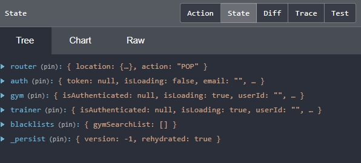

현재 진행하고 있는 팀프로젝트에서 rudux와 redux-saga를 사용하고 있다. <br>
나 외에도 프론트엔드분이 한분 계신데 store에 어떻게 저장할까 하다가 <a href="https://github.com/rt2zz/redux-persist" target="_blank">`redux-persist`</a>를 사용해 보고 싶어 제안해 보았고 동의해 주셔서 redux-persist를 사용하기로 하였다.<br><br>

## redux-persist란 ?

react에서 많이 사용하고 있는 redux는 상태관리로 유명한 라이브러리다. 하나의 store에서 데이터를 관리하면서 상태를 예측가능하게 만들고 유지보수 및 디버깅에 유리하기때문에 순수 js 및 js 라이브러리 및 프레임워크에서 많이 사용한다. <br>
하지만 새로고침을 하면 store의 데이터가 날아가기 때문에, 새로고침을 해도 상태를 유지시키는 기능을 구현해야 한다.
대표적으로 브라우저의 localStorage나 sessionStorage를 이용한 방법이 있는데 직접 코드를 작성해야 하고, store의 데이터가 많아지수록 코드가 복잡해진다는 단점이 있다. <br>

redux-persist는 localstorage와 sessionstorage에 데이터를 저장하고 저장공간에 있는 데이터를 쉽게 불러오게 도와주는 라이브러리다. 초기 설정만 하면 쉽게 데이터를 저장할 수 있다. <br> <br>

**\*필요한 라이브러리**

```js
    npm i connected-react-router redux-devtools-extension redux-persist history
    // or
    yarn add connected-react-router redux-devtools-extension redux-persist history
```

<br>

## redux-persist 설정하기

**\*폴더 구조**

```bash
index.js
redux
    └── reducers
        └── index.js
    └── sagas
        └── index.js
    └── store.js
    └── types.js
```

나는 redux폴더 및에 reducers와 sagas를 나누고 store.js에 이를 통합하여 store를 생성하는 구조로 만들었다.

<br>

**\*reducers/index.js**

```js
import { combineReducers } from 'redux';
import { connectRouter } from 'connected-react-router';
import { createBrowserHistory } from 'history';
import { persistReducer } from 'redux-persist';
import storage from 'redux-persist/lib/storage
// import storageSession from 'redux-persist/lib/storage/session';

export const history = createBrowserHistory();

const persistConfig = {
  key: 'root',
  storage: storage, // or storageSession
  // whitelist: ['']   // 특정 reducer만 사용하고 싶을 때
  // blacklist: [''],  // 특정 reducer를 제외하고 싶을때
};

const rootReducer = combineReducers({
  router: connectRouter(history),
  auth: authReducer,
  ...
});

const persistedReducer = persistReducer(persistConfig, rootReducer);

export default persistedReducer;

```

<br>

- createBrowserHistory() : react-router를 사용하는 경우 history를 props로 전달한다면, 각각의 컴포넌트들은 history, location, match 객체를 props로 부터 제공받아 사용할 수 있다.
- persistConfig = { storage } : localStorage와 storageSession를 선택할 수 있다.
- persistConfig = { whitelist, blacklist } : 속성을 사용하면 store에 저장될 reducer를 설정할 수 있다. (설정하지 않으면 모든 reducer가 저장된다)

<br>

**\*reducers/store.js**

```js
import { createStore, applyMiddleware } from 'redux';
import createSagaMiddleware from 'redux-saga';
import { composeWithDevTools } from 'redux-devtools-extension';
import { persistStore } from 'redux-persist';
import persistedReducer from './reducers';
import rootSaga from './sagas';

const sagaMiddleware = createSagaMiddleware();

export const store = createStore(
  persistedReducer,
  composeWithDevTools(applyMiddleware(sagaMiddleware)),
);

sagaMiddleware.run(rootSaga);

export const persistor = persistStore(store);

export default { store, persistor };
```

<br>

- persistReducer(persistConfig, rootReducer) : persistConfig 가 추가된 rootReducer로 store를 생성한다.
- persistStore : 새로고침을 하거나 브라우저가 종료되도 상태가 지속되는 store를 생성한다.

<br>

**\*index.js**

```js
import React from 'react';
import ReactDOM from 'react-dom';
import App from './App';
import { Provider } from 'react-redux';
import { ConnectedRouter } from 'connected-react-router';
import { history } from './redux/reducers';
import { PersistGate } from 'redux-persist/integration/react';
import { store, persistor } from './redux/store';

ReactDOM.render(
  <Provider store={store}>
    <ConnectedRouter history={history}>
      <PersistGate loading={null} persistor={persistor}>
        <App />
      </PersistGate>
    </ConnectedRouter>
  </Provider>,
  document.getElementById('root'),
);
```

<br>

- ConnectedRouter : provider와 connectedRouter를 사용하면 history 객체를 받아서 사용할 수 있다.

<br>



적용이 완료되었다면 Redux DevTools에서 확인이 가능하다. state에 하단처럼 \_persist값이 생겼고 새로고침해도 데이터가 유지된다.

<br>

**\*사용해 보니 모든 데이터가 저장되기 때문에 저장이 필요없는 값까지 저장이 되버렸다. <br>이는 불필요한 메모리를 증가시킨다. 따라서 blackList를 설정하기 위해 blackList전용 reducer를 생성했다. <br>(이건 좀 귀찮은 방법이고 카테고리벼로 나눈방법에 위배되는 방법이었다. 만약 큰 규모라면 카테고리별로 blackList reducer를 따로 만들었겠지만 나는 하나의 blacklist 파일만 만들어 몽땅 처리했다. <br> 이게 단점이라면 단점이지만 간단한 설정을 통해 자동으로 store에 저장해주는 기능은 정말 편리한 것 같다.**
<br>

```toc

```
