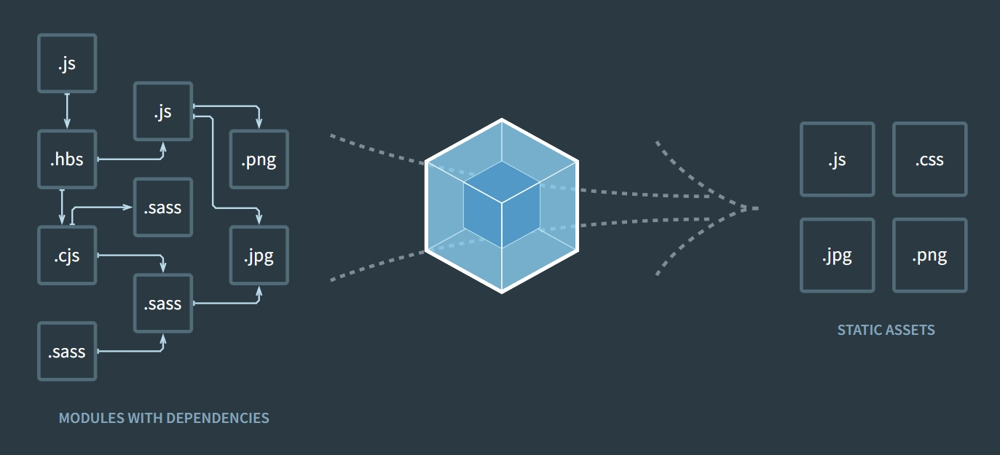
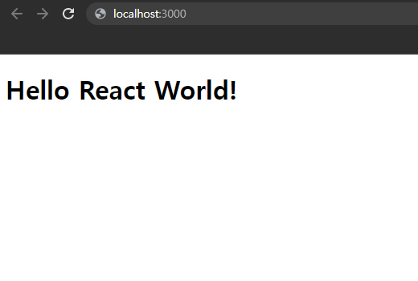

최근 구직활동을 시작하면서 사전과제를 받게 되었다. <br>
나의 포지션은 프론트엔드 개발자로 react 라이브러리를 사용하고 있기때문에 react로 자사 사이트 클론 코딩하고 api 요청에 대한 응답결과를 구현하는 과제였다. <br>
포트폴리오를 만들었을때는 CRA를 사용해서 리액트 프로젝트를 만들었었다. create-react-app 한줄만 입력하면 손쉽게 리액트 프로젝트를 만들 수 있었기 때문이다.<br>

생각해보니 프론트엔드 자격요건이나 우대사항에 webpack & babel에 대한 이해나 지식을 요구하는 경우를 종종 보았는데 직접 설정해서 사용해본적은 인강으로 react를 배웠을때 정도였던 것 같다. 문득 **직접 프로젝트를 설정할 수 있지만 CRA를 사용하는 것과 모르고 사용하는 것의 차이는 매우 크다**는 생각이 들었다.<br>

그래서 마침 사전과제도 요청받았겠다 과제도 하고 내 공부도 할 겸 (꿩먹고 알먹고😋) CRA없이 react 프로젝트를 만들고 프로젝트 환경을 설정해 보기로 했다. <br><br><br>

## 웹팩과 바벨

설정을 시작하기 전에 바벨과 웹팩에 대해 간단하게 알아보자. <br><br>

### 웹팩



<br>

<div class="blockquote">
    웹팩은 자바스크립트 애플리케이션을 위해 여러개의 파일을 하나로 <b>묶어주는</b> 모듈 번들러이다.
</div>

웹팩은 여러 파일을 하나의 파일로 합치는 역할을 하며, 각 모듈간의 의존성을 분석하여 그룹화시켜준다. <br>
(모듈을 하나의 파일이라고 생각하고 각 파일들을 하나로 합쳐준다고 생각하면 쉽다.)
프로젝트에 사용되는 많은 라이브러리들을 빌드과정을 통해 html이 실행할 수 있는 하나의 파일로 합쳐준다.<br>
js, jsx뿐만 아니라 css, 폰트, 이미지 등 다양한 파일을 번들링 할 수 있다.<br><br>

**\*웹팩이 필요한 이유**

1. 파일 단위의 자바스크립트 모듈 관리의 필요성 : 전역변수 오염 방지
2. 웹 개발 작업 자동화 도구 : 적용 → 새로고침의 문제 해결, 용량이 큰 파일 자동 압축 등
3. 웹 애플리케이션의 빠른 로딩 속도와 높은 성능 → 로딩속도를 높여 사용자 이탈 방지 등

<br>

### 바벨

<div style="display:inline-block">


</div>

<br>
<br>

<div class="blockquote">
    바벨은 ES6+ 버전 이상의 자바스크립트 코드를 하위 버전의 자바스크립트 문법으로 <b>변환</b> 시켜준다. 
</div>

바벨 웹사이트를 방문하면 `Babel is a Javascript compiler`이란 문구가 보인다. <br>
문구 그대로 바벨은 자바스크립트 컴파일러다. 자바스크립트의 특정 문법, 타입스크립트, JSX 등의 문법은 웹 브라우저에서 지원하지 않는 경우가 많은데 호환 가능한 ES5이하의 문법으로 변환 해준다. <br><br>

**\*바벨이 필요한 이유**

1. 크로스 브라우징 (호환성) : 오래된 브라우저 유저들을 고려하고 모든 브라우저에서 동작하기 위해 사용
2. 개발자를의 편리성: 브라우저의 호환여부를 따지지 않고 최신문법 사용이 자유롭기 때문에 개발의 효율성이 증가

<br><br>

## 개발환경 구축

### 1. package.json 생성 및 react 설치

- react : 리액트 코어 라이브러리
- react-dom : 리액트와 DOM을 연결

```js
// package.json 생성
yarn init -y

yarn add react react-dom
```

<br>

### 2. 바벨설치

- @babel/core : 바벨 코어
- @babel/preset-react : 리액트의 JSX 코드를 트랜스파일링
- @babel/cpreset-env : ES6+ 코드를 ES5 코드로 트랜스파일링 (+폴리필 자동화)

```js
yarn add -D @babel/core @babel/preset-react @babel/preset-env
```

<br>

### 3. 웹팩과 관련 모듈(loader) 설치

- webpack : 웹팩 코어
- webpack-cli : 터미널의 커맨드라인에서 웹팩 사용
- webpack-dev-server : 웹팩을 메모리 상으로만 빌드한 결과물을 개발 서버에 구동
- babel-loader : ES6+, JSX 문법을 트랜스파일링
- css-loader : CSS 코드를 JS로 변환
- style-loader : 변환된 css파일을 index.hmtl의 &lt;style&gt;태그에 삽입
- file-loader : 이미지, 폰트 등의 파일 로딩
- json-loader : json 파일 로딩
- dotenv : .env 파일을 환경변수에 대신 설정해줌

```js
// webpack 설치
yarn add -D webpack webpack-cli webpack-dev-server

// 관련모듈 설치
yarn add -D babel-loader css-loader style-loader file-loader

// 나는 프로젝트에서 json을 사용했기 때문에 추가로 설치했다. (선택)
yarn add -D json-loader

// .env 파일을 사용한다면 설치 (선택)
yarn add dotenv
```

<br>

웹팩으로 번들링 한 후의 파일에 적용할 플러그인을 설치한다.

- html-webpack-plugin : html 파일에 번들링된 JS 코드를 삽입하고 dist 폴더에 번들링된 결과물을 옮겨줌
- clean-webpack-plugin : 번들링을 할 때 마다 이전의 번들링 결과를 제거

```js
yarn add -D html-webpack-plugin clean-webpack-plugin
```

<br>

### 4. 바벨, 웹팩 설정

프로젝트 루트에 `babel.config.js` 파일을 만들고 프리셋을 설정한다.

```js
// babel.config.js
module.exports = {
  presets: ['@babel/preset-env', '@babel/preset-react'],
};
```

<br>

프로젝트 루트에 `webpack.config.js` 파일과 `.env`파일을 만든다. <br>
(웹팩 설정에 따라 프로젝트 결과물이 달라질 수 있으며, 설정 옵션이 많기 때문에 webpack 사이트를 참고하면서 필요한 설정을 하면 된다.)

```js
//.env
MODE = 'development'; // development(개발 모드), production(프로덕션 모드)
PORT = '3000';
```

```js
// webpack.config.js
const webpack = require('webpack');
const HtmlWebpackPlugin = require('html-webpack-plugin');
const { CleanWebpackPlugin } = require('clean-webpack-plugin');
const dotenv = require('dotenv').config();

module.exports = {
  mode: process.env.MODE, // 만약 환경변수를 사용하지 않는다면 직접 'development' 입력
  entry: './src/index.js',
  output: {
    // 번들링 결과 : /dist폴더
    path: __dirname + '/dist',
    // bundle.해쉬.js로 생성
    filename: 'bundle.[hash].js',
    publicPath: '/',
  },
  resolve: {
    // 번들링을 할 파일 설정
    extensions: ['.js', '.jsx'],
  },
  module: {
    // loader 설정 - 등록한 로더의 뒤의 요소부터 번들링에 반영
    // node_modules 제외
    rules: [
      {
        test: /\.(js|jsx)$/,
        exclude: '/node_modules/',
        loader: 'babel-loader',
      },
      {
        test: /\.css$/,
        use: [{ loader: 'style-loader' }, { loader: 'css-loader' }],
      },
      {
        test: /\.(png|jpe?g|gif|svg)$/i,
        loader: 'file-loader',
        options: {
          name: 'assets/[contenthash].[ext]',
        },
      },
    ],
  },
  plugins: [
    // 빌드 이전 결과물을 제거
    new CleanWebpackPlugin(),
    // 번들한 css파일과 js파일을 html 파일에 link 태그, script태그로 추가
    new HtmlWebpackPlugin({
      template: 'public/index.html',
    }),
    // 환경 정보를 제공
    new webpack.DefinePlugin({
      mode: process.env.MODE,
      port: process.env.PORT,
    }),
  ],
  devServer: {
    host: 'localhost',
    port: process.env.PORT,
    open: true,
    historyApiFallback: true,
    // hot : 모듈의 변화된 부분만 서버에 자동으로 반영
    hot: true,
  },
};
```

<br>

- start : 개발서버에서 리액트 프로젝트 수행
- build : dist 폴더에 번들링된 파일 생성

```js
// package.json
"scripts": {
  "start": "webpack-dev-server --progress --mode development",
  "build": "webpack --progress --mode production"
}
```

<br>

### 5. 리액트 컴포넌트 생성

루트에 public 폴더를 만들고 index.html 파일을 만든다. <br>

```html
<!DOCTYPE html>
<html lang="ko">
  <head>
    <meta charset="UTF-8" />
    <meta name="viewport" content="width=divice-width, initial-scale=1.0" />
    <meta http-equiv="X-UA-Compatible" content="ie=edge" />
    <title>title</title>
  </head>
  <body>
    <div id="root"></div>
  </body>
</html>
```

<br>

src 폴더를 생성하고 index.js와 App.js 파일을 만들고 다음과 같이 입력한다.

```js
// index.js
import React from 'react';
import ReactDom from 'react-dom';
import App from './App';

// public/index.html 파일에서 root아이디를 가진 DOM에 랜더
ReactDom.render(<App />, document.getElementById('root'));
```

<br>

```js
// App.js
import React from 'react';

const App = () => {
  return (
    <div className="App">
      <h1>Hello React World!</h1>
    </div>
  );
};
export default App;
```

<br>
<br>

`yarn start`로 프로젝트 실행하면 서버가 실행된다.

<div style="display:inline-block">



</div>

`yarn build` 명령어를 실행하면 dist 파일에 번들링 된 결과물인 bundle.js와 index.html이 생성된다.

<br><br>

## 포스팅을 마치며..

처음에는 babel-loader와 css-loader style-loader만 설치해서 설정했었다. 근데 코딩하면서 import로 이미지를 불러오는 것도 json을 불러오는 것도 전부 설정이 필요하다는 것을 알게 되었다. <br>
그동안 CRA가 한번에 설치해주는게 얼마나 편한지 알게되었고, webpack과 babel이 어렵다는 막연한 두려움을 해소해주는 계기가 되었다. 😉<br>
(나중에 scss-loader도 웹팩에 추가해서 사용해봐야지...)<br><br>

⚙ prettier나 es-lint까지 설정하면 개발 효율성이 더욱 높아질 것 같다.

<br>

```toc

```
