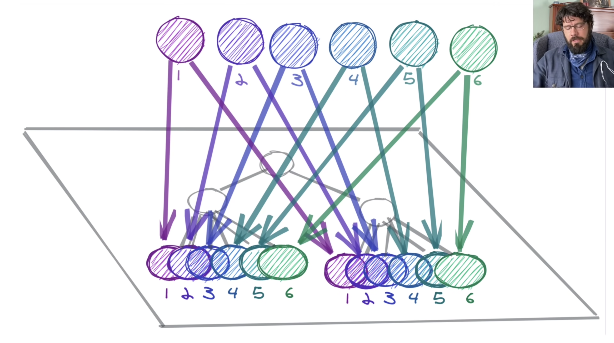

회사의 새로운 프로젝트에서 React query와 함께 Recoil을 써보고 싶다는 생각이 들었다. <br>
우리 회사는 전역적으로 관리할 상태들이 많지 않아 쉽게사용할 수 있는 Context API를 사용하고 있다. <br>
나는 React를 공부할때 Redux를 사용해봤기 때문에 Redux의 복잡한 코드가 너무 싫었다. 전역적으로 사용하기 위한 초기 세팅도 복잡하고 여러모로 나와 맞지 않는다는 생각이 들었다. devtools가 잘 되어있기 때문에 어떤 액션이 취해졌고 데이터가 어떻게 변경되었는지에 대한 디버깅이 유리하다는 큰 장점이 있지만 많은 상태관리가 필요하지 않은 우리 회사의 상황에서 좋아하지도 않는 Redux를 사용하고 싶지는 않았다. <br>
Context API를 사용해도 되지만 React query와 Recoil의 궁합이 좋다는 글을 Recoil을 써볼까라고 쉽게한 생각이 Recoil의 가벼움과 React스러운 부분이 마음에 들어 공부해서 꼭 사용해보자고 생각하는 계기가 되었다.<br><br>

## Recoil?

> `A state management library for React.` - React를 위한 상태관리 라이브러리 <br> 1. 작고 React스러운 <br> 2. 데이터 흐름 그래프 <br> 3.
> 교차하는 앱 관찰 <br>

Recoil은 React를 만든 메타(페이스북)에서 만든 상태관리 라이브러리이다. React를 만든 회사에서 직접 상태관리 라이브러리를 만들어 주었으니 React스러운건 당연하다고 할 수 밖에 없다. <br>
유명한 상태관리 라이브러리인 Redux, Mobx 등이 있지만 상대적으로 후발 주자인 Recoil을 선택한 이유를 나열해 보자면, <br>

1. React를 사용해본 개발자라면 상대적으로 배우기 쉽다. <br>
   특히 Hooks를 사용하는 프론트 개발자들이라면! Redux가 초기 세팅부터 숨이 막히는 반면 Recoil은 RecoilRoot로 최상위에 감싸기만 하면 되는 등 사용이 비교적 쉽다.
2. Redux에서 비동기통신의 Success/fail의 결과에 따른 state를 관리하기 위해선 redux-thunk, redux-saga같은 미들웨어를 사용하여 구현해야 하는데, Recoil은 미들웨어의 사용없이 쉽게 비동기 로직을 구현할 수 있다.(Suspense에 위임하여 비동기 처리)
3. React스럽다. <br>
   state의 값을 읽고 쓰기위해 useState와 비슷한 [get, set] 형태를 사용하며 빠르고 유연한 상태를 유지한다.
4. 자체 캐싱기능으로 빠른 비동기 데이터 처리가 가능하다.
5. 상태를 분산적으로 둘 수 있기 때문에 코드 스플리팅이 가능하다. <br><br>

## Recoil 시작하기

```js
// recoil 설치
npm install recoil
yarn add recoil

// recoil 시작 - index.jsx
import React from 'react';
import ReactDOM from "react-dom/client";
import { RecoilRoot } from 'recoil';
import App from "./App";

const root = ReactDOM.createRoot(document.getElementById("root"));
root.render(
  <RecoilRoot>
    <App />
  </RecoilRoot>
);
```

<br>

## Recoil 핵심 개념

Recoil에는 다양한 API가 존재하지만 공식문서에서 소개하는 기본 API는 크게 2가지가 있다. 바로 <a href="https://recoiljs.org/ko/docs/basic-tutorial/atoms" target="_blank">Atoms</a>와 <a href="https://recoiljs.org/ko/docs/basic-tutorial/selectors" target="_blank">Selectors</a>다.

<small class="from">이미지 출처 : <a href="https://ichi.pro/ko/recoil-js-dansunhwa-doen-reactleul-wihan-goseongneung-sangtae-gwanli-223553121461863" target="_blank">https://ichi.pro/ko/recoil-js-dansunhwa-doen-reactleul-wihan-goseongneung-sangtae-gwanli-223553121461863</a></small> <br>
Recoil은 방향이 있는 그래프가 직교한 형태로 리액트 컴포넌트 트리에 붙어있게 만들어 준다. 이 그래프의 루트에서부터 상태 변화가 일어나는데 이 루트를 우리는 아톰(atom)이라고 한다. 그리고 이 과정은 순수함수를 통해서 일어나며 이를 선택자(selector)라고 한다. <br><br>

### 1. Atoms

 <br>
<small class="from"><a href="https://www.youtube.com/watch?v=_ISAA_Jt9kI" target="_blank">https://www.youtube.com/watch?v=\_ISAA_Jt9kI</a></small> <br>
Atom은 **하나의 작은 상태 단위**로 **업데이트 및 구독이 가능**하다. <br>
Atom이 업데이트 되면 구독하고 있는 컴포넌트들은 리렌더링이 일어나며 하나의 Atom을 구독하는 컴포넌트가 여러개라면 그 컴포넌트들은 상태를 공유한다. <br>
(Atom은 비눗방울로 추상화 할 수 있는데 React 애플리케이션의 상단에 Atom이 비눗방울처럼 떠나닌다고 생각해보자. 개발을 하다가 어떤 비눗방울 (상태)이 필요하다면 해당하는 비눗방울만 선택해서 사용할 수 있다.) <br>

전역적으로 사용될 state인 비눗방울(atom)을 생성하려면,

```js
// state 파일 - store.js
import { atom } from 'recoil';

export const textState = atom({
  key: 'textState', // unique key
  default: '',
});
```

```js
// TodoList.jsx
import { useSetRecoilState } from 'recoil';

const TextInput = () => {
  const [text, setText] = useRecoilState(textState);

  const onChange = (event) => {
    setText(event.target.value);
  };

  return (
    <div>
      <input type="text" value={text} onChange={onChange} />
      <br />
      Echo: {text}
    </div>
  );
};

export default TextInput;
```

`atom`에 고유한 key와 default값을 설정하고 컴포넌트에서 `useRecoilState`를 사용하여 해당 state를 [get, set] 할 수 있다. (이때 여러 컴포넌트에서 textState를 구독하고 있다면 해당 컴포넌트들은 상태를 공유한다.) <br><br>

```js
// TodoList.jsx
import { useSetRecoilState, useRecoilValue } from 'recoil';

const TextInput = () => {
  const setText = useRecoilState(textState);
  const text = useRecoilValue(textState);

  const onChange = (event) => {
    setText(event.target.value);
  };

  return (
    <div>
      <input type="text" value={text} onChange={onChange} />
      <br />
      Echo: {text}
    </div>
  );
};

export default TextInput;
```

`useSetRecoilState`로 [get, set]을 모두 사용할 수 있지만, `useRcoilValue`를 사용하면 get과 set을 분리 할 수 있다. <br>
특정 state의 값을 참고만 할때 `useRcoilValue`를 사용하자.

<br>

### 2. Selectors

`selector`는 `atom`이나 다른 `selector`들을 구독해서 `파생된 상태(derived state)`를 리턴하는 순수 함수이다. <br>
파생된 상태 : `atom`을 원하는대로 변형해 유도된 새로운 값.

```js
// store.js
export const purchasedBreadAtom = atom({
  key: 'purchased Bread',
  default: {
    price: 000,
    // ....
  },
});

export const purchasedBeverageAtom = atom({
  key: 'purchased Beverage',
  default: {
    price: 000,
    // ....
  },
});
```

```js
// PriceResult.jsx
import { selector, useRecoilValue } from 'recoil';

const priceSelector = selector({
  key: 'priceSelector',
  get: ({ get }) => {
    const bread = get(purchasedBreadAtom);
    const beverage = get(purchasedBeverageAtom);

    return (bread?.price || 0) + (beverage?.price || 0);
  },
});
```

`selector`는 내부적으로 함수에서 get을 매개변수로 넘겨서 사용할 수 있는데, get 메서드는 `atom`과 다른 `selector`에 접근할 수 있다. <br>
다른 `atom`이나 `selector`에 접근할 때 마다 의존성 관계가 만들어져서 다른 `atom`을 업데이트하거나 `selector`가 다시 계산이 되기도 한다. `selector`는 `useRecoilValue`로 값을 읽을 수 있다.

<br>

```js
const PriceResult = () => {
  const priceReulsts = useRecoilValue(priceSelector);

  return (
    <div>
      <p>bread Price + beverage Price = {priceReulsts}</p>
    </div>
  );
};

export default PriceResult;
```

<br>
기본적인 Recoil API에 대해 알아보았다. 다음에는 로그인했을 때 사용자의 정보를 Recoil을 이용해 전역 상태로 유지하는 방법에 대해 공부해 봐야 겠다.<br>

<div class="from add">
    <ul>
        <li>- 참고 <a href="https://recoiljs.org/ko/" target="_blank">https://recoiljs.org/ko/</a></li>
        <li><a href="https://devowen.com/366" taget="_blank">https://devowen.com/366</a></li>
        <li><a href="https://tech.osci.kr/2022/06/16/recoil-state-management-of-react/" target="_blank">https://tech.osci.kr/2022/06/16/recoil-state-management-of-react/</a></li>
        <li><a href="https://blog.bitsrc.io/react-trying-recoil-js-d505214373c6" target="_blank">https://blog.bitsrc.io/react-trying-recoil-js-d505214373c6</a></li>
    </ul>
</div>

```toc

```
