<div style="max-width: 450px;">

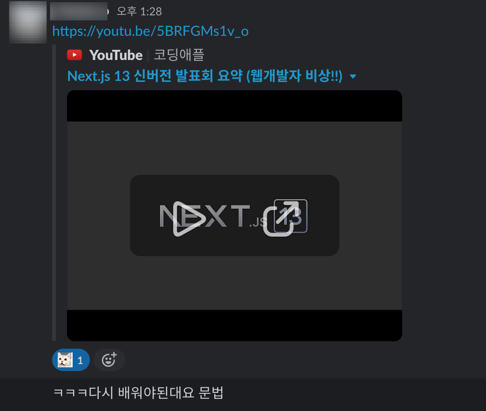

</div>

어느날 사수가 갑작스럽게 보내준 링크. <small class="from notline"><a href="https://www.youtube.com/watch?v=5BRFGMs1v_o&t=1s" target="_blank">(Next.js 13 신버전 발표회 요약 (웹개발자 비상!!))</a></small> <br>
나는 프론트엔드 웹개발자로 React를 사용하고 있고 우리회사는 production에서 많이 사용되고 편리한 Next.js를 사용중이다. <br>
사실 사수가 저 링크를 보내주기 전까지 우리 회사가 무슨 버전을 쓰는지도 모르고 신경조차 쓰지 않았다. <br>
핑계를 대자면 나는 이제 막 5개월이 지난 신입 개발자라 Next.js를 배우는데 더 신경을 썼었고 입사 초반에 우리집 어린 고양이가 급성신부전으로 입원해서 심리적으로 힘들었었고 8월말에 걸린 코로나 + 후유증, 무너진 워라벨, 어린 고양이의 만성 신부전 판정으로 멘탈과 체력, 돈까지 탈탈 털려서 시키는 일적인 코딩외에 아무 생각도 하지 않았다. <br><br>
그러다 최근 정신차리고 멘탈관리 및 커리어를 위해 다시 개발공부를 시작하려던 차에 사수가 보내준 링크와 사이드프로젝트에서 만난 프론트 개발자분과 13버전을 공부하기로 하면서 그동안 내가 써왔던 문법은 Next.js 9.3이후에 만들어진 메소드인걸 알게 되었다. <br><br>

## Next.js의 주요기능

1. automatic routing : /pages 폴더에 있는 파일은 자동 라우팅
2. code splitting : 자동 코드 분할로 빠른 로딩
3. pre-rendering, SSG/SSR : 페이지 단위로 지원되어 쉽게 사용가능
4. Fast Refresh 지원 : 컴포넌트 수정에 대한 빠른 피드백을 제공
5. 내장 CSS, Sass 지원 모든 CSS-in-JS 라이브러리 지원 : 손쉽게 scss/module.css 사용 가능
6. typescript: 별다른 webpack 설정없이 typescript를 설치하면 바로 사용 가능

<br>

## Next.js 13

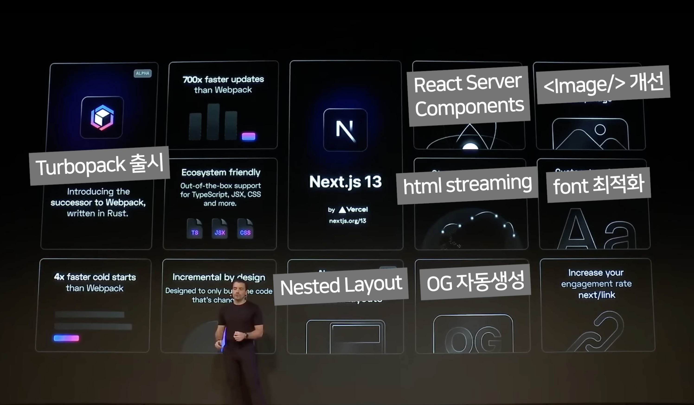
<small class="from">https://www.youtube.com/watch?v=5BRFGMs1v_o&t=1s 캡쳐</small>

10월 26일 <a href="https://nextjs.org/conf" target="_blank">Next.js Conf</a>에서 <a href="https://nextjs.org/blog/next-13" target="_blank">Next.js 13버전</a>이 새롭게 발표됐다.<br>
공식문서에서 설명하고 있는 대표적인 변화점은,

1. **app/Directory** <br>
   - Layouts : 리렌더링 방지를 기본으로 구현한 Layout<br>
   - React Server Component : React 의 새로운 Server Component 지원하여 로딩 속도 개선<br>
   - Streaming : 점진적으로 스트리밍 되어 UI 렌더링 할 수 있는 Streaming
2. **Turbopack** (alpha) : 웹팩보다 700배 빠른 Rust 기반의 대체품
3. **New Next/image** : 빨라진 lazy loading (Google과 협업으로 기존 로딩 퍼포먼스를 저해하던 요소들 개선)
4. **New @next/font** (beta) : 빌드타임 때 최적화를 시키면 구글 폰트가 기본으로 내장 (폰트 최적화)
5. **Improved next/link** : 기존 &lt;Link&gt;안에 사용되던 &lt;a&gt; 태그 불필요

<br>

### 최신 Next.js 설치하기

```js
npm i next@latest react@latest react-dom@latest eslint-config-next@latest
```

<br>
설치를 완료하니 3개의 파일/폴더가 있고, react 18.2.0, next 13.0.2 버전이 설치되어 있다. <br><br>

<div style="max-width: 550px;">

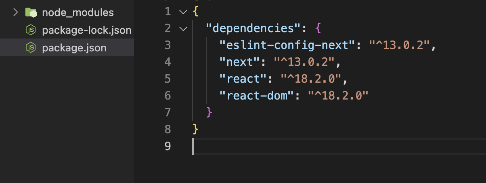

</div><br>

### 1. app/Directory (beta)

<div style="display:inline-block; max-width: 210px;">

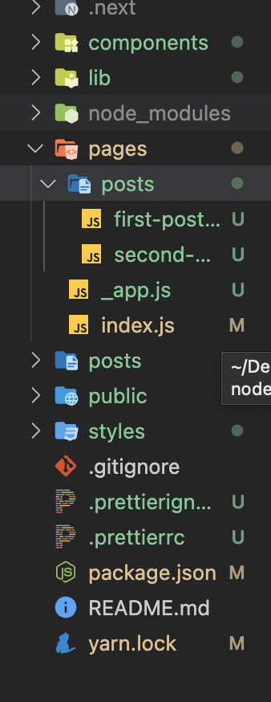

</div> <br>

기존의 Next.js는 별도의 라우터 설정없이도 `pages` 디렉토리 안에 파일을 생성하면 즉시 경로를 생성할 수 있었다. (automatic routing) <br>
Next.js 13에서는 `app` 디렉토리가 새롭게 등장하였다. (현재 포스팅하는 날짜 기준으로 `pages`와 `app` 디렉토리가 공존할 수 있는 beta 버전이기 때문에 production에서의 사용을 권장하지 않고 있다.) <br>
`app` 디렉토리는 아래에 등장하는 4가지가 포함된다.<br><br>

#### 1) Layouts

공통으로 사용되는 UI 컴포넌트를 layout 파일안에 위치시키면 불필요한 리렌더링을 방지를 하고 컴포넌트간의 상호 작용을 쉽게 구현할 수 있다.

<div style="max-width: 570px;">

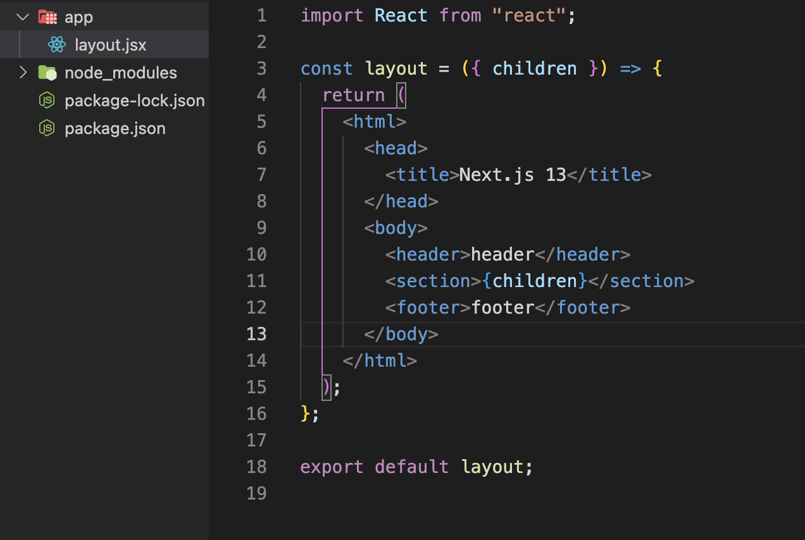
</div>

**layout 파일만 생성해서 실행하려고 하니 다음과 같은 에러 메시지가 떴다**

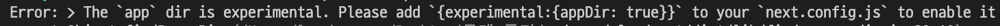

next.config.js파일을 생성하여 다음 코드를 추가하자.

```js
module.exports = {
  experimental: { appDir: true },
};
```

다시 실행하니 이번에는 404에러 페이지(This page could not be found)가 떴다. 원인은 page 파일을 생성하지 않아서였다. <br>
**`app` 디렉토리안에 layout과 page 파일을 함께 만들어야 실행된다.** (기존 `pages`의 index 파일과 비슷하다.) <br>
dynamic routes를 사용하려면 기존의 index였던 이름을 page로 바꾸기만 하면 된다.

<div style="max-width: 570px;">

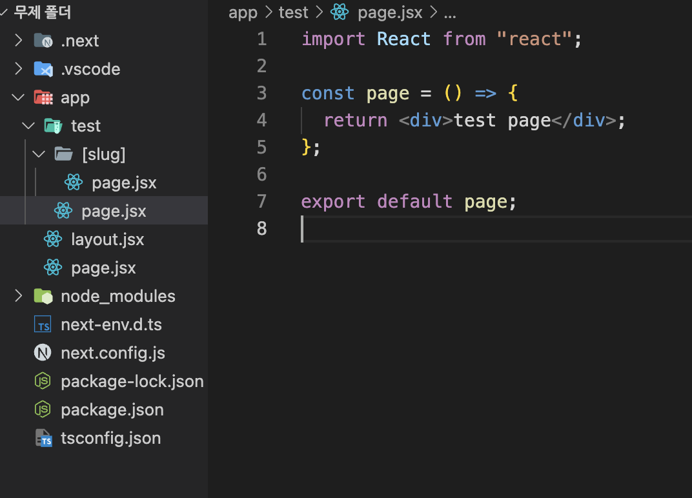

</div>

<div style="max-width: 550px;">

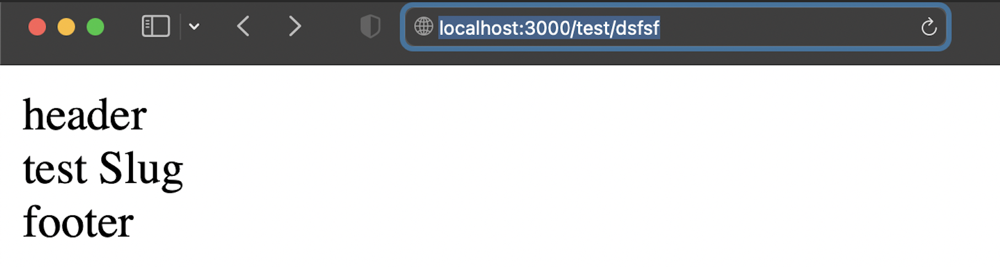
</div>

정상적으로 실행되었다! 기존에는 페이지마다 Layout 컴포넌트를 불러와야하는 번거로움이 있었는데 성능에도 좋고 편리해진점이 마음에 든다. 👍<br><br>

#### 2) Server Components

React의 새로운 <a href="https://ko.reactjs.org/blog/2020/12/21/data-fetching-with-react-server-components.html" target="_blank">Server Components</a> 아키텍처에 대한 지원으로 나온듯한 업데이트 <br>
서버 구성 요소를 사용 하여 클라이언트에 전송되는 JavaScript의 양을 줄이면서 더 빠른 초기 페이지 로드를 가능하게 하는 동시에 복잡한 인터페이스를 구축할 수 있는 기반을 마련하고 있다고 하는데.. <br>
→ 아직 Server Components에 대한 개념이 부족해서 이부분은 공부를 해야겠다.
<br><br>

#### 3) Streaming

`app` 디렉토리에 lodaing이라는 예약파일을 생성하면 데이터를 가져오는 부분에서 로드 상태를 표시해주는 컴포넌트다. <br>
Server Components와 layout 예약파일과 함께 사용하면 데이터가 필요하지 않은 부분은 화면에 먼저 표시되고 데이터가 필요한 부분은 loading에 작성한 내용이 먼저 표시된 후 로드가 완료되는 실제 내용이 표시된다. <br>
로딩스피너같은 로딩중임을 나타내는 컴포넌트를 넣으면 따로 작업하지 않아도 자동으로 로딩중임을 보여주는 편리한 기능인 것 같다.


#### 4) Support for Data Fetching

이전의 Next.js에서 data를 fetch하기 위해선 getServerSideProps나 getStaticProps를 사용하여 데이터를 가지고 왔었다. 사실 저부분 코드가 예쁘지도 약간 난해한 느낌이었는데 Next.js 13에서는 좀더 직관적으로 쉽게 바꼈다!

<div style="max-width: 550px;">

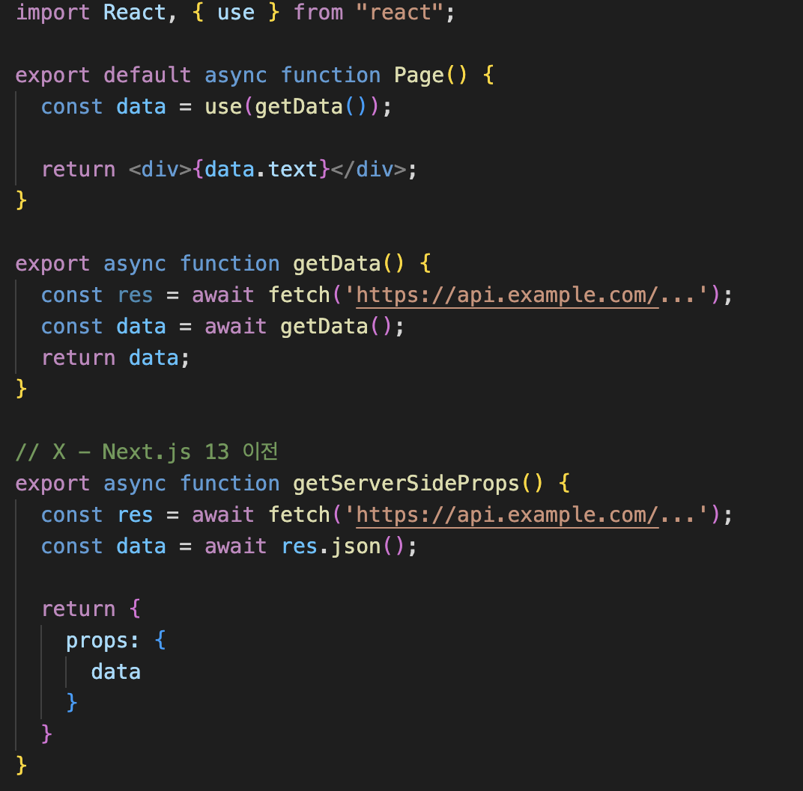
</div>
아래처럼 getStaticProps를 통해 받아온 응답데이터를 props로 넘겨준 후 파라미터로 받아왔다면 Next.js 13에서는 use를 사용해 fetch 함수를 실행해주면 된다. <br>
fetch 함수 뒤에 cache, next 옵션을 추가할 수 있다.

```js
// getStaticProps와 비슷 - 빌드 시 딱 한번만 호출
fetch(URL, { cache: 'force-cache' });

// getServerSideProps와 비슷 - 매 요청때마다 호출
fetch(URL, { cache: 'no-store' });

// getStaticProps의 revalidate 옵션을 사용하는 것과 비슷
fetch(URL, { next: { revalidate: 10 } });
```

<br>

### 2. Turbopack

<div style="max-width: 300px; margin: 0 auto;">

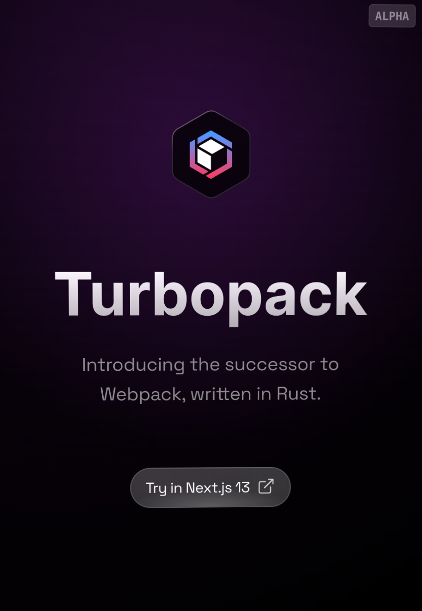
</div>

새로운 Rust기반의 Js 번들링 툴로, 
- webpack보다 700배 빠른 업데이트
- Vite보다 10배 빠른 업데이트
즉 Webpack보다 빠르게 번들링 해주는 새로운 툴인데.. 이게 진짜라면 엄청 유용할 것 같지만 아직 beta 버전이고 webpack자체도 좋기때문에 좀 더 안정화되면 사용해보는게 좋을 것 같다. <br><br>

### 3. Next/image
새로운 Image 구성 요소가 도입되어 레이아웃 변경 없이 쉽게 이미지를 표시하고 성능 향상을 위해 필요에 따라 파일을 최적화할 수 있게 되었다. 기존에는 width height값을 적용하지 않으면 레이아웃이 깨지는 Layout shift가 발생하곤 했는데 Next.js 13에서는 이를 자동으로 처리해준다.

- Ships less client-side JavaScript 
- Easier to style and configure 
- More accessible requiring alt tags by default 
- Aligns with the Web platform 
- Faster because native lazy loading doesn't require hydration

업데이트 사항인데 alt와 성능향상이 주된 내용이다.<br><br>

### 4. @next/font

Next.js 13에서는 새로운 글꼴 시스템이 도입되었다. <br>
- 사용자 정의 글꼴을 포함하여 글꼴을 자동으로 최적화.
- 개인 정보 보호 및 성능 향상을 위해 외부 네트워크 요청 제거
- 모든 글꼴 파일에 대한 자체 내장형 호스팅
- CSS `size-adjust` 속성 을 사용하여 자동으로 레이아웃 이동 없음 (layout shift 사라짐)
새로운 글꼴 시스템을 사용하면 성능향상뿐만 아니라 내장된 구글 폰트를 편리하게 사용할 수 있다!!!
빌드 시 자동으로 다운되기 때문에 자체 호스팅에 포함되면 구글로 따로 요청을 보내지 않는다고 한다. 

```js
// 구글 폰트 사용
import { Inter } from '@next/font/google';

const inter = Inter();
<html className={inter.className}></html>


//  사용자 정의 글꼴
import localFont from '@next/font/local';

const myFont = localFont({ src: './my-font.woff2' });
<html className={myFont.className}></html>
```
<br>

### 5. next/link
드디어 &lt;Link&gt;안에 사용되던 &lt;a&gt;가 사라지게 되었다. (실제로 사라진건 아니고 자동으로 렌더된다.)  왜 써야하는지 이해가 안되던 &lt;a&gt;가 사라진걸 보니 나만 불편한게 아니었나 보다.  😏

```js
import Link from 'next/link'

// Next.js 12
<Link href="/about">
  <a>About</a>
</Link>

// Next.js 13
<Link href="/about">
  About
</Link>
```
<br>

#### *next/link를 Next.js 13로 업그레이드 하기
Next.js 13에 대한 링크를 업그레이드하기 위해 코드베이스를 자동으로 업데이트하는 <a href="https://nextjs.org/docs/advanced-features/codemods" target="_blank">codemod</a>를 제공한다. 

```js
// ./pages 디렉토리에 있는 코드들을 변경하고 싶을때 
npx @next/codemod new-link ./pages
```
<br>

### 6. OG Image Generation

소셜 카드, 개방형 그래프 이미지(open graph images)라고 OG Image는 마케팅적으로 많이 사용되며 사용자들의 클릭수를 높여준다. <br>
하지만 React로 OG를 관리하는게 생각보다 까다롭다. (실제로 회사에서 한번 og관련 이슈가 있었다.) 설정하지 않기에는 마케팅적으로 비효율적이고 카톡으로 링크공유가 일상인 한국인들은 og image에 매우 익숙하다. <br>
Next.js 13에서 동적 소셜 카드를 생성하는 새로운 라이브러리인 <a href="https://vercel.com/docs/concepts/functions/edge-functions/og-image-generation" target="_blank">@vercel/og</a>가 등장했다. 

***OG(Open Graph)** : 콘텐츠가 표시되는 방식을 관리하기 위한 메타정보들을 정의해놓은 프로토콜. 주로 url로 공유할때 해당 콘텐츠의 요약내용이 보이도록 미리보기를 제공해준다.

<div style="max-width: 350px; margin: 0 auto;">

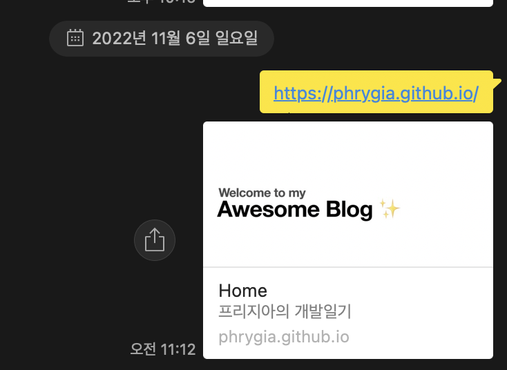

<small class="from" style="margin-top:-15px;">내 블로그 og image도 변경해야겠네..</small>
</div>

```js
// pages/api/og.jsx
import { ImageResponse } from '@vercel/og';

export const config = {
  runtime: 'experimental-edge',
};

export default function () {
  return new ImageResponse(
    (
      <div
        style={{
          fontSize: 128,
          background: 'white',
          width: '100%',
          height: '100%',
          display: 'flex',
          textAlign: 'center',
          alignItems: 'center',
          justifyContent: 'center',
        }}
      >
        Hello world!
      </div>
    ),
    {
      width: 1200,
      height: 600,
    },
  );
}
```
<div style="max-width: 350px;">

</div>
url을 공유하면 ImageResponse안에서 입력한 텍스트가 이미지로 바뀐다. 즉, text → image로 바꿔주는 것 같은데 안에 이미지 파일을 넣으면 이미지 그대로 출력해주는지도 알아봐야 될 것 같다. 그게 맞다면 엄청 편리한건 확실한 것 같다.<br><br>

### 7. Middleware API Updates

초기 API 디자인에 대한 피드백을 듣고 개발자 경험을 개선하고 강력한 새 기능을 추가하기 위해 몇 가지 추가 사항을 추가되었다. <br>
→ 미들웨어를 사용해본적이 없어 정확한 개념이 부족한것 같아 이부분은 공부를 더 해봐야겠다.

```js
// middleware.ts
import { NextResponse } from 'next/server';
import type { NextRequest } from 'next/server';

export function middleware(request: NextRequest) {
  const requestHeaders = new Headers(request.headers);
  requestHeaders.set('x-version', '13');

  const response = NextResponse.next({
    request: {
      headers: requestHeaders,
    },
  });

  response.headers.set('x-version', '13');
  return response;
}

// middleware.ts
import { NextRequest, NextResponse } from 'next/server';
import { isAuthenticated } from '@lib/auth';

export const config = {
  matcher: '/api/:function*',
};

export function middleware(request: NextRequest) {
  if (!isAuthenticated(request)) {
    return NextResponse.json(
      {
        success: false,
        message: 'Auth failed',
      },
      {
        status: 401,
      },
    );
  }
}

// next.config.js
const nextConfig = {
  experimental: {
    allowMiddlewareResponseBody: true
  },
};
```
<br>
대표적인 업데이트에 관해서 정리해보았는데 정말 나는 최소한만 사용한다는걸 알게되었달까..  react Next.js에 대해 좀더 깊게 공부해야겠다고 생각하는 계기가 되었다.

<div class="from add">
    <ul>
        <li>참고 : <a href="https://news.hada.io/topic?id=7665" target="_blank">https://news.hada.io/topic?id=7665</a></li>
        <li><a href="https://nextjs.org/blog/next-13" target="_blank">https://nextjs.org/blog/next-13</a></li>
         <li><a href="https://www.youtube.com/watch?v=5BRFGMs1v_o&t=1s" target="_blank">코딩 애플님 유튜브</a></li>
    </ul>
</div>

```toc

```
