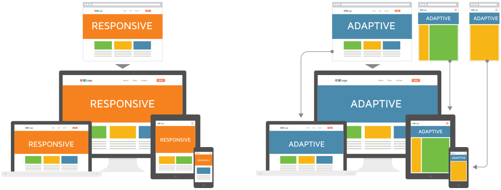
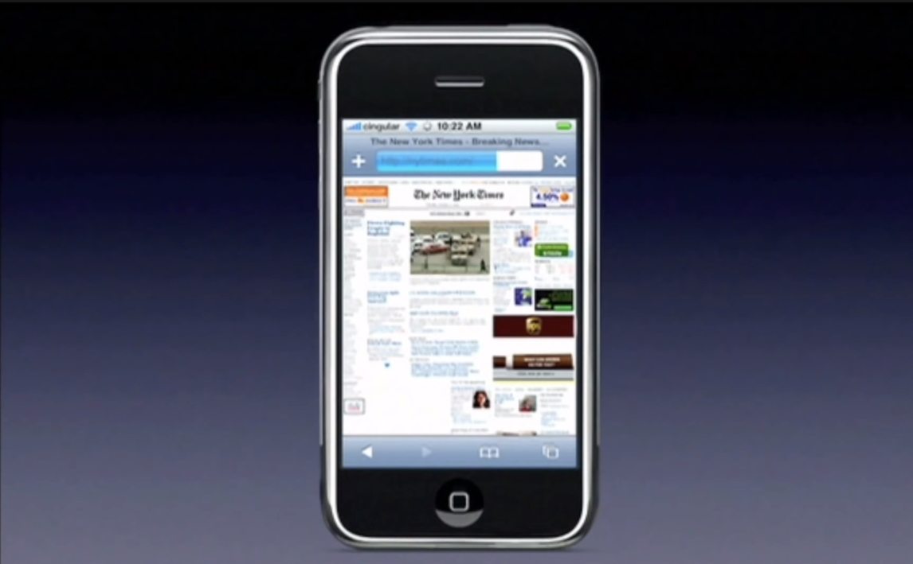
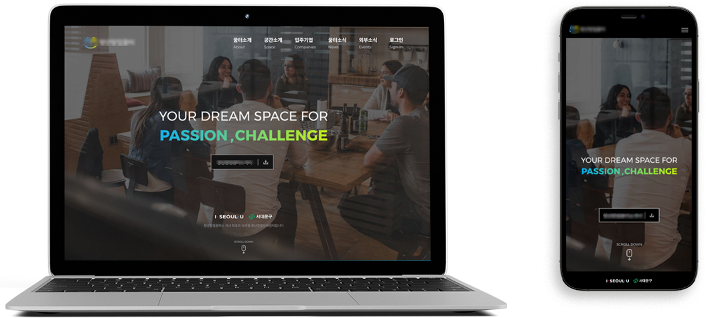

퍼블리싱 프리랜서일을 할때면 자주 등장하는 용어가 바로 `반응형`이란 단어다. 반응형이란 단어와 함께 언급되는 `적응형`이란 단어도 있으며, 이 두 단어가 나올때마다 '도대체 무슨 차이지?' 라는 의문도 따라온다. 퍼블리싱을 3년동안 했지만 반응형과 적응형의 차이에 대해 명확하게 설명하지 못하고 명확한 차이를 모른다고 생각됐기 때문에 이 두가지는 어떻게 다른지에 대해 알아보고자 조사하게 되었다.
<br><br><br>

## 반응형 vs 적응형



<small class="from">사진 출처 : <a href="https://uxplanet.org/adaptive-vs-responsive-web-design-eead0c2c28a8" target="_blank">https://uxplanet.org/</a></small><br><br><br>

## 1. 반응형: RWD(Responsive Web Design)
***웹의 해상도, 레이아웃 등이 디바이스에 따라 반응하여 유동적으로 변환되는 웹페이지** <br>
과거의 웹을 사용하는 주요기기는 컴퓨터였으며, 모니터에 맞춰 화면의 크기와 레이아웃이 구성되었다. 2007년 애플사에서 아이폰을 출시하면서 스마트폰의 시대가 열렸고, 어디서든 손쉽게 웹사이트에 접근할 수 있게 되었다. 하지만 아래의 사진처럼 문제가 발생하였다. <br><br>


바로 손바닥만한 기기에서 큰 모니터에서만 보던 화면으로 웹사이트를 봐야한다는 문제였다. 웹사이트의 모든 내용을 담기에는 글자가 너무 작아져서 읽을 수조차 없었으며 읽기위해서는 손가락으로 화면을 일일히 확대해서 봐야하는 번거로움이 있었다. <br>
이러한 문제점으로 인해 같은 페이지라 할지라도 어떤 장치로 접속하느냐에 따라 다른 종류의 화면을 보여줘야 할 필요성이 대두되기 시작했다. 하지만 같은 페이지를 pc용 스마트폰 용으로 나누어 만드는 건 시간적·비용적으로 매우 비효율적이었다. (한 사이트의 페이지가 100개라면? pc용 스마트폰 용 200개를 만들어야 하며, 아이패드 출시이후 태블릿용 사이즈까지 포함하여 최대 300개를 만들어야 한다.) 이를 해결하기 위한 방법으로 반응형 웹 기술이 주목받게 되었다. <br>
반응형 웹의 기술 요소로는 캐스케이딩 스타일 시트3(Cascading Style Sheets3; CSS3) 미디어 쿼리, 유동형 그리드(Fluid Grid), 유동형 이미지(Flexible Images) 등이 있다.
이 3가지 기술은 2010년 에단 마코트(Ethan Marcotte)가 `Responsive Web Design`이란 글에서 유동적인 웹페이지를 개발하는 방법을 소개하면서 알려졌다.

<table>
    <thead>
        <tr>
            <th>기술 요소</th>
            <th>설명</th>
        </tr>
    </thead>
    <tbody>
        <tr>
            <th>CSS3 미디어 쿼리(Media Query)</th>
            <td>디스플레이의 폭, 높이 등의 정보들을 이용하여 단말기 브라우저 창의 특정 지점을 기준으로 각 해상도에 최적화되도록 레이아웃 스타일을 바꿀 수 있다. (웹, 프린터, 음성 합성 장치 등의 상황에 맞는 미디어유형을 설정할 수 있다.) </td>
        </tr>
        <tr>
            <th>유동형 그리드(Fluid Grid)</th>
            <td>디스플레이 너비에 따라 가변단위(%등)로 값을 설정하여 화면을 가변적으로 구성할 수 있다.</td>
        </tr>
        <tr>
            <th>유동형 이미지(Flexible Images)</th>
            <td>디스플레이 너비에 따라 적절한 크기로 이미지의 형태가 늘어나고 줄어들게 설정 할 수 있다.</td>
        </tr>
    </tbody>
</table>

반응형 홈페이지는 위의 3가지 기술이 어우러져 스스로 환경에 반응하여 실시간으로 적용되는 방식이며, 디바이스의 가로너비와 %단위를 사용하여 창의 너비가 변할때 레이아웃이 변경된다. 주로 데스크탑/태블릿/모바일 3가지로 분류한 뒤 널리 통용되는 width사이즈를 기준으로 CSS3 미디어 쿼리(Media Query)를 작성하여 웹사이트를 제작한다. (태블릿과 데스크탑을 하나로 취급하여 제작하는 경우도 많다.)

```css
/* Desktop */
@media only screen and (min-width: 1021px) { } 

/* Tablet */
@media only screen and (min-width: 768px) and (max-width: 1020px) { }

/* Mobile */
@media only screen and (max-width: 767px) { }
```
<br>

 <br>
<small>필자가 코딩한 반응형 사이트 : 데스크탑 + 모바일 2가지로 진행하였다.</small>
<br><br><br>

## 2. 적응형: AWD(Adaptive Web Design)

***서버나 클라이언트에서 웹에 접근한 디바이스를 체크하여 그 디바이스에 최적화된 미리 정해 놓은 각 디바이스의 디스플레이에 맞는 웹을 보여주는 디자인** <br>
데스크탑의 경우 데스크탑용 템플릿을 모바일은 모바일용 템플릿을 제공한다. (ex: 카페24) 기기별로 다른 템플릿을 제작해야하기 때문에 작업시간과 비용이 많이 들며, 유지보수가 어렵고 복잡해진다는 단점이 있다. 반응형웹은 모든 기기의 템플릿과 CSS를 다운로드하기 때문에 데이터 낭비와 로딩속도가 느려질수 있지만, 적응형웹은 사용자 기기에 맞는 템플릿과 CSS만을 다운로드하기 때문에 속도가 더 빠를 수 있다.
<br><br>

<div class="from add">- 참고
    <ul>
        <li><a href="https://terms.naver.com/entry.nhn?docId=3609911&cid=58598&categoryId=59316" target="_blank">https://terms.naver.com/entry.nhn?docId=3609911&cid=58598&categoryId=59316</a></li>
        <li><a href="https://terms.naver.com/entry.nhn?docId=3350028&cid=40942&categoryId=32828" target="_blank">https://terms.naver.com/entry.nhn?docId=3350028&cid=40942&categoryId=32828</a></li>
        <li><a href="https://ko.wikipedia.org/wiki/%EC%A0%81%EC%9D%91%ED%98%95_%EC%9B%B9_%EB%94%94%EC%9E%90%EC%9D%B8" target="_blank">https://ko.wikipedia.org/wiki/%EC%A0%81%EC%9D%91%ED%98%95_%EC%9B%B9_%EB%94%94%EC%9E%90%EC%9D%B8</a></li>
    </ul>
</div>

```toc

```
