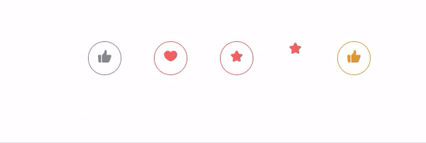

새로운 vue 프로젝트 사전미팅에서 장바구니에 담기는 액션을 부탁받았었다.

<small class="from">출처 : <a href="https://www.npmjs.com/package/react-clap-button" target="_blank">react clap button</a></small>
<br><br>

이런 방식으로 장바구니에 담기는 액션을 부탁받았는데, 아직 vue가 미숙한 나는 어떻게 코딩해야 할지 큰 고민에 빠졌었다.

- **어떻게 만들까?**
<ol style="list-style-type: upper-greek;">
    <li>&nbsp;npm에서 타인이 만든걸 사용할까?</li>
    <li>&nbsp;없다면 내가 직접 작성할까?</li>
    <li>&nbsp;작성한다면 클릭할때와 카운트될때의 액션을 제외하고 css로 처리가 가능할까?</li>
</ol>
<br><br>

## 1. npm에서 타인이 만든걸 사용할까?

npm에서 clap button을 검색하여 위의 박수치는 액션을 찾았다. 정말 딱 내가 원하던 액션이었고 클라이언트가 보여준 액션과도 거의 흡사했다. 'Wow! 딱 원하던거야! 역시 npm 최고! 내가 생각하는건 이미 남이 만들어 놨을줄 알았다니까? 가만히 보자... 어라? 그런데 이건 react잖아? 😥 아니야! 실망하긴 이르지!! react가 있으면 vue도 있을거야!' 라는 생각으로 바로 npm 검색을 했고 <a href="https://www.npmjs.com/package/vue-clap-button" target="_blank">vue clap button</a>을 찾았다.


<small class="from">출처 : <a href="https://www.npmjs.com/package/vue-clap-button" target="_blank">vue clap button</a></small>
<br><br><br>

'역시! react가 있으면 vue도 있었어!' 흡족한 마음으로 테스트용 프로젝트에 모듈을 설치해보았다.
그런데 내가 원하던 액션이 아니었다. react clap button은 버튼을 누르면 초록색 동그라미안에 숫자가 카운트 되면서 위로 사라지지만 vue clap button은 버튼에 마우스가 hover된 상태에서만 카운트되는 숫자가 보이는 치명적인 단점이 있었다.

<br><br>
css를 수정으로 작동이 되는지 확인해 보았지만 css문제는 아닌것으로 보여 npm 모듈이용을 포기하기로 했다.
<br><br><br>

## 2. npm에 없다면 내가 직접 작성할까?

내가 생각한 2번째 방법은 직접 자바스크립트 코드를 작성하면 되잖아 였다. 엄청난 고난이도 작업은 아니지만 버튼을 연속으로 누르면 위로가던 숫자 카운터가 밑에서 다시 카운트되어야 하는 귀찮은 작업이기는 했다. 하지만, 이 액션만 사용하려고 npm 모듈을 설치하는 것보다는 낫다고 생각되어 직접 만들기에 도전했다.
<br><br><br> -**완성된 모습**-


<br>vue 프로젝트젝트를 생성한 후 코드를 작성해 보자.<br><br>

**- HTML**

```html
<div id="vue" class="clap_btn_wrapper">
  <!-- 박수 버튼 (실제로 클릭되는 버튼) -->
  <button ref="clap" class="clap_button" @click="clapClick()">
    
  </button>
  <!-- 카운트 되는 태그 -->
  <div ref="clicker" class="clap_counter" />
</div>
```

<br>

**- CSS**

```css
.clap_btn_wrapper {
  position: relative;
  width: 80px;
  height: 80px;
}
.clap_btn_wrapper .clap_button {
  height: 100%;
  width: 100%;
}
.clap_btn_wrapper .clap_counter {
  position: absolute;
  top: -30px;
  font-weight: 700;
  opacity: 0;
}
.clap_btn_wrapper .clap_counter.act {
  opacity: 1;
}
```

<br>

**- JS**

```js
new Vue({
  el: '#vue',
  data: {
    counter: 0, // 카운터 되는 data
  },
  methods: {
    // 클릭했을 때
    clapClick() {
      const clickCounter = this.$refs.clicker;

      // 박수 친 횟수 올리기 (counter)
      clickCounter.textContent = `+ ${++this.counter}`;

      // 숨겨진 clap_counter를 노출시킨다.
      clickCounter.classList.add('act');
    },
  },
});
```

<br>클릭했을 때 박수횟수를 증가시키는 clapClick함수를 작성하였다. 클릭했을 때, 박수 횟수가 증가한다.

<br><br>

## 3. 직접 코드를 작성한다면 클릭할때와 카운트될때의 액션을 제외하고 css로 처리가 가능할까?

클릭했을 때 박수횟수를 증가시키는 함수는 완성되었다.
이제 클릭했을때 clap_counter가 위로 사라지고, 클릭하면 다시 나타나는 css를 구현해 보기로 했다.
클릭했을 때 박수횟수를 증가시키는 counter 증가함수와, 클릭했을때 바로바로 애니메이션을 줄 수 있도록 element의 클래스명을 체크하는 함수로 나누어 코드를 작성하였다.
숫자를 표시하는 clap_counter의 animation 코드에 css의 tranaslateY와 scale을 이용해 위로 사라지고 커졌다 작아지는 효과를 주었다.<br><br>

**- CSS**

```css
.clap_btn_wrapper .clap_counter.first {
  animation: first-bump 1s forwards;
}
.clap_btn_wrapper .clap_counter.act {
  animation: bump 1s forwards;
}

/* 처음 실행 됐을때 clap_counter를 표시한다. -> 높이(translateY) 조절 가능 */
@keyframes first-bump {
  0% {
    transform: translateY(-10px);
    opacity: 1;
  }
  50% {
    transform: translateY(-20px);
    opacity: 1;
  }
  100% {
    transform: translateY(-30px);
    opacity: 0;
  }
}

/* 버튼이 클릭될때마다 튕기듯이 커지고 처음 위치에 표시할 수 있게 해주는 애니메이션 
-> 원하는 크기(scale)와 높이(translateY)는 조절 가능 */
@keyframes bump {
  0% {
    transform: translateY(-10px) scale(0.9);
    opacity: 1;
  }
  50% {
    transform: translateY(-10px) scale(1);
    opacity: 1;
  }
  100% {
    transform: translateY(-25px) scale(1);
    opacity: 0;
  }
}
```

<br>

**- JS**

```js
methods: {
  // 클릭했을 때
  clapClick() {
    const clickCounter = this.$refs.clicker
    clickCounter.textContent = `+ ${++this.counter}`

    // 처음 실행 됐을때 clap_counter를 표시하기 위해 class에 'first' 클래스가 있는지 체크 -> x: first 클래스 추가, o: act클래스 추가
    if (clickCounter.classList.contains('first')) {
      this.runAnimation(clickCounter, 'act')
    } else {
      this.runAnimation(clickCounter, 'first')
    }
    this.runAnimation(this.$refs.clap, 'scale')

    // 박수 친 횟수 올리기 (counter)
    clickCounter.textContent = `+ ${++this.counter}`

    // 숨겨진 clap_counter를 노출시킨다.
    clickCounter.classList.add('act')
  },
  // element의 클래스명 존재여부 체크 -> x: 클래스추가, o: 클래스 삭제
  runAnimation(element, className) {
    if (element && !element.classList.contains(className)) {
      element.classList.add(className)
    } else {
      element.classList.remove(className)
      element.style.width = element.offsetWidth
      element.classList.add(className)
      /*
      클래스를 삭제했다가 바로 추가가 되는 코드는 원하는 대로 작동하지 않기때문에 둘 사이에 하나의 이벤트를 걸어줘야 한다.
      처음에는 setTimeout으로 시간차를 두었는데 clap_counter가 부자연스럽게 움직이는 현상이 있어
      element.style.width = element.offsetWidth 라는 의미없는 코드를 두었다.
      이는 다른 방법을 찾으면 보강해야 되겠다.
      setTimeout(() => {
        element.classList.add(className)
      }, 0)
      */
    }
  }
}
```


<br>

## 4. CSS 보강 및 최종 완성 코드

못생긴 버튼에 CSS코드를 추가하여 예쁘게 보강하기로 했다.<br><br>

**- HTML**

```html
<div id="vue" class="clap_btn_wrapper">
  <button ref="clap" class="clap_button" @click="clapClick()">
    
  </button>
  <div ref="clicker" class="clap_counter" />
</div>
```

<br>

**- CSS**

```css
.clap_btn_wrapper {
  position: relative;
  width: 80px;
  height: 80px;
}
.clap_btn_wrapper .clap_button {
  height: 100%;
  width: 100%;
  outline: none;
  cursor: pointer;
  background-color: #fff;
  border: 2px solid green;
  border-radius: 100%;
}
/* 버튼을 클릭했을때 튕기듯이 커지는 애니메이션 효과를 주는 class */
.clap_btn_wrapper .clap_button.scale {
  animation: scale 0.7s forwards;
}
.clap_btn_wrapper .clap_counter {
  position: absolute;
  left: 50%;
  top: -30px;
  width: 30px;
  height: 30px;
  line-height: 30px;
  margin-left: -15px;
  background-color: green;
  border-radius: 100%;
  color: #fff;
  opacity: 0;
  font-size: 12px;
  text-align: center;
}
.clap_btn_wrapper .clap_counter.first {
  animation: first-bump 1s forwards;
}
.clap_btn_wrapper .clap_counter.act {
  animation: bump 1s forwards;
}
/* 튕기듯이 커지는 애니메이션 */
@keyframes scale {
  0% {
    transform: scale(1);
  }
  50% {
    transform: scale(1.05); /* 클릭됐을때 좀더 큰 효과를 원한다면 scale 조절 */
  }
  100% {
    transform: scale(1);
  }
}
@keyframes first-bump {
  0% {
    transform: translateY(-10px);
    opacity: 1;
  }
  50% {
    transform: translateY(-20px);
    opacity: 1;
  }
  100% {
    transform: translateY(-30px);
    opacity: 0;
  }
}
@keyframes bump {
  0% {
    transform: translateY(-10px) scale(0.9);
    opacity: 1;
  }
  50% {
    transform: translateY(-10px) scale(1);
    opacity: 1;
  }
  100% {
    transform: translateY(-25px) scale(1);
    opacity: 0;
  }
}
```

<br>

**- JS**

```js
new Vue({
  el: '#vue',
  data: {
    counter: 0,
  },
  methods: {
    clapClick() {
      const clickCounter = this.$refs.clicker;
      clickCounter.textContent = `+ ${++this.counter}`;
      if (clickCounter.classList.contains('first')) {
        this.runAnimation(clickCounter, 'act');
      } else {
        this.runAnimation(clickCounter, 'first');
      }
      this.runAnimation(this.$refs.clap, 'scale');
    },
    runAnimation(element, className) {
      if (element && !element.classList.contains(className)) {
        element.classList.add(className);
      } else {
        element.classList.remove(className);
        element.style.width = element.offsetWidth;
        element.classList.add(className);
      }
    },
  },
});
```

<br>

<p class="codepen" data-height="500" data-theme-id="dark" data-default-tab="css,result" data-user="dmsgp62" data-slug-hash="WNxBRQy" style="height: 265px; box-sizing: border-box; display: flex; align-items: center; justify-content: center; border: 2px solid; margin: 1em 0; padding: 1em;" data-pen-title="vue clap button">
  <span>See the Pen <a href="https://codepen.io/dmsgp62/pen/WNxBRQy">
  vue clap button</a> by chaeyeon (<a href="https://codepen.io/dmsgp62">@dmsgp62</a>)
  on <a href="https://codepen.io">CodePen</a>.</span>
</p>
<script async src="https://static.codepen.io/assets/embed/ei.js"></script>
<br><br><br>

## 포스팅을 마치며..

vue에서 ref 사용을 권장하지 않는 걸로 알고 있는데 부득이하게 element를 지정하기 위해 사용하게 되었다. 아직 vue에 대한 공부가 부족하다고 생각된다. 사실 react를 더 좋아하지만 프리랜서 프로젝트에서는 vue를 다루기 때문에 vue를 사용해야 한다. vue 프론트엔드 개발자처럼 깊게 공부한적도 깊게 생각한 적도 없었는데, 장바구니 버튼을 만들면서 여러가지를 알게 되었다.
사실 처음에는 mounted() 안에 vanila js코드로 입력했다가 다른 페이지에서 에러가 발생해 method로 변경하였는데, 이때, vue의 life cycle이 중요하다는 사실을 알았다.
기술 블로그는 예전부터 시작하고 싶었고 실제로 만들어놨었지만 어떤 주제를 다뤄야 할지와 시간이 없다는 핑계로 요리조리 피해 다녔는데, 나는 코딩을 할 때 동일한 기능의 코드들도 대충대충 복사해서 쓴다는 사실을 깨닫고, 블로그에 정리하면서 이런 코딩스타일을 고치고 멋진 프론트엔드 개발자가 되고 싶어서 겨우겨우 시작하게 되었다.
첫 포스팅은 프로젝트에서 제일 깊이 고민했던 버튼 클릭시 count되는 액션이 보이는 clap-button으로 시작했다. 내 코드가 미숙하거나 이상할 수도 있고 부끄럽기도 하지만, 많은 사람들과 공유하고 싶었다.
앞으로 수많은 코딩을 통해 더 멋진 코드를 작성하고 싶다.

```toc

```
