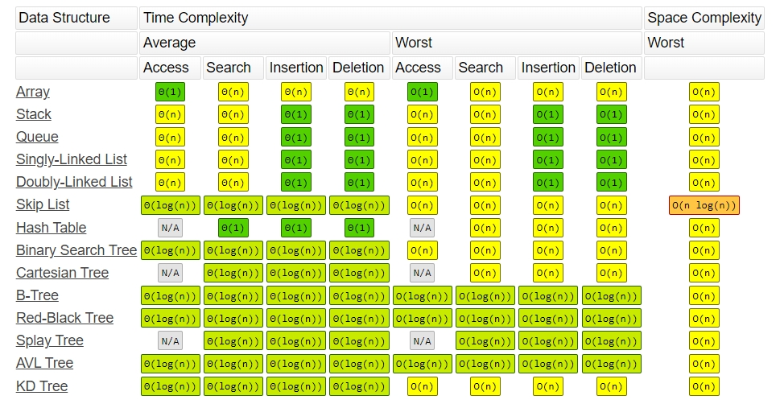
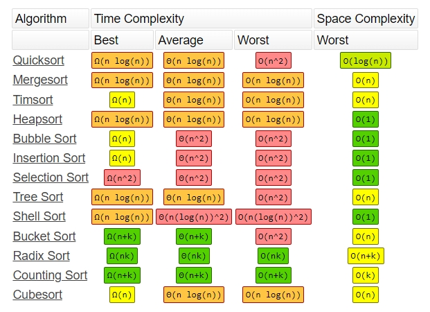

알고리즘을 구현하기 전에 알고리즘이 얼마나 효과적인지 분석하는 법을 이해해야 한다.<br>
알고리즘을 구현할 때 빅오 표기법이 **해당 알고리즘이 얼마나 효율적인지**를 나타내기 때문에 빅오 표기법은 중요하다.<br>
효율적인 방법을 고민한다는 것은 시간 복잡도를 고민한다는 것과 같은 말이다. <br>
`빅오 표기법은 알고리즘의 최악의 경우 복잡도를 측정하며 알고리즘의 효율성을 나타내는 표기법이다.`

## Time Complexity (시간 복잡도)

문제를 해결하는데 걸리는 시간과 입력의 관계를 가리킨다. <br>
<u>즉, 입력값에 따라 연산을 실행할 때, 연산 횟수에 비해 얼마만큼의 시간이 걸리는가를 의미한다. </u><br>
시간복잡도를 고민한다는 것은 입력값이 커짐에 따라 증가하는 시간을 최소화한 알고리즘을 만들었다는 의미이기도 한다.<br>
시간복잡도는 Big-o 표기법을 사용해 나타낼 수 있다.<br>


<small class="from">출처 : 자바스크립트로하는 자료 구조와 알고리즘</small><br>

**\*시간복잡도 순서** : 𝑂(1) < 𝑂(log n) < 𝑂(n) < 𝑂(n log n) < 𝑂(n²) < 𝑂(n³) < 𝑂(2ⁿ) < 𝑂(n!)

**알고리즘 분석 시 가장 자주 등장하는 유형**

<table style="width: auto;">
    <colgroup>
        <col style="width:180px;">
        <col style="width:210px;">
    </colgroup>
    <thead>
        <tr>
            <th>표기법</th>
            <th>명칭</th>
        </tr>
    </thead>
    <tbody>
        <tr>
            <th>O(1)</th>
            <td>상수</td>
        </tr>
        <tr>
            <th>O(n)</th>
            <td>선형</td>
        </tr>
        <tr>
            <th>O(n²)</th>
            <td>2차</td>
        </tr>
        <tr>
            <th>O(log₂ n)</th>
            <td>로그</td>
        </tr>
        <tr>
            <th>O(n log₂ n)</th>
            <td>다형 로그</td>
        </tr>
        <tr>
            <th>O(n^c)</th>
            <td>고차</td>
        </tr>
        <tr>
            <th>O(2ⁿ)</th>
            <td>지수</td>
        </tr>
    </tbody>
</table>

## O 표기법 이해

알고리즘의 효율은 어떻게 측정할 수 있을까? <br>
보통 CPU(소요 시간), 메모리, 디스크, 네트워크의 사용량을 생각할 수 있는데, 그중 O 표기법은 CPU 사용량을 대상으로 한다.

### 1. O(1)

**입력값이 증가하더라도 시간은 변하지 않는다.** 따라서 O(1)을 상수 시간이라고 부른다. <br>
입력값의 크기와 관계없이 즉시 출력값을 얻을 수 있다.
배열의 항목을 인덱스를 사용해 접근하는 경우를 예로 들 수 있다.

```js
// 예제 1
function O_1(arr, index) {
  return arr[index]
}
const arr = ["a", "b", "c", "d", "e"]
let index = 3
console.log(O_1(arr, index)) // 'd'

// 예제 2
function increment(num) {
  return num++
}
console.log(increment(99)) // 100
```

- 함수 실행시 걸리는 시간을 X라고 했을 때, 예제 1과에서 arr 배열의 개수가 늘어나거나 index의 값이 바뀌더라도 즉시 출력값을 얻을 수 있다.
- 예제 2또한 99를 다른 숫자로 바꾸어도 실행 시간은 여전히 X이다.
- 인자에 상관없이 함수의 성능은 달라지지 않기 때문에 일정한 O(1)의 복잡도를 갖는다.

### 2. O(n)

선형 복잡도라고 부르며, **입력값의 증가도에 따라 시간도 동일한 비율로 증가하는 것**을 의미한다.

```js
// 예제 3
function sequentialSearch(array, item) {
  for (let i = o; i < array.length; i++) {
    if (item === array[i]) {
      return i
    }
  }
  return -1
}
const arr = [1, 2, 3, 4, 5, 6, 7, 8, 9, 10]
const item = 1
```

- 예제 3에서 배열에서 item의 값과 같으면 그 즉시 함수를 종료한다.
- 만약 item이 1이라면 첫번째 루프 실행 시 곧바로 종료된다.
- 루프 반복시 드는 비용 : {1}, item = 10 → 총 {10}의 비용 발생 (1을 찾을때 보다 10배의 비용이 든다.)
- (최악의 경우 → 값이 없어도 모든 루프를 돌고 -1을 리턴할 것이다.)
- arr = [1... 1000], item = 1000 일때 드는 비용은 1000이다.<br>
  최악의 경우일 때, 크기가 1000이면 비용도 1000이 되므로 O(n)의 시간복잡도를 갖게 되는 것이다.

### 3. O(n²)

O(n²)은 2차 복잡도라고 부르며, **입력값이 증가함에 따라 시간이 n의 제곱수의 비율로 증가하는 것**을 의미한다. <br>
대표적으로 버블 정렬 알고리즘이 있다.

```js
// 예제 4
function swap(array, index1, index2) {
  let aux = array[index1]
  array[index1] = array[index2]
  array[index2] = aux
}

function bubbleSort(array) {
  let length = array.length
  for (let i = 0; i < length; i++) {
    for (let j = 0; j < length - 1; j++) {
      if (array[j] > array[j + 1]) {
        swap(array, j, j + 1)
      }
    }
  }
}
const arr = [1, 2, 3, 4, 5, 6, 7, 8, 9, 10]
bubbleSort(array)
```

- 크기가 10인 배열을 넣고 실행하면 총 비용은 100(10²) 이다.
- 크기가 100인 배열이면 총 비용은 10000(100²)이 된다.
- 입력값이 커질수록 실행 시간은 기하급수적으로 늘어난다.

**\* 단일 루프라면 O(n), 중첩 루프면 O(n²), 삼중 루프라면 복잡도는 O(n³)이 된다.**

### 4. O(log₂ n)

- 입력값의 크기가 커질수록 실행 시간이 로그(log: 지수 함수의 역함수) 만큼 짧아지는 알고리즘
- 예를 들어 데이터가 10배가 되면, 처리 시간은 2배가 된다.
- 대표적으로는 이진 탐색이 있다.
- 재귀가 순기능으로 이루어지는 경우도 해당된다.

### 5. O(n log₂ n)

- 데이터가 많아질수록 처리시간이 로그(log) 배만큼 더 늘어나는 알고리즘
- 예를 들어 데이터가 10배가 되면, 처리 시간은 약 20배가 된다.
- 대표적으로는 병합 정렬, 퀵 정렬이 있다.

### 6. O(2ⁿ)

- 데이터량이 많아질수록 처리시간이 기하급수적으로 늘어나는 알고리즘
- 대표적으로 피보나치 수열이 있으며, 재귀가 역기능을 할 경우도 해당된다.

## 시간복잡도 줄이는 법



<small class="from">출처 : <a href="https://www.bigocheatsheet.com/" target="_blank">https://www.bigocheatsheet.com/</a></small>

자료구조 및 알고리즘을 적절히 사용하여 시간복잡도를 줄이고 **반복문으로 인해 시간 복잡도가 기하급수적으로 증가 할 수 있으니 반복문 사용에 유의하도록 한다.** <br>
위의 표를 참고하면 유명한 알고리즘이 어떤 시간 복잡도를 가지고 있는지 알 수 있다. <br>
위에서 나오는 알고리즘 정도는 열심히 공부해야 겠다.

<small class="from add">참고 : 자바스크립트로하는 자료 구조와 알고리즘(배세민)<br>
자바스크립트 자료 구조와 알고리즘(로이아니 그로네)<br>
<a href="https://coding-factory.tistory.com/608" tearget="_blank">https://coding-factory.tistory.com/608</a><br>
<a href="https://hanamon.kr/%EC%95%8C%EA%B3%A0%EB%A6%AC%EC%A6%98-time-complexity-%EC%8B%9C%EA%B0%84-%EB%B3%B5%EC%9E%A1%EB%8F%84/" tearget="_blank">https://hanamon.kr/%EC%95%8C%EA%B3%A0%EB%A6%AC%EC%A6%98-time-complexity-%EC%8B%9C%EA%B0%84-%EB%B3%B5%EC%9E%A1%EB%8F%84/</a>
</small>
