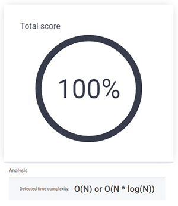

## MissingInteger.

문제 : <a href="https://app.codility.com/programmers/lessons/4-counting_elements/missing_integer/" target="_blank">codilit MissingInteger</a><br>
N개의 정수로 이루어진 배열 A가 있다. A에 존재하지 않는 가장 작은 양의 정수를 반환하는 함수를 작성하는 문제이다.
(0보다 큰 양의 정수를 반환해야 한다.)<br>
예를들어, 배열 A가 [−1, −3]으로 주어졌을때 0보다 큰 1이 반환되어야 한다.

### Solution:

처음 내가 푼 코드는 이렇다.<br>
배열 A를 순서대로 정렬하고 1부터 A의 가장큰수로 채워진 새로운 배열 arr을 만든다. <br>
그리고 존재하는 값을 확인하기 위해 Set을 사용하여 arr의 값을 복사한다. (indexOf를 사용하면 시간측정이 길어졌기 때문에 Set을 사용했다.)<br>
for문으로 A의 배열을 돌면서 set에 값이 있는지 체크하고 있다면 delete 메소드로 삭제한다. <br>

남아있는 배열의 개수가 0개라면 A = [1,2,3] 처럼 순서대로 채워진 배열이라는 뜻이기 때문에 3보다 큰 4를 리턴하기 위해 배열의 마지막 원소보다 1이 큰 수를 리턴한다. <br>
A = [1, 3, 6, 4, 1, 2]일때 원소를 삭제하면 5가 남는다. 남아있는 배열의 개수가 이처럼 1개라면 배열의 첫번째 원소를 리턴한다. <br>
그 외에 A = [-1, -3] 처럼 음의 정수로 이루어진 배열이었다면, arr은 [1,2]로 생성되었기 때문에 첫번째 원소인 1을 리턴한다.

```js
function solution(A) {
  const N = A.length
  A.sort((a, b) => a - b)
  const arr = new Array(N).fill().map((v, i) => i + 1)
  const set = new Set([...arr])

  for (let i = 0; i < N; i++) {
    if (set.has(A[i])) set.delete(A[i])
  }

  if (set.size === 0) return A[N - 1] + 1
  else return [...set][0]
}
```

### Result :

<div style="text-align: left;">



</div>

#### \*분석도 결과 : O(N) or O(n log₂ n)

### 다른 사람의 풀이

출처 : <a href="https://sustainable-dev.tistory.com/7" target="_blank">https://sustainable-dev.tistory.com/7</a>

```js
function solution(A) {
  A.sort((a, b) => a - b)
  let min = 1

  for (const i in A) {
    if (A[i] > 0 && A[i] === min) min++
  }
  return min
}
```

좀 더 효율적인 코드를 검색해보다가 사실 엄청 간단한 문제였다는 걸 깨닫게 된 코드 <br>
오름차순으로 배열을 정렬하고 변수 min을 가장 작은 값인 1로 선언한다 <br>
같은 수가 배열안에 있으면 min을 증가시킨다. <br>
(시간 복잡도는 내 코드와 동일했다.)<br>

문제를 풀 때, 좀 더 효율적인 알고리즘 방법을 생각하는 연습을 해야겠다. 🤣
