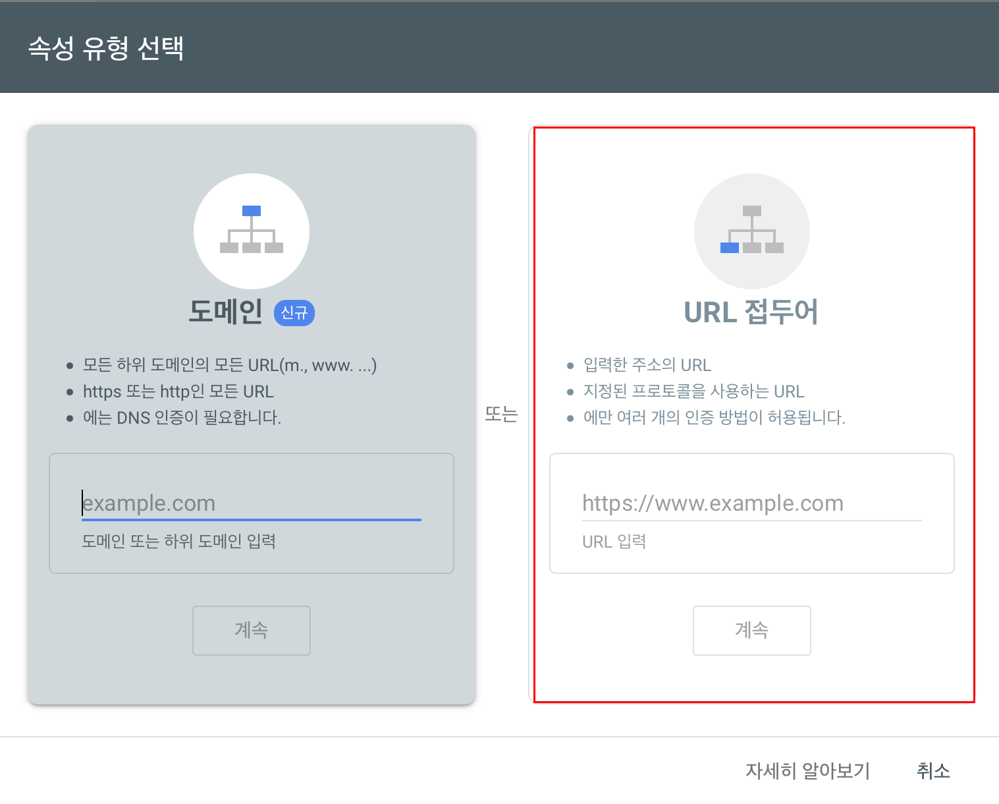
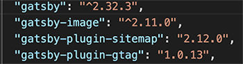
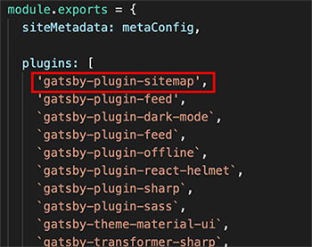
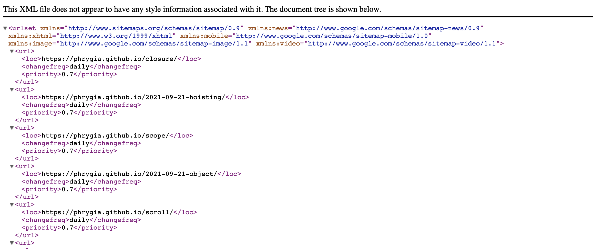
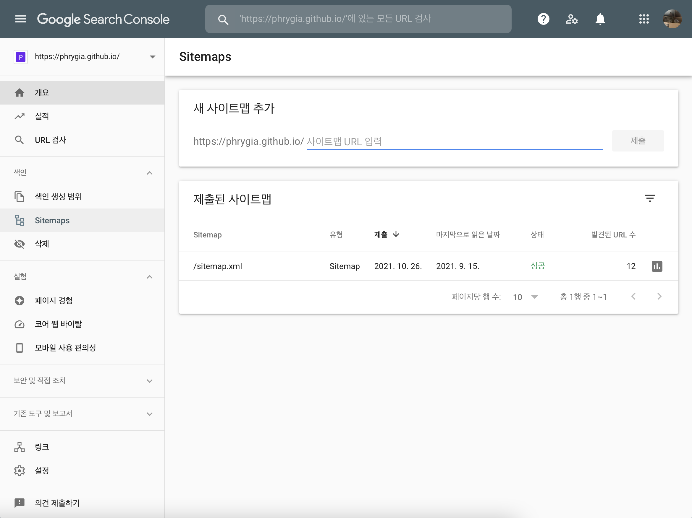
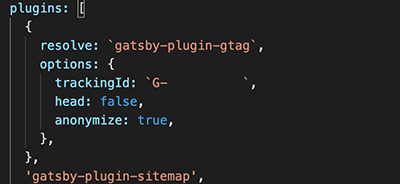
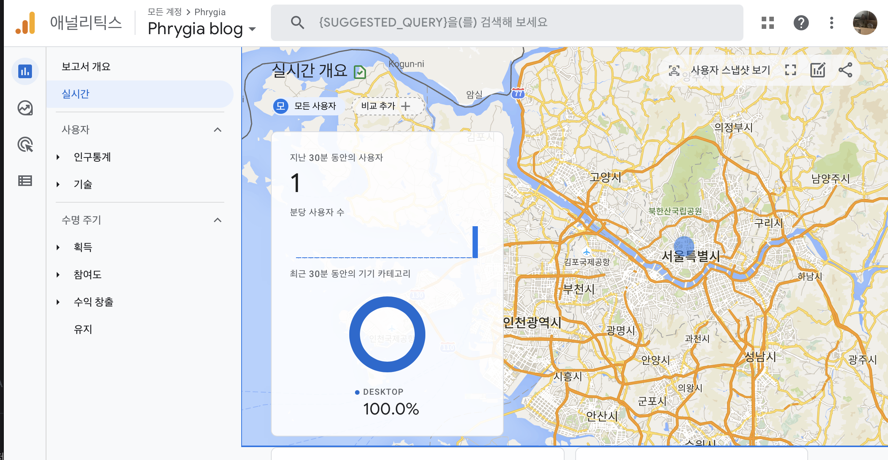

최근 jekyll로 사용하던 블로그를 gatsby로 바꾸었다. <br>
처음에 jekyll을 선택했었던 이유를 github으로 시작할 생각이었고 테마가 다양했던 jekyll을 선택했었다.

## Jeykll에서 Gatsby로 이전한 이유는?

가장 큰 이유는 Jeykll은 Ruby로 만들어졌기 때문에 JS를 주언어로 사용하는 필자에게 어려우면서 생소했다. 프론트엔드 개발자가 많이 쓰는 gatsby는 react를 사용하는 나에게 쉬우면서도 재밌게 다가왔고 npm 플러그인을 쉽게 추가할 수 있어 다양한 기능을 다루기 수월했기 때문에 블로그 이전을 감행했다. (또한 전보다 많아진 테마도 마음에 들었다.)

나는 zoomkoding님의 <a href="https://github.com/zoomKoding/zoomkoding-gatsby-blog" target="_blank">zoomkoding-gatsby-blog</a>테마를 사용하여 블로그를 개설했다. <br>
깃허브 테마는 심플한 테마가 많지만 zoomkoding님의 테마는 블랙/화이트 모드 선택 및 과하지 않게 동적인 요소들이 마음에 들어 이 테마로 블로그를 개설했다.

## Google Search Console에 gatsby 블로그 등록하기

1. <a href="https://search.google.com/search-console/about" target="_blank">google search console </a> 사이트에 접속한다.
2. 속성 추가 → URL 접두어 → 소유권 확인 (HTML 태그 : react-helmet을 이용해 meta 등록 )
   <br><br>
   
   <br>
3. gatsby-plugin-sitemap 설치

```js
npm i gatsby-plugin-sitemap
yarn add gatsby-plugin-sitemap
```

내가 설치한 테마의 gatsby 버전이 낮은편이라 yarn add gatsby-plugin-sitemap을 입력했을때 높은버전의 플러그인이 설치되었기 때문에 warning 경고가 떴었다. 자신의 gatsby와 호환되는 버전의 플러그인을 설치하자!



4. gatsby-config.js 파일에 `gatsby-plugin-sitemap`추가한다.



5. build (build를 해야 sitemap.xml 파일이 생성된다.)

```js
yarn build (or gatsby build)
```

6. build가 끝나면 로컬 서버를 실행한다.

```js
yarn develop (or gatsby develop)
```

localhost:8000/sitemap.xml에 접속하면 다음 화면과 같이 xml파일이 생성된 걸 확인할 수 있다.



7. 사이트맵 추가

```js
yarn deploy (or gatsby deploy)
```

gatsby 변경사항을 사이트에 업로드 한다. github 페이지에서 sitemap.xml이 제대로 보여진다고 Google Search Console에서 새 sitemap.xml을 제출한다.



## gatsby 블로그에 Google Analytics 추적코드 심기

1. <a href="https://analytics.google.com/" target="_blank">구글 애널리틱스</a> 계정 만들기
2. 속성에 내 블로그 정보 추가하기
3. gatsby-plugin-gtag 설치

```js
npm i gatsby-plugin-gtag
yarn add gatsby-plugin-gtag
```

4. gatsby-config.js 파일에 `gatsby-plugin-gtag` 옵션을 추가한다.



<a href="https://janeljs.github.io/blog/google-analytics/" target="_blank">jane's PS님의 블로그</a>를 확인해 보면 추적이 되지 않을 때 gatsby-plugin-gtag를 플러그인 최상단에 배치하라고 되어있어 처음부터 최상단에 위치시켜 놓으면 편한다..

```js
{
   resolve: `gatsby-plugin-gtag`,
      options: {
         trackingId: `G-XXXXXXXXXX`, // 측정 ID
         head: false, // head에 트래킹스크립트 넣고 싶다면 true로 설정
         anonymize: true,
      }
   },
},
```

5. 동작 확인하기

```js
yarn build (or gatsby build)
yarn deploy (or gatsby deploy)
```

gatsby 변경사항을 사이트에 업로드 한 뒤 제대로 작동하는 지 확인한다.



**블로그를 이전하면서 애널리틱스가 작동하지 않고 sitemap.xml이 제대로 생성되지 않아 한동안 방문자 추적이 전혀되지 않았다. 앞으로 미리미리 구글링 하면서 문제를 해결해야 겠다. 한달정도 방치해놨던 과거의 나야 반성하자**
