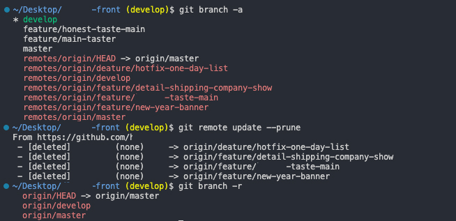
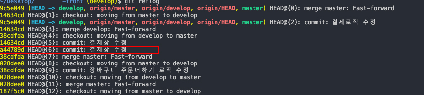
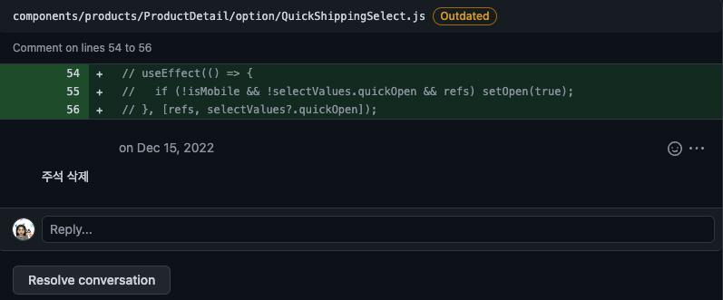

프론트엔드 개발자로 일한지 7개월정도가 되었다. 퍼블리셔로 오래 지내면서 git은 거의 사용해 본 적이 없었고 (아주 간단하게 사용) 사용하더라도 git GUI인 소스트리를 사용해 git 명령어를 거의 모르는 상태였다고 봐도 무방했다.
물론 개발자로 이직 준비하면서 git에 대해 공부하긴 했었지만 혼자하는 공부는 한계가 있고 conflict나는 상황이 거의 없기 때문에 단편적인 git만 사용했던 것 같다.

7개월동안 일하면서 자주 쓰던 git 명령어에 대해 정리해 보려고 한다.

## git remote

나는 회사에서는 회사 맥북, 집에서는 내 맥북으로 일을 한다. 💻 (처음엔 회사맥북을 가지고 다녔는데 출퇴근 시간이 길다보니 피로도가 어마어마하고 재택때문에 항상 노트북을 가지고 다니는게 힘들어서 집의 맥북으로 개발을 하게 되었다.)<br>
퇴근전에 일을 끝내지 못했다면 다음날 이어서 작업을 해야되는데 노트북이 다른 경우가 많다보니 원격 저장소에 push를 한 후 다음날 pull을 받는 편인데 원격 저장소의 새로운 브랜치가 자동으로 반영되는게 아니다보니 `remote`는 자주 쓰는 명령어가 되었다.

```bash
# 현재 프로젝트에 등록된 원격 저장소를 확인 - 저장소를 Clone 하면 `origin`이라는 원격 저장소가 자동으로 등록되기 때문에 `origin` 출력됨
git remote

# 원격 저장소의 브랜치 가져오기 (삭제 X)
git remote update

# 원격 저장소에 존재하지 않는 브랜치들은 로컬에 반영하여 삭제 진행
git remote update --prune
git remote prune origin

# 원격 저장소에 어떤 브랜치들이 존재하지와 저장소의 구체적인 정보 확인
git remote show origin

# +원격 저장소 브랜치 가져오기
git checkout -t origin/[브랜치명]

## remote와 관련된 다양한 명령어 → 추가 공부

# 현재 프로젝트에 등록된 원격 저장소 확인
git remote -v

# 원격 저장소 추가
git remote add [이름] [url]
git remote add secondOrigin git://github.com/test/test.git

# 원격 저장소의 이름 변경
git remote rename [현재이름] [바꿀이름]

# 원격 저장소 삭제
git remote remove [현재이름]
git remote remove origin
git remote rm origin
```

## git branch

```bash
# 로컬 브랜치 목록 조회
git branch

# 원격 저장소의 브랜치 목록 조회
git branch -r

# 모든 브랜치 목록 조회
git branch -a

# 로컬 브랜치명 변경
git branch -m [현재브랜치명] [바뀔브랜치명]


## 원격 브랜치명 변경
# 원격 저장소의 브랜치명은 변경이 불가능하기 때문에
# → 로컬에서 이름 변경 후
# → 원격 브랜치에 push (새롭게 브랜치가 생성됨)
# → 원격 브랜치 삭제 (기존 브랜치)
git checkout [현재브랜치명]
git branch -m [현재브랜치명] [바뀔브랜치명]
git push origin -u [바뀔브랜치명]
git push origin --delete [현재브랜치명]
```

#### -u 옵션

git push -u origin develop
→ u 옵션을 사용하면 최초 한 번만 저장소명과 브랜치명을 입력하고 그 이후는 입력 생략 가능 (git push)

1. 회사 원격 저장소에 연결되었고 재택근무 중 git branch -a로 모든 브랜치 목록 조회 (실제 원격 저장소와 다름)<br>
2. git remote update --prune<br>
   &nbsp;&nbsp;&nbsp;&nbsp;→ 4개의 원격 브랜치가 삭제됨 <br>
3. git branch -r로 남아있는 원격 브랜치 확인<br>
   &nbsp;&nbsp;&nbsp;&nbsp;(동일한 브랜치명으로 작업할 수 있기때문에 꼭 작업시작전 업데이트가 필요함)



## git rebase

우리회사는 원래 develop에서 pull을 받고 새로운 브랜치를 만들어서 개발을 해야 하는데 초반에는 가끔 까먹고 내가 작업하던 브랜치에서 새로운 브랜치를 생성해서 개발을 하기도 했다. 그럼 develop에 PR 요청을 하면 conflict가 나기도 했는데 그때 사수가 알려줬던게 rebase다. 내가 브랜치에서 작업하고 있는 동안 develop 에 적용된 커밋들을 나의 브랜치에 적용하기 위해서 rebase를 사용한다.
`rebase`는 말 그대로 베이스를 다시 배치한다는 뜻이다. 같이 비교되는 것중 `merge`가 있다.

- merge : merge를 사용해서 최신 이력을 가져올 경우, 히스토리의 뿌리가 여러개고 나눠져 있어 복잡하고 어려운 커밋 히스토리를 가지게 된다. (안전)
- rebase : 베이스를 다시 정의함으로써 깔끔한 커밋 히스토리를 가지게 된다. (위험)

```bash
git rebase [브랜치명]
```

## commit 메시지 수정

```bash
# 로컬의 마지막 commit 메시지 수정하기
git commit --amend
git commit --amend -m "새로운 메시지"

# 이전 commit 메시지 수정하기
git log  # 이전 커밋의 hash값
git rebase -i [해쉬]
git rebase -i HEAD~3  # 최근 3개의 커밋 메시지 불러옴

# 원격저장소에 push된 커밋 수정 - 최대한 사용하지 말기
git push --force [브랜치명]
```

#### -i 옵션

git rebase -i HEAD~3
→ rebase명령을 대화형으로 수행하여 여러 커밋들의 순서를 바꾸거나 커밋 히스토리를 변경/삭제하고 싶을때 사용하는 옵션

#### --force

> We strongly discourage force pushing, since this changes the history of your repository. If you force push, people who have already cloned your repository will have to manually fix their local history. For more information, see "Recovering from upstream rebase" in the Git manual.

공식문서에서는 리포지토리의 기록이 변경되므로 변경을 권하지 않고 있다.

## git cherry-pick

내가 작업한 내용을 develop까지는 합쳤는데 실제 배포일시가 미뤄지면서 해당 브랜치가 master에 포함되면 안되는 상황이 발생했다. 이떄 사수님이 썼던 명령어가 `cherry-pick`!! <br>
`cherry-pick`이란 다른 브랜치에 있는 커밋을 선택적으로 현재 브랜치에 적용시킬 때 사용하는 명령어다. <br>

```bash
git cherry-pick [hash]

# cherry-pick 중단 (실행하기 전 코드로 되돌아감)
git cherry-pick -abort

# conflict난 코드를 수정 → git add로 추가 → git cherry-pick -continue로 충돌한 코드 반영 및 cheey-pick 실행
git cherry-pick -continue

```

## reset --hard로 날려먹은 작업내역 복구하기

작업을 하다보면 이전 commit 으로 되돌아가고 싶을때가 있다. 이때 `reset`을 사용한다. 나는 새롭게 작업한 내역이 필요가 없다면 `--reset` 옵션으로 작업내역이 필요하다면 `--soft` 옵션을 사용한다.

- --hard : 돌아간 커밋 이후의 commit들 (변경이력) 삭제
- --mixed : 변경 이력은 모두 삭제되지만 변경 내용은 남아있다. (unstaged 상태)
- --soft : 변경 이력은 모두 삭제되지만 변경 되용은 남아있다. (stage 상태)

```bash
git reset HEAD^
git reset HEAD~2
git reset [hash]

git reset --hard [hash]
git reset --mixed [hash]
git reset --soft [hash]
```

얼마전 작업을 하다가 특정 커밋으로 되돌아가야 하는 때가 있었는데 이후에 커밋된 내용들이 있었다. (새로운 개발내용) 근데 개발하느라 멘탈이 약간 나가있는 상태에서 확인을 잘 안하고 무작정 `reset --hard`를 하고 난 후에 개발했던 부분들이 로컬에서 날아갔다는걸 깨달았다. (심지어 github에서 history도 없었음) 🤯 <br>
`reset --hard`로 복구할 수 있다는걸 알게되어 복구 후 다시 똑같은 개발을 하지 않아도 되서 좋이한 적이 있다.



```bash
# 이전 커밋 목록 보가
git reflog

# 다시 reset으로 커밋 복구 → 이상태로 원격 저장소에 안올라감
git reset --hard [hash]

# 강제로 원격 브랜치에 업로드
git push -f origin [브랜치명]


## 위의 예제에서
git reset --hard a44789d
git reset --hard HEAD~6
```

## PR로 Review 받은 코드 수정한 후 재 commit (원격 저장소에 올라간 커밋내역 수정)



내가 개발한 코드를 사수님께 PR (Pull Request) 요청하면 사수님이 확인 후 merge 하거나 Review를 남겨준다. 그럼 내가 그 리뷰를 보고 수정해서 다시 커밋해야 되는데 입사한지 얼마 안됐을때는 방법을 몰라서 리뷰받은 PR을 강제로 닫은 후 원격에 올라간 브랜치를 삭제하고 다시 브랜치를 push 한다음 새로운 PR을 요청했던 적이 있었다. (엄청난 삽질..🤪)
나중에 제대로 된 검색을 통해 방법을 알게 되었고 종종 이 방법을 유용하게 사용하고 있다.

```bash

# 1. 수정한 코드 추가
git add .

# 2. 최신 commit 덮어쓰기
git commit --amend

# 3. 코드 변경을 강제로 원격 저장소에 반영 (*충돌 가능성이 있어 같은 브랜치를 여러명이 수정할땐 사용하지 않는게 좋음)
git push -f origin [브랜치명]

```
