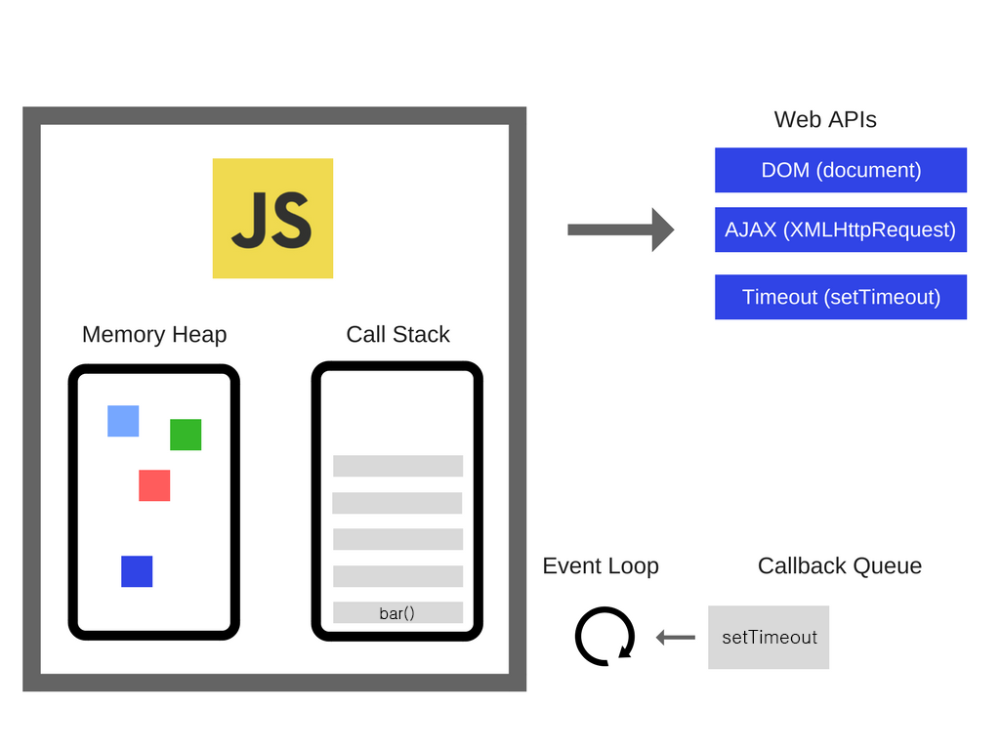

**자바스크립트는 싱글 스레드로 한번에 한개의 작업만을 다룰 수 있는 동기식 언어이다.** <br>
&nbsp; \*싱글 스레드 : 하나의 프로그램에서 하나의 코드만 실행할 수 있다는 뜻이다. 하나의 작업이 끝나야 다음 작업을 시작할 수 있다.

## 자바스크립트 런타임이란?

- 런타임이란 프로그래밍 언어가 구동되는 환경을 말한다.
- 자바스크립트 런타임은 자바스크립트가 구동되는 환경
- 종류 : 웹 브라우저 (크롬, 파이어폭스 등), Node.js
- 런타임 환경 : Memory heap, call stack, web Apis(setTimeout, DOM, AJAX), callback queue, event loop

**구글의 v8 자바스크립트 엔진 영역**

1. 콜 스택(call stack) : 소스코드 (전역, 함수 등) 평가 과정에서 생성된 실행 컨텍스트가 추가 및 제거되는 곳이다.
2. 힙(heap) : 객체가 저장되는 메모리 공간. 콜 스택의 실행 컨텍스트는 여기에 저장된 객체를 참조한다.

**브라우저 환경 및 Node.js 제공**

1. 콜백 큐(callback queue/event queue/task queue) : setTimeout이나 setInterval과 같은 비동기 함수나 이벤트 핸들러가 일시적으로 보관되는 영역이다.
2. 이벤트 루프(event loop) : 콜 스택에 현재 실행 중인 실행 컨텍스트가 있는지, 콜백 큐에 대기 중인 함수가 있는지 반복해서 확인한다. <br>
   · 비어있는 콜스택 & 콜백 큐에 대기중인 함수가 있을 때 : 이벤트 루프는 **순차적(FIFO)으로 콜백 큐에 대기 중인 함수를 콜 스택으로 이동**시킨다.

## 어떻게 작동할까?

```js
function foo() {
  console.log("foo")
}

function bar() {
  console.log("bar")
}

setTimeout(foo, 0)
bar()
```



위의 예제를 보면 setTimeout을 0초로 설정했기때문에 console.log("foo")가 먼저 출력되고 console.log("bar")가 실행된다고 생각한다. 하지만 실제로는 console.log("bar")가 먼저 출력된다.

1. setTimeout 함수의 실행 컨텍스트가 생성되고 콜스택에 푸시된다. (setTimeout callstack push)
2. setTimeout 함수가 실행되면 콜백 함수를 호출 스케줄링하고 종료되어 콜스택에서 팝(pop)된다. (setTimeout callstack pop)
3. 브라우저 또는 Node.js가 타이머를 설정하고 타이머의 만료를 기다린다. (호출 스케줄링)
4. 타이머가 만료되면 콜백 함수 foo가 콜백 큐에 푸시되고 대기하게 된다. (최소 4ms 후에 setTimeout callback queue push)
5. bar 함수의 실행 컨텍스트가 생성되고 콜 스택에 푸시되어 현재 실행 실행중인 컨텍스트가 된다. (setTimeout callstack push)
6. bar 함수가 종료되고 콜 스택에서 팝된다. (bar callstack pop)
7. 콜 스택의 모든 실행 컨텍스트가 종료되어 <u>비어있다면</u> 이벤트 루프가 감지한다.
8. 태스크 큐에서 대기 중인 foo가 이벤트 루프에 의해 콜 스택에 푸시되고 실행된후 종료되어 팝된다. (foo callstack push/pop)

<h4 style="line-height: 1.6;">
- 콜 스택에 푸시되는 함수가 많아질수록 속도는 느려진다. <br>
- 콜 스택에 너무 어려운 연산이 실행되면 속도가 느려지며 연산을 처리하는 동안 다른 이벤트의 작동이 멈춘다 (click 이벤트 등이 제대로 작동하지 않을 수 있다.) <br>
<small>&nbsp;&nbsp;&nbsp;→ 처리 시간이 오래 걸리는 연산으로 코딩하면 안된다.</small><br>
- 콜백 큐에 들어가는 이벤트 (onClick 등) 하나에 너무 많은 연산 및 실행 이벤트를 처리하면 안된다. <br>
<small>&nbsp;&nbsp;&nbsp;→ 콜 스택으로 푸시될때의 속도가 저하된다.</small>
</h4>
