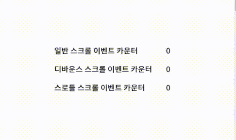

scroll 이벤트를 사용하면 스크롤을 올리거나 내리는 짧은 시간동안 많은 이벤트가 발생한다. 복잡한 작업의 scroll 이벤트를 처리한다면 빈번하게 실행되는 이벤트 때문에 성능이 저하되고 렉이 걸릴 확률이 높아진다. <br>
이처럼 짧은 시간 간격으로 연속해서 발생하는 이벤트의 과도한 이벤트 핸들러 호출을 방지하기 위해 스로틀과 디바운스를 사용하면 성능향상에 도움이 된다.

## 스로틀 (throttle)

짧은 시간 간격으로 이벤트가 연속해서 발생하더라도 <u>**일정 시간 간격**으로 이벤트 핸들러가 **최대 한 번만 호출**되도록</u> 한다.
즉, 스로틀은 짧은 시간 간격으로 연속해서 발생하는 이벤트를 그릅화해서 일정 시간 단위로 이벤트 핸들러가 호출되도록 호출 주기를 만든다.

\*실무에서는 <a href="https://underscorejs.org/#throttle" target="_blank">Underscore의 throttle 함수</a>나 <a href="https://www.geeksforgeeks.org/lodash-_-throttle-method/" target="_blank">Lodash의 throttle 함수</a>를 사용하는것을 권장한다.

```js
// Underscore
var throttled = _.throttle(updatePosition, 100)
$(window).scroll(throttled)

// Lodash
_.throttle(func, wait, options)
```

## 디바운스 (debounce)

짧은 시간 간격으로 이벤트가 연속해서 발생하면 이벤트 핸들러를 호출하지 않다가 <u>**일정 시간이 경과한 이후에** 이벤트 핸들러가 **한 번만 호출**되도록 한다.</u>
즉, 디바운스는 짧은 시간 간격으로 발생하는 이벤트를 그룹화해서 마지막에 한 번만 이벤트 핸들러가 호출되도록 한다.

\*실무에서는 <a href="https://underscorejs.org/#debounce" target="_blank">Underscore의 debounce 함수</a>나 <a href="https://www.geeksforgeeks.org/lodash-_-debounce-method/" target="_blank">Lodash의 debounce 함수</a>를 사용하는것을 권장한다.

```js
// Underscore
var lazyLayout = _.debounce(calculateLayout, 300)
$(window).resize(lazyLayout)

// Lodash
_.debounce(func, wait, options)
```

## 스로틀 vs 디바운스

scroll 이벤트로 스로틀과 디바운스를 비교해보자



- 스로틀 : 일정한 시간이 지날 때마다(500ms) 카운터 증가
- 디바운스 : 스크롤이 멈추고(특정 시간 사이에 어떤 이벤트도 발생하지 않았을 때) 500ms후에 카운터 증가

```html
<ul>
  <li>일반 스크롤 이벤트 카운터 <span class="normal-msg">0</span></li>
  <li>디바운스 스크롤 이벤트 카운터 <span class="debounce-msg">0</span></li>
  <li>스로틀 스크롤 이벤트 카운터 <span class="throttle-msg">0</span></li>
</ul>

<script>
  const $button = document.querySelector("button")
  const $normalMsg = document.querySelector(".normal-msg")
  const $debounceMsg = document.querySelector(".debounce-msg")
  const $throttleMsg = document.querySelector(".throttle-msg")

  // 디바운스
  const debounce = (callback, delay) => {
    let timerId
    return event => {
      // delay가 경과하기 이전에 이벤트가 발생하면 이전 타이머를 취소하고 새로운 타이머를 재설정
      // delay보다 짧은 간격으로 이벤트가 발생하면 callback은 호출되지 않는다.
      if (timerId) clearTimeout(timerId)
      timerId = setTimeout(callback, delay, event)
    }
  }

  // 스로틀
  const throttle = (callback, delay) => {
    let timerId
    return event => {
      // delay가 경과하기 전에 이벤트가 발생하면 아무동작도 하지 않는다.
      // delay가 경과했을 때 이벤트가 발생하면서 새로운 타이머를 재설정한다.
      // 따라서 delay 간격으로 callback이 호출된다.
      if (timerId) return
      timerId = setTimeout(
        () => {
          callback(event)
          timerId = null
        },
        delay,
        event
      )
    }
  }

  window.addEventListener("scroll", () => {
    $normalMsg.textContent = +$normalMsg.textContent + 1
  })

  // 500ms 동안 스크롤 이벤트가 발생하지 않으면 한번만 호출한다.
  window.addEventListener(
    "scroll",
    debounce(() => {
      $debounceMsg.textContent = +$debounceMsg.textContent + 1
    }, 500)
  )

  //
  window.addEventListener(
    "scroll",
    throttle(() => {
      $throttleMsg.textContent = +$throttleMsg.textContent + 1
    }, 500)
  )
</script>
```
