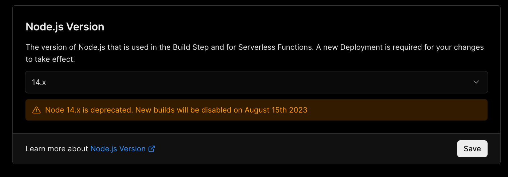
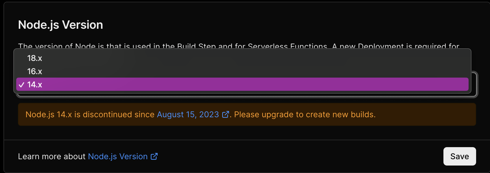
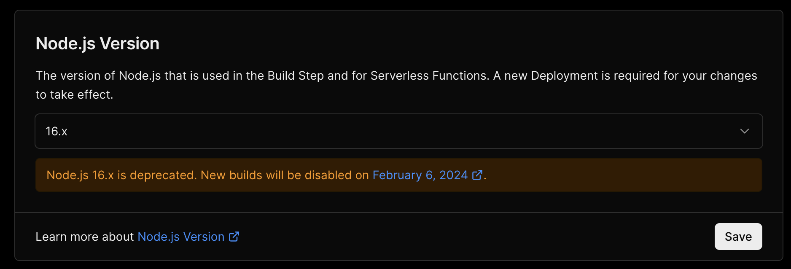
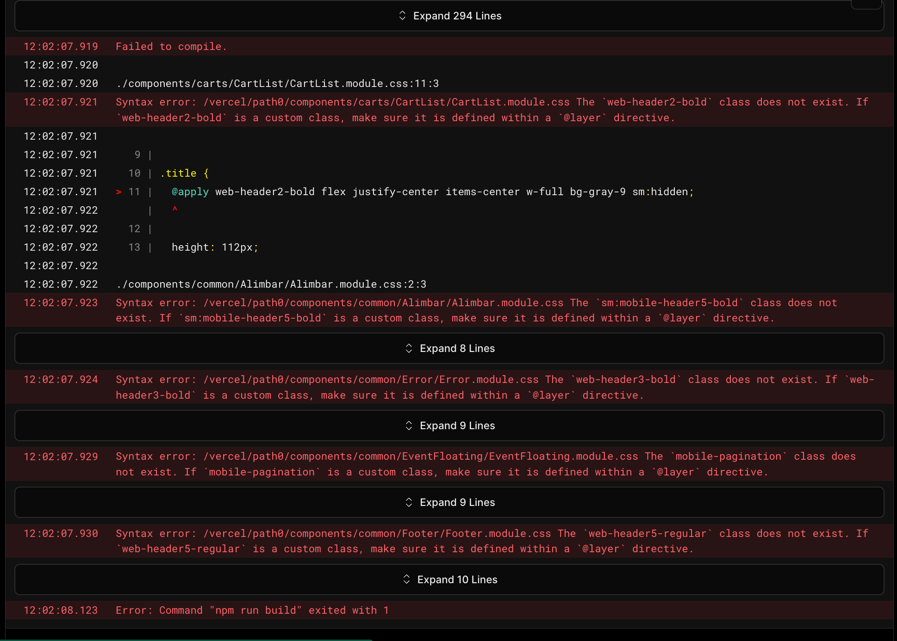
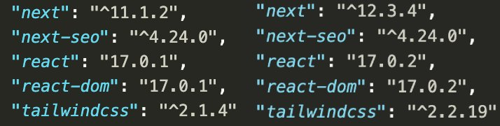
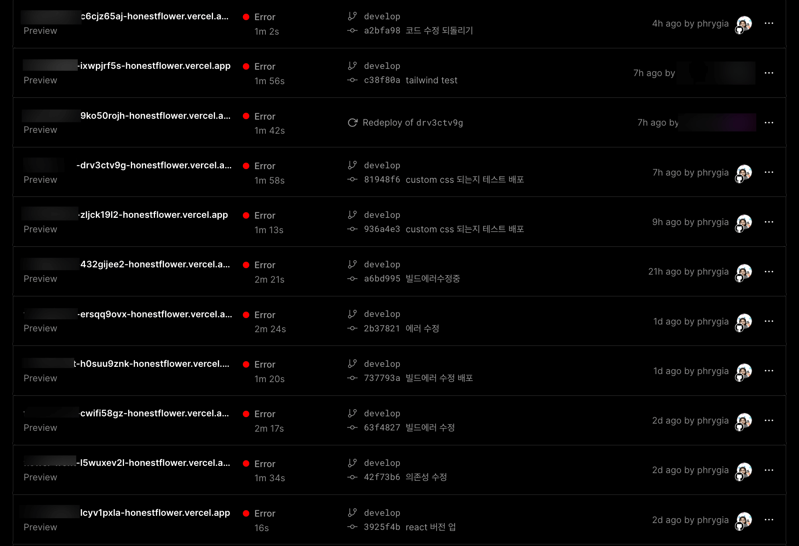
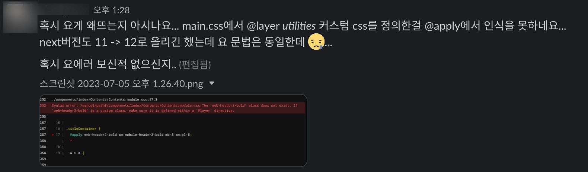
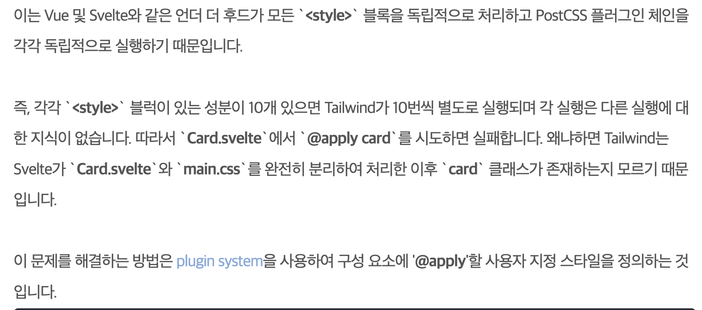
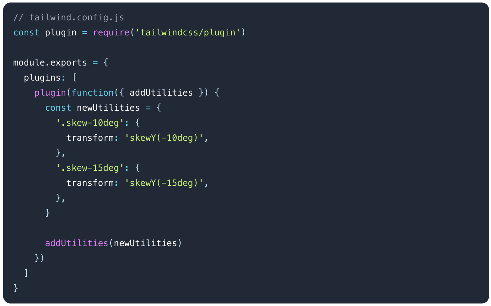

Nextjs로 자사 브랜드를 2개 운영중인 회사의 프론트엔드 개발자로 일하고 있는 필자는 어느순간부터 vercel에 접속할때마다 이런 문구를 발견했다.<br />
`Node 14.x is depercated. New builds will be disabled on August 15th 2023` <br />

2023년 8월 15일부터 새로운 빌드가 적용되지 않는다니😱😱 <br />
2개 프로젝트 모두 node 14로 되어있기 때문에 사수는 8월 15일 전까지만 적용하면 된다고 했다.. (그치만 아직 1년된 쪼렙이 괜히 건들였다가 프러덕션에서 문제 생기면 어쩌지 하는 걱정이 컸다.) <br />
프로젝트 1개는 작년 3분기~올해 1분기에 걸쳐 내가 만들어서 비교적 최신버전을 유지하고 있었기 때문에 상관없었지만, 나머지 1개는 사수가 몇년전에 만들어서 nextjs와 react 버전 자체가 낮았다. 새로운 npm 라이브러리를 설치할때마다 의존성 문제때문에 설치가 되지 않아 `npm install --lagacy-peer-deps`로 강제로 설치하고 있던 상태였다. `npm install --forc`로도 설치가되지 않아 더 강제적으로 설치해야만 했던 지난 날들..
(변명을 하자면 이걸 먼저 해결했었어야 됐는데 회사 개발만으로 항상 바쁘기 때문에 건드리지도 못했었다. 변명이지만..) <br />
어쨋든 무조건 node 버전을 업데이트 해야된 순간이 왔다. option으론 16.x와 18.x 가 있었기 때문에 쫄보는 16.x로 업데이트 하려고 했다.


아니 이보시게, 16.x도 2024년 2월 6일부터 안된다구요? 그럼 무조건 18.x로 해야되는거잖아😱 (18.x가 가장 최상위 버전이기때문에 지원 중단예정에 없다.)


어쩔수 없이 반강제로 18.x로 업데이트 여정이 시작되었다. <br />
(여담으로 내가 만들었던 프로젝트는 갑작스러운 수정요청이 들어왔을때 18.x로 바꿔놓은지 모르고 배포를 했는데 프로젝트가 나름 최신버전으로 되어있었기 때문인지 에러없이 성공적으로 업데이트가 됐다. 얼떨결에 업데이트가 된 샘이다.)

### 18.x 업데이트 에러발생

오래된 버전의 nextjs node버전을 18.x로 수정하고 배포해보았지만.. 역시나 에러가 발생했다. 에러의 원인은 tailwind custom class. 많은 css 파일에서 @apply로 custom class 사용하고 있었기 때문에 tailwind를 다 떼버리긴 쉽지 않았다. 방법을 찾아야했다. 또한 `npm install --lagacy-peer-deps`없이 라이브러리가 설치되지 않는 것도 해결해야 했다. 어차피 시작한거 의존성문제를 위해 react와 nextjs 버전도 업데이트 하기로 결정했다.


#### 1. 라이브러리 버전 업데이트 및 정리

<div style="max-width: 400px;">



</div>

의존성 에러가 발생했던 이유는 오래된 next 버전과 react 버전이 원인이었던 것 같다. next 13까지 나온 상황에서 11.1.2를 사용하고 있었다.. 13버전은 디렉토리 구조와 next 문법이 많이 달라졌기 때문에 13까지 업데이트 하는건 무리라고 판단해 12에서 가장 높은 12.3.4로 업데이트 하고 리액트로 17에서 가장 최신인 17.0.2로 업데이트 했다. <br />
이로 인해 또다른 문제가 발생했는데 업데이트가 되지않는 오래된 라이브러리들에서 에러가 발생했고 아직 `npm i` 로 설치되지 않았다.
이에 사용중이던 라이브러리들에 대한 버전을 찾아 설치하고 (너무 최신이면 또 에러가 발생한다.) 지원이 안되는 오래된 라이브러리들도 정리하여 새로운 라이브러리로 대체하자 정상적으로 설치가 되기 시작했다.

#### 2. tailwind custom class 에러

아직 tailwind custom class 때문에 여전히 많은 error가 발생했고 계속된 빌드 실패...
(이전에 npm run build를 사용해 본적이 없었기때문에 빌드 하고 확인 빌드 확인을 반복하다 vecel이 error로 뒤덮혔는데.. 이상황에 build를 사용하면 되는 거였었다.. 사수도 나도 사용안해봐서 몰랐던 부분으로 내가 build쓰면 배포때와 동일한 에러를 볼수 있다고 알려드렸다.)


기존의 custom class는 이렇게 css파일안에 코딩되어있었는데 왜인지 모르겠으나 node 18.x에서는 이 파일을 제대로 읽어들이지 못하는 것 같았다.

```css
@tailwind base;
@tailwind components;
@tailwind utilities;

@layer utilities {
  .ellipsis1 {
    @apply whitespace-nowrap overflow-hidden overflow-ellipsis;
  }
}

@tailwind variants;
```

이 문제를 해결하기위해 2일은 넘게 뻘짓을 하다가 결국 사수에게 sos..

그때부터 사수도 같이 고민하기 시작했고 사수가 해결해 줬다. (사수가 해결해 준 방법은 나도 적용해봤던건데 코드작성에 문제가 있었는지 해결되지 않았었다.. 결국 방법을 눈앞에 두고 나는 온갖 뻘짓을 한것.. **좀더 꼼꼼히 살펴보자**고 다시한번 느끼는 계기가 되었다. 정신차리자)

#### 3. tailwind custom class 플러그인화

왜 @layer안에 있는 코드를 불러오지 못하는지 이해가 되지 않아 검색하다가 발견한 블로그인데, 이분은 vue/svelte를 예시로 말씀해 주시지만 react도 비슷한 맥락을 가지고 있다고 생각하면 이해가 된다.
react가 &#60;style&#62;블록과 postCSS 플러그인 체인을 각각 독립적으로 실행하기 때문에 커스텀 클래스가 존재하는지 몰라 에러가 발생한다. 해결 방법은 plugin system을 사용하여 구성 요소에 '@apply'할 custom class 스타일을 정의하면 된다. <br />
(그럼 왜 이전에는 된거지? 🤔 아마 nextjs react 버전의 문제라고는 생각한다..)




기존의 css파일 @layer 안에 있던 코드를 tailwind.config.js 파일로 옮긴후 배포했더니 더이상의 에러 없이 18.x 버전으로 업데이트 되었다.


라이브러리 버전 및 tailwind 에러때문에 업데이트완료까지 3일이상의 시간이 걸렸었다. 내가 좀더 꼼꼼하고 자세히 봤었다면 사수의 도움없이도 해결될 수 있었던 문제였는데 아쉬운 마음이 든다. 앞으로는 좀더 주도적이고 꼼꼼하게 살펴보면서 왜 안되는지에 대한 원인도 정확하게 파악해봐야 겠다는 생각이 든다. 시간이 조금 걸리긴 했지만 업데이트 후 에러도 없고 의존성 문제도 해결해서 약간의 자신감과 동시에 주눅이 드는 시간이었던 것 같다.
