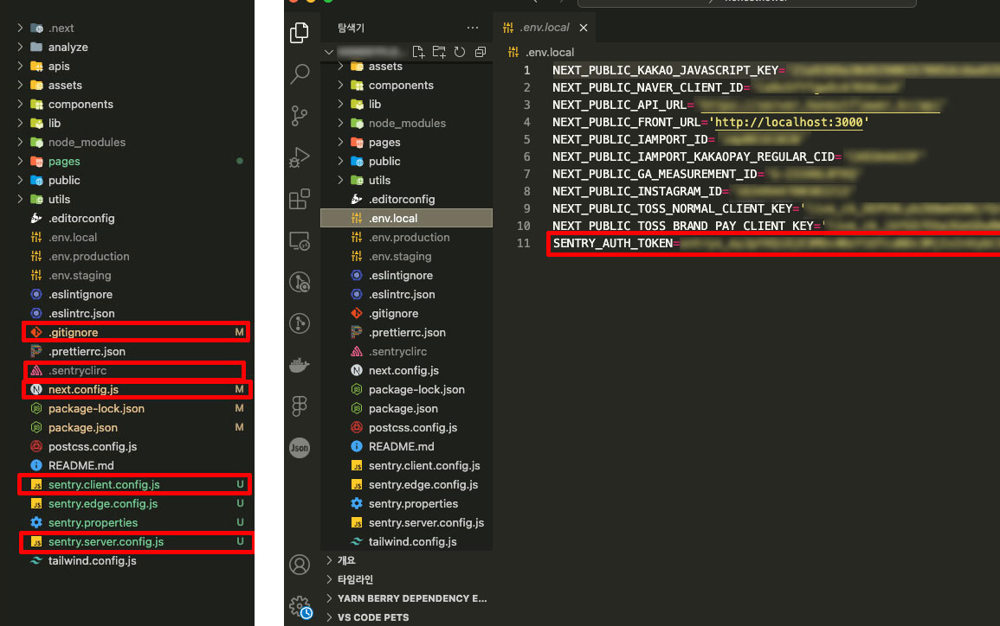

프론트엔드 개발자로 입사한지 어느덧 1년 8개월 정도 되었다.<br>
입사 했을때부터 서버는 Sentry에 연동되어 있었고 Slack으로 알림도 와서 종종 들여다보곤 했으며 사수가 Sentry를 보면서 에러를 해결하는 상황도 종종 옆에서 지켜봤다. <br><br>
프론트 개발자 친구가 자신이 다니는 회사 프로젝트에 Sentry를 도입했다는걸 들었을 때도 딱히 별생각이 없었다. 이유는 Nextjs에서 프론트 에러가 나면 내가 먼저 발견하기도 전에 바로 고객문의가 들어오기 때문이었다. (우리의 고객님들 😇..)<br><br>
그런 내가 회사 Nextjs 파일에 **Sentry를 도입하게 된 이유**는 Nextjs12를 13으로 업그레이드 하려다가 사수한테 빠꾸먹고 이참에 프론트에도 Sentry를 도입해보면 어떻게냐는 제안 때문이었다. <br>
(Nextjs14가 오지게 욕먹고 있기 때문에 피하고 싶어서 13으로 업그레이드 해본다고 했다가 나중에 14로 업데이트 하라고..)<br>

새로운걸 해보고 싶은 마음과 에러 핸들링이 편하다는 사수의 유혹에 제안을 받아들이고 Sentry를 설치했다.<br>

## 1. Sentry 프로젝트 생성

<a href="https://sentry.io/" target="_blank">https://sentry.io/</a>에 접속하고 로그인/회원가입 한다.<br>
(나는 팀 소속이라 사수가 나를 초대해줘서 가입했다. 개인/팀 자신의 상황에 따라 가입하면 된다.)


### Projects 만들기

Projects → Create Project → Nextjs 선택 + Project Name 입력 후 생성


## 2. 프로젝트에 Sentry 설치

프로젝트를 만들면 다음과 같은 설치 안내창이 나옵니다.


프로젝트 root 디렉토리 터미널에서 다음 명령어 입력.

```js
npx @sentry/wizard@latest -i nextjs
```

**🚨 생성한 프로젝트를 선택해주세요**

- <span style="font-weight:600;">Are you using Sentry Saas or self-hosted Sentry?</span><br >
  ㄴ Saas : Sentry 에서 제공하는 클라우드 서비스 <br >
  ㄴ Self-hosted : 자체 웹서버에 Sentry를 설치하는 방법
- <span style="font-weight:600;">Do you alreay have a Sentry acoount?</span><br >
  ㄴ Yes
- <span style="font-weight:600;">Select your Sentry project</span><br >
  ㄴ 위에서 생성한 프로젝트 선택


설치가 완료되면 sentry 관련 폴더가 생성된다.<br>
터미널의 `SENTRY_AUTH_TOKEN`를 복사하여 로컬 환경변수에 추가한다.



## 3. Vercel Sentry Token 환경변수 추가

터미널의 `SENTRY_AUTH_TOKEN` 환경변수 추가


## 4. Sentry Slack 연동하기

### 1) Sentry 계정에 Slack 워크스페이스 등록하기

Setting → Integrations → Slack → Install


### 2) Slack에 Sentry 앱 설치하기

앱 추가 → Sentry 검색 → 추가


### 3) 연동할 Slack 채널 ID 복사하기

슬래채널 마우스 오른쪽 클릭 → 채널 세부정보 보기 → 채널 ID 복사


### 4) Slack으로 전송하는 Alert(이벤트) 생성하기

Alerts → Alert 등록할 프로젝트 선택 → Create Alert


- Set conditions에 local과 개발서버 제외하는 필터 추가하기. <br>
- Slack 워크스페이스 선택 → 복사한 ID와 채널 이름 입력.


## 에러 이벤트 로그 💻

설정하면 다양한 에러가 Slack으로 전송된다. 라이브러리, 결제모듈 등에서 catch로 발생하는 에러도 Sentry 이슈로 전송된다. 내가 작성한 코드에서의 에러도 잡아내지만 프론트에 설치된 라이브러리의 에러도 잡아내는듯 하다. Sentry에서 보내는 모든 에러를 수정할 필요는 없을 듯 하다.


