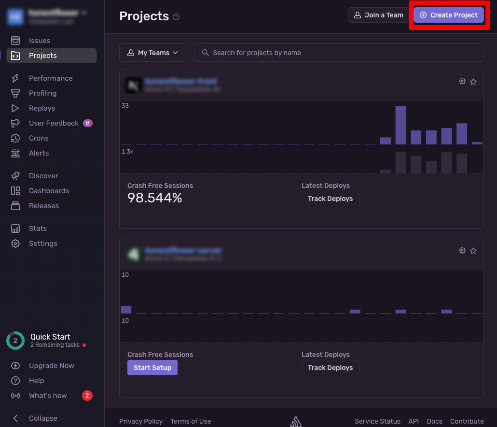
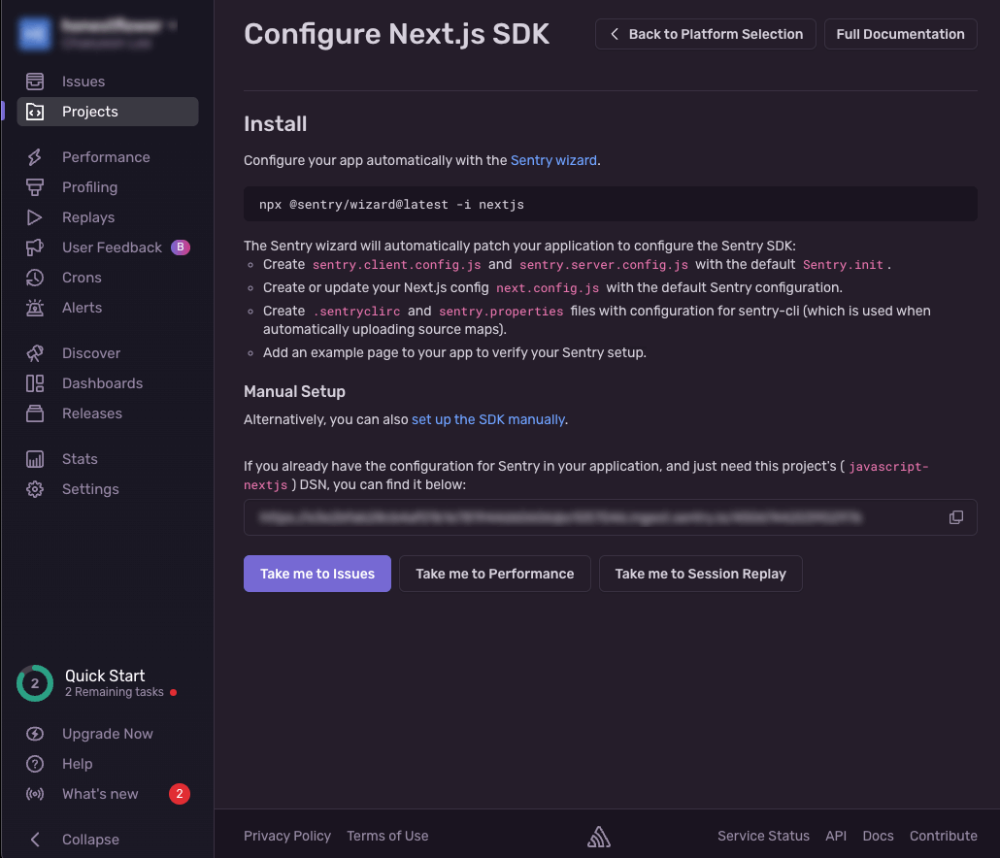

프론트엔드 개발자로 입사한지 어느덧 1년 8개월 정도 되었다.

## Sentry 프로젝트 생성

## 1. 프로젝트에 Sentry 설치

Saas or Self-hosted 
Saas : Sentry 에서 제공하는 클라우드 서비스  
Self-hosted : 자체 웹서버에 Sentry를 설치하는 방법

## 2. Vercel Sentry Token 환경변수 추가

## 3. Sentry Slack 연동하기

### 1) Sentry 계정에 Slack 워크스페이스 등록하기

Setting → Integrations → Slack → Install

### 2) Slack에 Sentry 앱 설치하기

앱 추가 → Sentry 검색 → 추가  
(저는 설정완료했기 때문에 추가되어 있습니다.)

### 3) 연동할 Slack 채널 ID 복사하기

슬래채널 마우스 오른쪽 클릭 → 채널 세부정보 보기 → 채널 ID 복사

### 4) Slack으로 전송하는 Alert(이벤트) 생성하기

Alerts → Alert 등록할 프로젝트 선택 → Create Alert

Set conditions에 local과 개발서버 제외하는 필터 추가하기.  
slack 워크스페이스 선택 → 복사한 ID와 채널 이름 입력.

## 에러 이벤트 로그 💻

