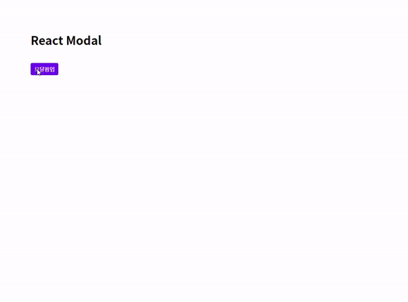

프로젝트를 진행할 때마다 모달창을 마주치는 일이 많다. 프론트엔드 프레임워크나 라이브러리를 사용하면 편리성이나 시간을 아낄 수 있기때문에 npm에 등록된 모듈을 사용하곤 했지만, 만들어진 모듈이 아닌 직접 만들어 재사용해 보기로 했다.

- **어떻게 만들까?**

1. &nbsp;재사용성 고려하기
2. &nbsp;Redux없이 만들기
3. &nbsp;함수형/클래스형 컴포넌트로 각각 만들기

## 1. 함수형으로 컴포넌트 만들기



**\*파일구조** <br>


재사용할 컴포넌트로 Modal.js 파일을 만들고, App.js에서 불러오도록 했다.

**- CSS (함수형/클래스형 공통)**

```css
.modal {
  display: none;
  position: fixed;
  top: 0;
  right: 0;
  bottom: 0;
  left: 0;
  z-index: 99;
  background-color: rgba(0, 0, 0, 0.6);
}
.modal button {
  outline: none;
  cursor: pointer;
  border: 0;
}
.modal > section {
  width: 90%;
  max-width: 450px;
  margin: 0 auto;
  border-radius: 0.3rem;
  background-color: #fff;
  /* 팝업이 열릴때 스르륵 열리는 효과 */
  animation: modal-show 0.3s;
  overflow: hidden;
}
.modal > section > header {
  position: relative;
  padding: 16px 64px 16px 16px;
  background-color: #f1f1f1;
  font-weight: 700;
}
.modal > section > header button {
  position: absolute;
  top: 15px;
  right: 15px;
  width: 30px;
  font-size: 21px;
  font-weight: 700;
  text-align: center;
  color: #999;
  background-color: transparent;
}
.modal > section > main {
  padding: 16px;
  border-bottom: 1px solid #dee2e6;
  border-top: 1px solid #dee2e6;
}
.modal > section > footer {
  padding: 12px 16px;
  text-align: right;
}
.modal > section > footer button {
  padding: 6px 12px;
  color: #fff;
  background-color: #6c757d;
  border-radius: 5px;
  font-size: 13px;
}
.modal.openModal {
  display: flex;
  align-items: center;
  /* 팝업이 열릴때 스르륵 열리는 효과 */
  animation: modal-bg-show 0.3s;
}
@keyframes modal-show {
  from {
    opacity: 0;
    margin-top: -50px;
  }
  to {
    opacity: 1;
    margin-top: 0;
  }
}
@keyframes modal-bg-show {
  from {
    opacity: 0;
  }
  to {
    opacity: 1;
  }
}
```

**- Modal.js**

```js
import React from "react"
import "../../../assets/css/modal.css"

const Modal = props => {
  // 열기, 닫기, 모달 헤더 텍스트를 부모로부터 받아옴
  const { open, close, header } = props

  return (
    // 모달이 열릴때 openModal 클래스가 생성된다.
    <div className={open ? "openModal modal" : "modal"}>
      {open ? (
        <section>
          <header>
            {header}
            <button className="close" onClick={close}>
              &times;
            </button>
          </header>
          <main>{props.children}</main>
          <footer>
            <button className="close" onClick={close}>
              close
            </button>
          </footer>
        </section>
      ) : null}
    </div>
  )
}
```

**- App.js**

```js
import React, { useState } from "react"
import Modal from "./commons/components/Modals/Modal"

function App() {
  // useState를 사용하여 open상태를 변경한다. (open일때 true로 만들어 열리는 방식)
  const [modalOpen, setModalOpen] = useState(false)

  const openModal = () => {
    setModalOpen(true)
  }
  const closeModal = () => {
    setModalOpen(false)
  }

  return (
    <React.Fragment>
      <button onClick={openModal}>모달팝업</button>
      //header 부분에 텍스트를 입력한다.
      <Modal open={modalOpen} close={closeModal} header="Modal heading">
        // Modal.js <main> {props.children} </main>에 내용이 입력된다. 리액트
        함수형 모달 팝업창입니다. 쉽게 만들 수 있어요. 같이 만들어봐요!
      </Modal>
    </React.Fragment>
  )
}

export default App
```

## 2. 클래스형으로 컴포넌트 만들기

**- Modal.js (재사용 컴포넌트 - 자식)**

```js
import React, { useState } from "react"
import Modal from "../../../commons/components/Modals/Modal"

export class Modal extends Component {
  render() {
    // 열기, 닫기, 모달 헤더 텍스트를 부모로부터 받아옴
    const { open, close, header } = this.props

    return (
      <div className={open ? "openModal modal" : "modal"}>
        {open ? (
          <section>
            <header>
              {header}
              <button className="close" onClick={close}>
                &times;
              </button>
            </header>
            <main>{this.props.children}</main>
            <footer>
              <button className="close" onClick={close}>
                close
              </button>
            </footer>
          </section>
        ) : null}
      </div>
    )
  }
}
```

**- App.js (부모 컴포넌트)**

```js
import React, { Component } from 'react';
import Modal from './commons/components/Modals/Modal';

export class ChatRooms extends App {
    this.state = {
        modalOpen: false,
    }

    openModal = () => {
        this.setState({ modalOpen: true })
    }
    closeModal = () => {
        this.setState({ modalOpen: false })
    }
    render() {
        return (
            <React.Fragment>
                <button onClick={ this.openModal }> 모달팝업</button>
                <Modal open={ this.state.modalOpen } close={ this.closeModal } title="Create a chat room">
                    // Modal.js <main> { this.props.children } </main>에 내용이 입력된다.
                    리액트 클래스형 모달 팝업창입니다.
                    쉽게 만들 수 있어요.
                    같이 만들어봐요!
                </Modal>
            </React.Fragment>
        )
    }
}
export default App
```

이로써 어디서든 Modal 컴포넌트를 가지고 와서 재사용할 수 있게 되었다. 모달은 워낙 기본적이고 중요한 부분은 아니라 만들어진 모듈을 사용할때가 많은데, 못만들어서 모듈을 이용하는 것과 만들줄 알지만 너무 할일이 많아서 모듈을 이용하는 건 매우 다르다고 생각되었다. 나는 어느쪽인가 생각해 보다가 만들어 보기로 했고, 생각보다 어렵지 않게 만들 수 있었다. 처음에는 함수형으로 만들었지만 클래스형 컴포넌트의 사용률이 더 높기 때문에 클래스형도 함께 만들어 봤다. 앞으로 작은 프로젝트이거나 커스텀이 필요해서 원하는 모듈이 없을때는 모달창을 직접 만들어 사용할 수 있을 것 같다.
