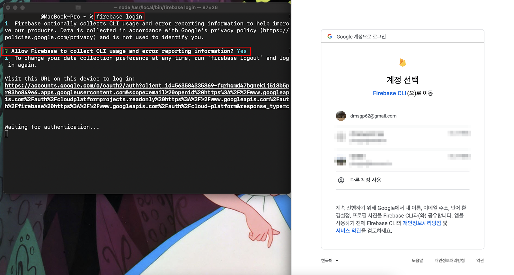
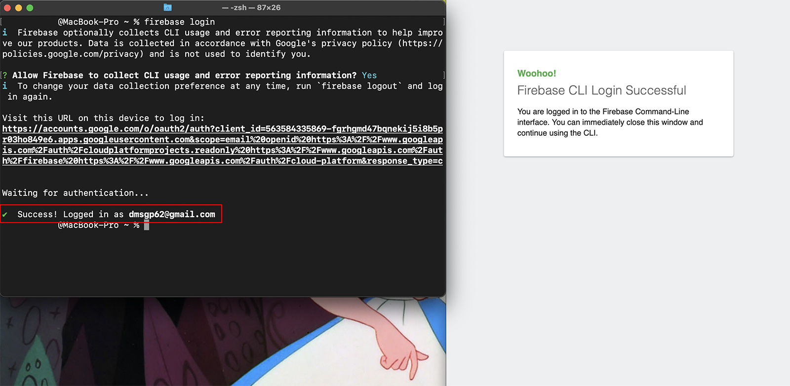
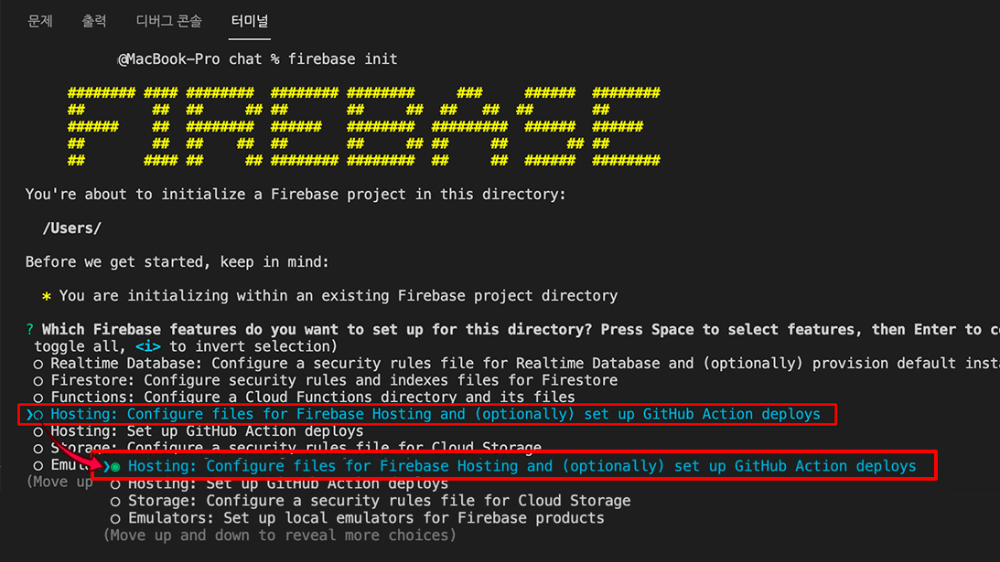
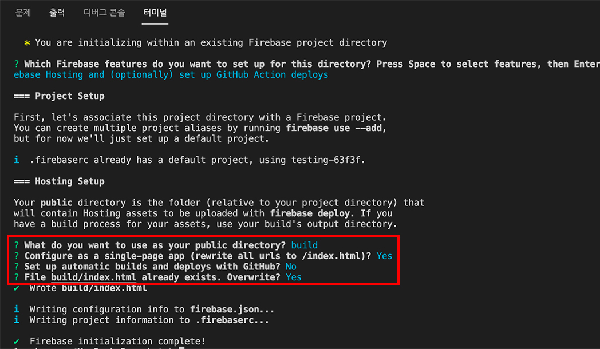
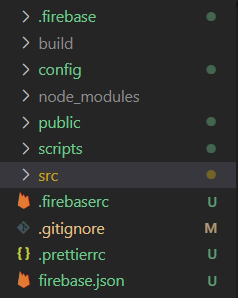
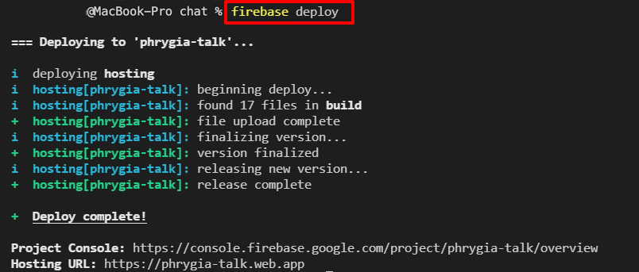
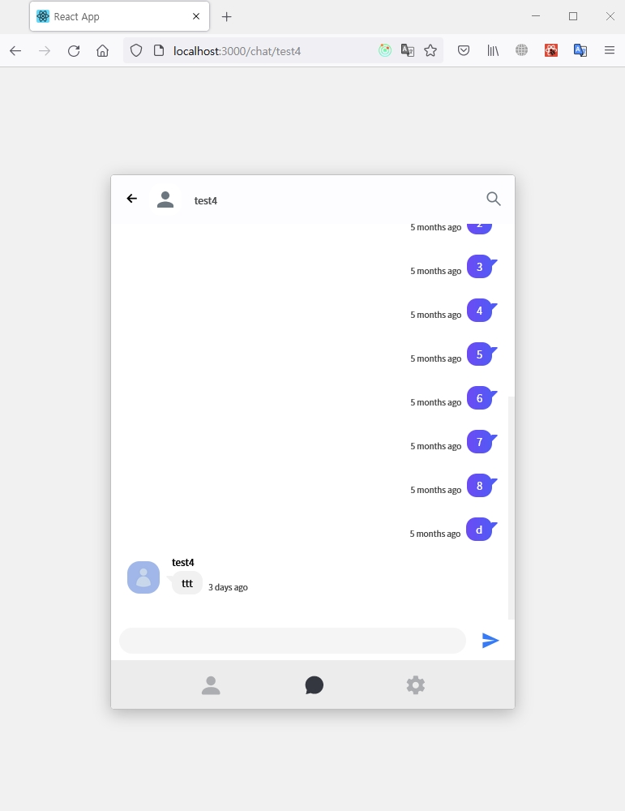
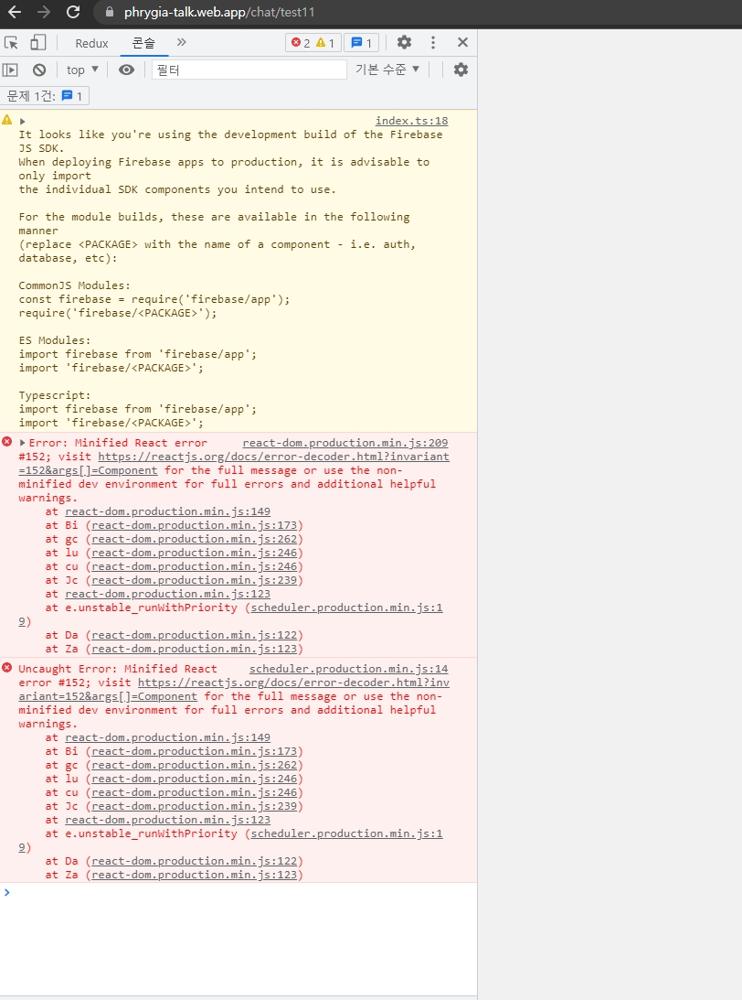

개인 포트폴리오 프로젝트 중 하나를 firebase를 이용하여 채팅앱을 만들었다. firebase를 이용하여 만들었으니 배포까지 해보자. <a href="https://firebase.google.com/" target="_blank">google firebase</a>에서 프로젝트를 만들어 앱에 연결된 상태이고 **build까지 완료**된 상태다.

## 1. CLI 설치 및 firebase 로그인

```js
// CLI 설치
npm install -g firebase-tools
yarn add firebase-tools

// firebase 로그인
firebase login
```

터미널 창에서 위 코드를 입력하고 로그인을 하면 `Allow Firebase to collect CLI usage and error reporting information?`가 뜨면 Y를 입력하고 구글 계정을 선택하여 로그인한다.



로그인이 완료되면 Success! 문구가 뜬다.


## 2. firebase 설정하기

```js
firebase init
```

설정에서 Hosting을 선택하고 **스페이스** 누르고 엔터(선택)



이미 프로젝트를 생성했기 때문에 `Use an existing project`를 선택했다.



`What do you want to use as your public directory?` <br>
&nbsp; → 미리 build한 폴더의 index.html파일을 사용하기 위해 **build**를 입력한다.<br>

`Configure as a single-page app (rewrite all urls to /index.html)?` <br>
&nbsp; → SPA일 경우 모든 url을 index.html으로 다시 작성하겠냐는 질문같은데 나는 리액트를 이용했기 때문에 **Y**를 입력했다.<br>

`Set up automatic builds and deploys with Github?` <br>
&nbsp; → 자동적으로 Github을 배포할거냐는 질문같은데 나는 N를 입력했다.<br>

`File build/index.html already exists. Overwrite?` <br>
&nbsp; → 이미 있는 index.html을 덮어쓰겠냐는 질문인데 나는 Y를 입력했다. <br><br>

자신의 상황에 맞게 설정하면 된다. firebase 설치완료가 뜨고 firebase.json파일과 .firebaserc 생성됐다면 설정이 완료된 것이다.



## 3. firebase 배포하기

```js
firebase deploy
```

Deploy complete가 완료되면 자신의 firebase URL이 나타난다.



접속하면 정상적으로 작동한다.


## \*Firebase Hosting Setup Complete이 뜬다면?


난 처음에 Firebase Hosting Setup Complete이 계속 떴었는데 `What do you want to use as your public directory?`에서 public을 입력하라는 글을 보고 따라했던게 원인인 것 같다. build로 입력하고 배포하니 정상적으로 작동했다.

**\*알 수 없는 오류발생** <br>
로컬 파일에서는 채팅을 보내면 정상적으로 작동하는데 배포한 프로젝트에서는 저부분에 오류가 발생했다.





구글 콘솔에서 뜨는 URL(<a href="https://reactjs.org/docs/error-decoder.html/?invariant=152&args[]=Component" target="_blank">Error Decoder</a>)을 살펴봐도 왜 오류가 뜨는지 알수가 없어 저부분은 해결하지 못하고 있다. 😭 (제일 중요한 페이지인데) 혹시 원인을 아신다면 댓글 부탁드립니다. 😭😭
