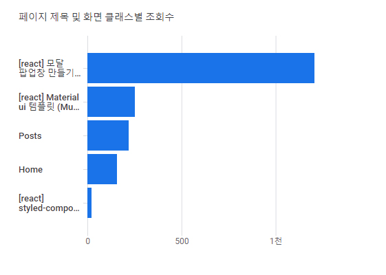
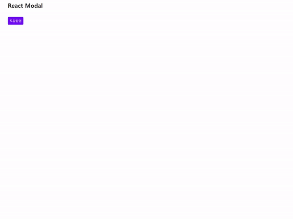
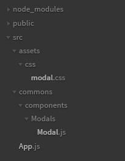

<div style="text-align: left;">



</div>

내 블로그에서 가장 조회수가 높은 포스팅은 react 모달 포스팅이다. (<a href="https://phrygia.github.io/react/2021-09-21-react-modal/" target="_blank">[react] 모달 팝업창 만들기</a>) <br>
전에 만들었던 Modal은 트랜지션이 적용되지 않았었다. 최근 프로젝트를 만들면서 트랜지션이 적용된 Modal을 만들어야 했었기에 트랜지션이 적용된 react Modal을 만들어 보기로 했다. <br>
(\* Modal은 이전에 만들었던 코드에 트랜지션을 추가 적용한다.)

## 트랜지션이 적용된 Modal 컴포넌트 (함수형)

<small class="from">-완성된 모습-</small>



**\*파일구조** <br>



**- CSS**

```css
.modal {
  position: fixed;
  top: 0;
  right: 0;
  bottom: 0;
  left: 0;
  z-index: 99;
  background-color: rgba(0, 0, 0, 0.6);
  animation: fadeOut 0.25s ease-out forwards;
  display: flex;
  justify-content: center;
  align-items: center;
}
.modal button {
  outline: none;
  cursor: pointer;
  border: 0;
}
.modal.open {
  animation-name: fadeIn;
}
.modal.open > section {
  animation-name: slideUp;
}
.modal > section {
  width: 90%;
  max-width: 450px;
  margin: 0 auto;
  border-radius: 0.3rem;
  background-color: #fff;
  overflow: hidden;
  animation: slideDown 0.25s ease-out forwards;
}
.modal > section > header {
  position: relative;
  padding: 16px 64px 16px 16px;
  background-color: #f1f1f1;
  font-weight: 700;
}
.modal > section > header button {
  position: absolute;
  top: 15px;
  right: 15px;
  width: 30px;
  font-size: 21px;
  font-weight: 700;
  text-align: center;
  color: #999;
  background-color: transparent;
}
.modal > section > main {
  padding: 16px;
  border-bottom: 1px solid #dee2e6;
  border-top: 1px solid #dee2e6;
}
.modal > section > footer {
  padding: 12px 16px;
  text-align: right;
}
.modal > section > footer button {
  padding: 6px 12px;
  color: #fff;
  background-color: #6c757d;
  border-radius: 5px;
  font-size: 13px;
}

@keyframes fadeIn {
  from {
    opacity: 0;
  }
  to {
    opacity: 1;
  }
}
@keyframes fadeOut {
  from {
    opacity: 1;
  }
  to {
    opacity: 0;
  }
}
@keyframes slideUp {
  from {
    transform: translateY(-100px);
  }
  to {
    transform: translateY(0px);
  }
}
@keyframes slideDown {
  from {
    transform: translateY(0px);
  }
  to {
    transform: translateY(-100px);
  }
}
```

**- Modal.js**

```js
import React, { useState, useEffect } from "react"

const Modal = props => {
  // 열기, 닫기, 모달 헤더 텍스트를 부모로부터 받아옴
  const { open, close, header } = props

  // 현재 트랜지션 효과를 보여주고 있는 중이라는 상태 값
  const [animate, setAnimate] = useState(false)
  // 실제 컴포넌트가 사라지는 시점을 지연시키기 위한 값
  const [visible, setVisible] = useState(open)

  useEffect(() => {
    setVisible(open)

    // open 값이 true -> false 가 되는 것을 감지 (즉, 모달창을 닫을 때)
    if (visible && !open) {
      setAnimate(true)
      setTimeout(() => setAnimate(false), 200)
    }
    return () => {
      setVisible(false)
    }
  }, [visible, open])

  if (!animate && !visible) return null

  return (
    // 모달의 open close클래스로 css animation을 구현
    <div className={open ? "modal open" : "modal"}>
      <section>
        <header>
          {header}
          <button className="close" onClick={close}>
            &times;
          </button>
        </header>
        <main>{props.children}</main>
        <footer>
          <button className="close" onClick={close}>
            close
          </button>
        </footer>
      </section>
    </div>
  )
}

export default Modal
```

**- App.js**

```js
import React, { useState, useEffect } from "react"

const App = () => {
  // useState를 사용하여 open상태를 변경한다. (open일때 true로 만들어 열리는 방식)
  const [modalOpen, setModalOpen] = useState(false)

  const openModal = () => {
    setModalOpen(true)
  }
  const closeModal = () => {
    setModalOpen(false)
  }

  return (
    <React.Fragment>
      <button onClick={openModal}>모달팝업</button>
      <Modal open={modalOpen} close={closeModal} header="Modal heading">
        함수형 모달 팝업창입니다. 쉽게 만들 수 있어요. 같이 만들어봐요!
      </Modal>
    </React.Fragment>
  )
}

export default App
```

이전코드와 달라진점은 animate, visible 상태값을 추가하고 모달창을 열때와 닫을때의 상태를 체크하여 그에 맞는 css animation 값을 준다는 것이다. 특히, 모달창을 닫을때의 상태를 체크해서 setTimeout으로 애니메이션을 보여준다음 모달창을 사라지게 해야한다는 것이다.
