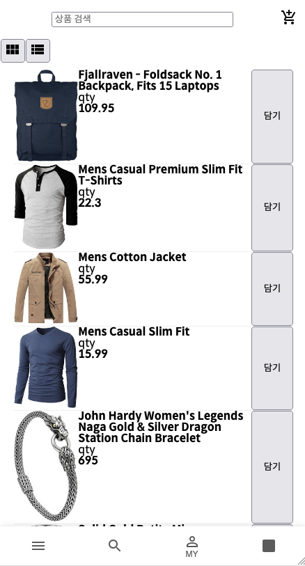

커머스 인하우스 신입 프론트엔드 개발자로 취업한지 2달정도 되었다. 현재 회사는 3개의 사이트를 가지고 있는데 1개만 자체솔루션이고 2개는 쇼핑몰 웹 솔루션을 사용하고 있다. 일반 솔루션을 사용하면 개발에 한정적이고 재고를 정확하게 관리하기 힘들기 때문에 하반기에 자체 솔루션 개발 계획이 있었다. 어쩌다보니 입사하고 3개월도 안되어 새롭게 구축하는 자체 솔루션 사이트의 웹 프론트 페이지 전체 구현을 맡게 되었다. 🤣 <br>
사수님이 내가 원하는 스택을 마음껏 사용해도 된다고 해서 어떤 라이브러리를 사용할까 고민해보다가 많은 회사들이 Reacy Query라는 것을 사용해 프론트와 서버의 상태관리를 분리 시키는 작업을 한다는 것을 알게 되었고, 나도 새로운 트렌드를 따라가보고 싶어 사용을 결정하게 되었다 <br>
실서비스에 적용하기에 앞서 최소한의 지식을 습득하고자 React Query가 무엇인지에 대해 공부해 보았다.

## React Query?

> `React Query is often described as the missing data-fetching library for React, but in more technical terms, it makes fetching, caching, synchronizing and updating server state in your React applications a breeze.` <br> React Query는 종종 누락된 데이터를 가져오기 위한 React 라이브러리로 설명되지만, React(클라이언트)에서 서버의 값을 가져오거나 캐싱, 동기화, 업데이트할 수 있도록 해준다. <br>

위는 React Query의 <a href="https://tanstack.com/query/v4/docs/overview" target="_blank">공식문서</a>에 나와있는 설명으로 대충 요약하자면 클라이언트에서 서버의 값을 핸들링하기 쉽게 만들어 준다는 말이다.

#### 그렇다면 이전 방식보다 나은점은 무엇일까?

React Query 이전에는 서버의 값을 핸들링하기 위해서는 loading, error, fetch 등 서버값을 다루기 위한 동작들을 개발자가 직접 구현해줘야 했었다. 실제로 Redux에서 서버값을 받아온다면 try/catch 구문을 써야 하는 등 코드가 장황하게 길어지는 순간들이 발생한다. <br>
또한 React Query는 자체적으로 캐싱 기능이 있기 때문에 개발자가 직접 구현하지 않아도 되며 Hooks를 기반으로한 리액트스러운 라이브러리이기 때문에 리액트 개발자가 사용하기 쉽다는 장점이 있다. (심지어 자체 devtools가 있다.)<br>
캐싱, get한 데이터의 자동 updating 지원, 중복 호출 컨트롤 지원, 무한 스크롤, 쉬운 비동기 관리 등등..

## React Query의 Server State


<small class="from">이미지 출처 : <a href="https://freestrokes.tistory.com/170" target="_blank">https://freestrokes.tistory.com/170</a></small> <br>

- **Fetching** - 데이터를 요청하는 초기 상태.
- **Fresh** - 데이터가 만료되지 않은 상태. 새로고침 시 다시 Fetching됨.
- **Stale** - 데이터가 만료된 상태. 데이터의 최신화가 필요하기 때문에 Fetching을 통해 Fresh상태 유지. <br>
  &nbsp; &nbsp; fresh에서 stale로 변경되는 시간 : staleTime(기본값: 0)
- **Inactive** - 애플리케이션에서 사용하지 않는 데이터에 대한 상태. 가비지 컬렉터에 의해 제거 됨. <br>
  &nbsp; &nbsp; 캐싱된 상태로 남아있는 시간: cacheTime(기본값: 5분)
- **Delete** - Inactive 데이터가 가비지 컬렉터에 의해 캐시에서 삭제된 상태.

ex) ['data']라는 query key로 데이터를 `Fetching `<br>
→ ['data']라는 query key를 가진 값이 캐싱 됨<br>
→ ['data']가 `Fresh` 상태에서 `staleTime` 이후 `Stale` 상태가 됨<br>
→ `cacheTime`이 지난 후 가비지 컬렉터에 수거되고 `Delete`됨.<br>
(cacheTime 이전에 새롭게 mount되면, Fetching이 실행되고 Fresh한 값을 설정하는 동안 캐싱된 데이터가 보여짐)

## Reacy Query 기본 사용

React Query에서 많이 사용되는 기본 API에 대해 알아보자

### 1. useQuery (query key), useQueries

일반적으로 프론트 개발자가 코딩할 때 가장 많이 쓰는 API 메서드가 get이라고 생각되는데 useQuery는 데이터를 get 하기 위한 api다. <br>
동기적으로 실행하고 싶다면 `enabled`옵션을 사용하면 된다.

```js
// useQuery 옵션
useQuery(queryKey, queryFn?, {
  cacheTime,
  enabled,
  networkMode,
  initialData,
  initialDataUpdatedAt,
  isDataEqual,
  keepPreviousData,
  meta,
  notifyOnChangeProps,
  onError,
  onSettled,
  onSuccess,
  placeholderData,
  queryKeyHashFn,
  refetchInterval,
  refetchIntervalInBackground,
  refetchOnMount,
  refetchOnReconnect,
  refetchOnWindowFocus,
  retry,
  retryOnMount,
  retryDelay,
  select,
  staleTime,
  structuralSharing,
  suspense,
  useErrorBoundary,
})
```

**· 첫번째 파라미터** : Array형태의 query Key(unique key). <br>
(이전에는 string, array이 였는데 업데이트 되면서 string만 입력하면 에러가 뜨는걸 보니 array형태의 값이어야 하는 것 같다.)<br>
**· 두번째 파라미터** : query Function. 즉 api를 요청하는 Promise 기반의 비동기 함수. <br>
**· 그 외 옵션** : {} 안에서 사용할 수 있는 유용한 프러퍼티들. <br>
(onError, onSuccess 등 비동기 요청에 대한 성공 실패를 쉽게 다룰 수 있다.)

useQuery는 기본적으로 비동기로 동작하기 때문에 여러개의 useQuery가 존재한다면 여러개가 동시에 실행된다. (여러개가 존재한다면 useQueries 사용)

```js
// 여러 useQuerie - 가독성 및 불필요한 코드 증가
const query1 = useQuery(["data1"], fetchData1)
const query2 = useQuery(["data2"], fetchData2)
const query3 = useQuery(["data3"], fetchData3)

// useQueries 사용
const results = useQueries({
  queries: [
    { queryKey: ["post", 1], queryFn: fetchPost, staleTime: Infinity },
    { queryKey: ["post", 2], queryFn: fetchPost, staleTime: Infinity },
  ],
})
```

### 2. useMutation

useMutation은 서버의 데이터를 바꿀때 (create, update, delete) 사용하는 api다. <br>
mutation에 대한 다양한 프러퍼티를 제공한다.

```js
const {
  data,
  error,
  isError,
  isIdle,
  isLoading,
  isPaused,
  isSuccess,
  mutate,
  mutateAsync,
  reset,
  status,
} = useMutation(mutationFn, {
  cacheTime,
  mutationKey,
  networkMode,
  onError,
  onMutate,
  onSettled,
  onSuccess,
  retry,
  retryDelay,
  useErrorBoundary,
  meta,
})

// mutate 함수를 호출하여 mutation을 실행
mutate(variables, {
  onError,
  onSettled,
  onSuccess,
})
```

```js
// WritePost.js
import { useMutation, useQueryClient } from '@tanstack/react-query';

const WritePost = () => {
  const addPost = (data) => {
    return axios.post(`https://jsonplaceholder.typicode.com/posts`, data);
  };

  const mutation = useMutation((data) => addPost(data), {
    onMutate: (variables) => {
      console.log('onMutate', variables);
      // variable : { title: `title`, body: `body`, userId: 1 }
    },
    onError: (error, variables, context) => {
      console.log('onError', context);
    },
    onSuccess: (data, variables, context) => {
      console.log('onSuccess', data);

      // update후에 query key의 get 함수를 재실행
      queryClient.invalidateQueries(query key);

      // mutation에서 return된 값으로 get 함수의 파라미터를 변경해야할 경우 setQueryData 사용
      queryClient.setQueryData([query key, { userId: 1 }], data);
    },
    onSettled: (data, error, variables, context) => {
      console.log('onSettled', data);
    },
  });

  const handleSubmit = () => {
    mutation.mutate({ title: `title`, body: `body`, userId: 1 });
  };

  return (
    <div>
      <button type="button" onClick={handleSubmit}>
        Add to Post
      </button>
      {mutation.isLoading && 'loading...'}
      {mutation.isSuccess && 'post update success!!'}
    </div>
  );
};

export default WritePost;
```

### 3. useQuery의 Query Options

자주 쓰이는 Query Option에 대해 알아보자 (더 많은 옵션들은 <a href="https://tanstack.com/query/v4/docs/overview" target="_blank">공식문서</a>에서..)

1. **enabled (boolean)** <br>
   동기로 바꿔주어 자동으로 실행되지 않게 설정하는 옵션
2. **retry (boolean | number | (failureCount: number, error))**<br>
   요청이 실패했는 때 재시도 횟수를 정하는 옵션으로, 기본값은 3번이다.
3. **staleTime (number)** <br>
   데이터가 Fresh 상태로 유지되는 시간이다. 기본값은 0이며 이후 Stale 상태가 된다.
4. **cacheTime (number)** <br>
   Inactive 상태에서 캐시 데이터가 메모리에 남아있는 시간이다. (기본 5분) 이후 가비지 컬렉터에 수거되고 Delete 상태가 된다.
5. **onSuccess (data)** <br>
   쿼리 성공 시 실행되는 함수로 서버에서 넘어오는 값을 useState로 설정하기 좋다.
6. **onError (error)** <br>
   쿼리 실패 시 실행되는 함수로 에러에 대한 처리를 할 수 있다.
7. **initialData** <br>
   쿼리가 아직 생성되기 전에 해당 쿼리값을 불러오도록 코딩하면 참조 에러가 발생하는데 이때 쿼리 캐시의 초기 데이터를 설정한다. (초기 데이터는 기본적으로 Stale 상태임)

## useQuery를 이용한 get 예시

#### 기본설정

먼저 사용하고 있는 React 프로젝트에 Reacy Query를 설치한다. (devtools를 사용하고 싶다면 같이 설치해준다.)

```js
$ npm i @tanstack/react-query
// or
$ yarn add @tanstack/react-query

// devtools
$ npm i @tanstack/react-query-devtools
// or
$ yarn add @tanstack/react-query-devtools
```

**QueryClientProvider?** <br>
리액트에서 비동기 요청을 처리하기 위한 Context Provider로 하위 컴포넌트들에서 QueryClient를 사용할 수 있게 해줍니다. (최상위에 위치한다면 전역적으로 사용할 수 있다.)<br>

```js
// -index.jsx
import React from "react"
import ReactDOM from "react-dom/client"
import "./index.css"
import App from "./App"
import { QueryClient, QueryClientProvider } from "@tanstack/react-query"
import { ReactQueryDevtools } from "@tanstack/react-query-devtools"

const queryClient = new QueryClient()
const rootNode = document.getElementById("root")

ReactDOM.createRoot(rootNode).render(
  <React.StrictMode>
    <QueryClientProvider client={queryClient}>
      <App />
      {/* devtools */}
      <ReactQueryDevtools initialIsOpen={false} />
    </QueryClientProvider>
  </React.StrictMode>
)
```

#### 기본 API를 사용하여 상품 목록 불러오기

 <br>
https://fakestoreapi.com 쇼핑몰 api를 사용하여 상품 목록을 불러와보자.

```js
// ProductList.jsx
import React, { useState } from "react"
import { useQuery } from "@tanstack/react-query"
import ListProductItem from "../../ui/Product/ListProductItem"
import { Props, Apis } from "../../../utils/lib/api"

const ProductList = () => {
  const [products, setProducts] = useState([])
  const [listType, setListType] = useState("list")

  const { error, status, isLoading } = useQuery(
    ["products"],
    () => Apis.get("/products"),
    {
      onSuccess: data => setProducts(data),
    }
  )

  return (
    <div>
      {isLoading && <p>isLoading...</p>}

      {products.length > 0 && (
        <ul>
          <ListProductItem products={products} />
        </ul>
      )}
    </div>
  )
}

export default ProductList
```

```js
// api.js
import axios from "axios"

const api = axios.create({
  baseURL: "https://fakestoreapi.com/",
  headers: {
    "Content-type": "application/json; charset=UTF-8",
    accept: "application/json,",
  },
})

export const Apis = {
  get: (url: string) => api.get(url).then(res => res.data),
  // post, patch, delete 구현..
}
```

React Query를 처음 사용했을때는 fetch 함수를 작성해야 하는데 (api를 요청하는 부분) 왜 굳이 useQuery를 또 써야하지에 대한 의문점이 생겼었는데 계속 공부를 하다보니 데이터를 좀 더 직관적이고 쉽게 다둘 수 있어 좋다고 생각되는 라이브러리다. error, loading 및 재요청 횟수, 캐시 시간설정까지 옵션을 사용하면 쉽게 데이터를 다룰 수 있어 편하다고 생각되었고 왜 많은 개발회사들이 React Query를 사용하는지 알 수 있었다. <br>
다가오는 새 프로젝트에서 자유자재로 React Query를 사용하는 그날까지 더 열심히 공부해야겠다. (udemy에 reacy Query에 대한 강의를 보면서 공부했었는데 굳이 강의를 보지 않아도 될정도로 쉽게 배울 수 있는 라이브러리라고 생각된다.)
