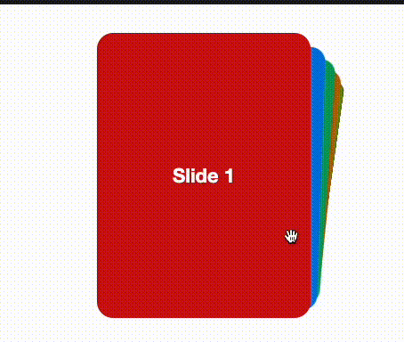
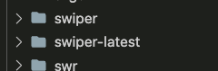

회사에서 VIP를 상대로 한 연말 프로모션 페이지를 만들기 위해 한장한장 카드를 넘기는듯한 UI가 필요했습니다. 저희 회사는 기존에 <a href="https://swiperjs.com/demos" targer="_blank">Swiper</a>를 사용하고 있었기 때문에 평소 자주 사이트를 방문하는 편이었고 전에 demo 페이지에서 봤던 기억을 떠올렸습니다. Effect cards 효과를 디자이너분께 보여드렸더니 생각했던것과 똑같다고 해주셔서 이걸 사용해서 작업을 하기로 했습니다.

<div style="max-width:380px; margin-left:auto; margin-right:auto;">



</div>

```js
// package.json
{
    "swiper": "^6.8.0",
}
```

그런데 한가지 문제가 있었습니다. 저희 회사 홈페이지는 2년도 전에 만들었기 때문에 낮은 버전의 swiper가 깔려있다는게 문제였죠. Effect cards 7.0.0부터 사용이 가능합니다. 무작정 버전을 업그레이드 하기엔 import를 불러오는 형태가 다르기 때문에 기존에 사용하던 수많은 코드를 수정해야 하는 문제가 있습니다. 산더미같이 쌓여있는 프로젝트때문에 많은 시간을 할애 할수도 없는게 직장인의 슬픈 현실이죠 🥲

줄서있는 프로젝트를 제치고 급하게 연말 프로젝트로 들어온 일이었기 때문에 빠른 작업이 중요했습니다. 제가 직접 구현하는 것보다 라이브러리를 사용하는게 훨씬 속도가 빠르겠지만 모든 파일을 수정할수도 없는 노릇이었죠.
그래서 고민을 하다 생각한 방법이 같은 라이브러리를 다른 버전으로 설치하는 방법이었습니다. (권장하진 않습니다. 빠른 구현을 위해 어쩔수 없다고 합리화 했습니다.) 나중에 꼭 삭제하리라 마음먹고(혹시 구버전을 삭제하고 신버전으로 교체) 구글링하고 적용해 보았습니다.

```js
npm install <alias>@npm:<라이브러리명>
yarn add <alias>@npm:<라이브러리명>

// npm install swiper-lastest@npm:swiper@latest - 최신버전 설치
// npm install swiper-lastest@npm:swiper@11.0.5 - 특정버전 설치
```

이렇게 설치하면 package.json에 새롭게 라이브러리가 추가되고 node_modules에는 swiper-latest라는 폴더가 생성되었습니다.

```js
// package.json
{
    "swiper": "^6.8.4",
    "swiper-latest": "npm:swiper@^11.0.5",
}
```



파일에서는 이렇게 불러오면 잘 작동하는 걸 볼 수 있습니다!

```js
import { Swiper, SwiperSlide } from "swiper-latest/react"
import { EffectCards, Pagination } from "swiper-latest/modules"

import "swiper-latest/css/effect-cards"
```

<div style="max-width:380px; margin-left:auto; margin-right:auto;">


</div>

시간이 넉넉하다면 기존 라이브러리 버전을 업데이트 해서 파일들을 수정하는 방식을 권장하지만, 저처럼 시간이 매우 촉박한(😂) 개발자에겐 유용한 방법이라고 생각됩니다. <br > \*참고한 사이에서는 <u>점진적으로 업그레이드</u> 하기 위한 하나의 방법으로 소개하기도 합니다.<br ><br >

<small class="from add">참고 : <a href="https://www.nieknijland.nl/blog/use-multiple-versions-of-an-npm-package-at-the-same-time" target="_blank">https://www.nieknijland.nl/blog/use-multiple-versions-of-an-npm-package-at-the-same-time</a>
</small>
