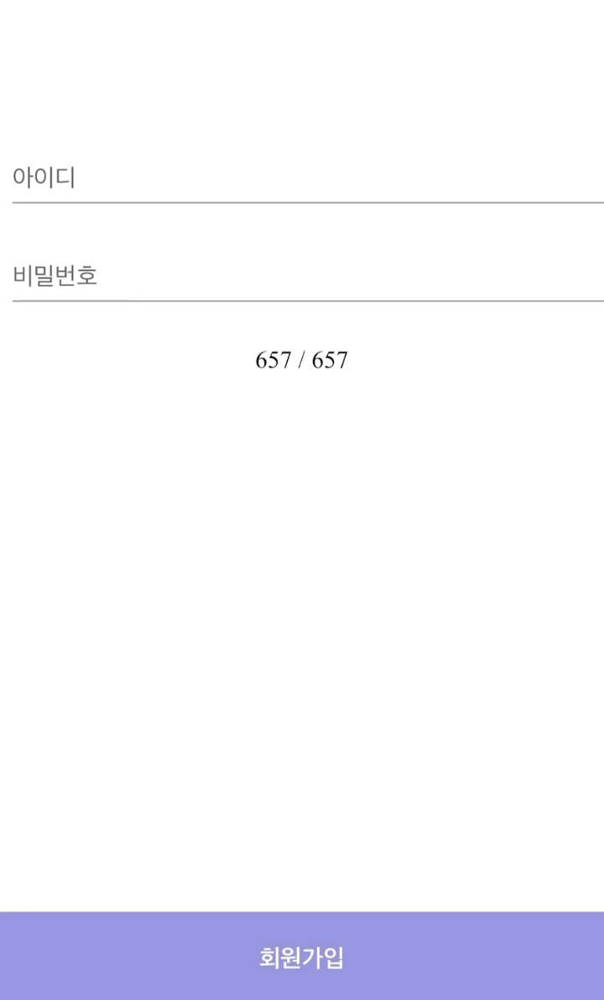
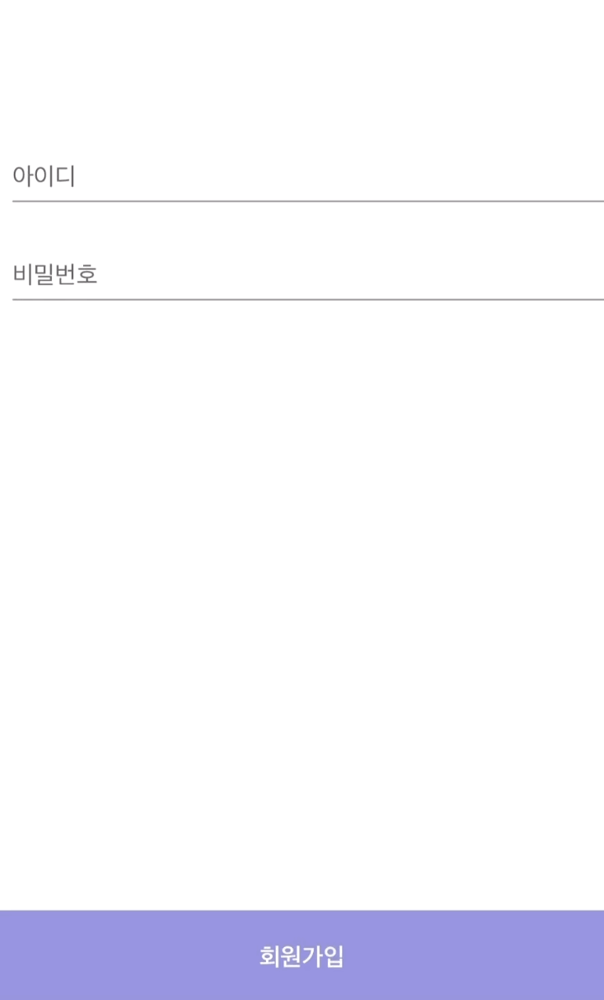

<div style="display: flex">





</div>

```js
// useGetResizeHeight.tsx
import { useEffect, useState } from "react"

const useGetResizeHeight = () => {
  const [height, setHeight] = useState < number > 0
  const [chagneHeight, setChangeHeight] = useState < number > 0

  const debounce = (callback: any, delay: number) => {
    let timerId: any
    return (event: any) => {
      if (timerId) clearTimeout(timerId)
      timerId = setTimeout(callback, delay, event)
    }
  }

  useEffect(() => {
    if (window.innerHeight) {
      setHeight(window.innerHeight)
      setChangeHeight(window.innerHeight)
    }
  }, [])

  useEffect(() => {
    if ("VisualViewport" in window) {
      const emitEvent = (name: any) => {
        window.dispatchEvent(
          new CustomEvent(name, {
            detail: {
              originalEvent: this,
            },
          })
        )
      }

      const handleResize = (event: any) => {
        const { height: visualViewportHeight } = event.target
        const eventName =
          Math.ceil(visualViewportHeight) < window.innerHeight
            ? "keyboardopen"
            : "keyboardclose"
        emitEvent.call(event, eventName)

        if (Math.ceil(visualViewportHeight) < window.innerHeight)
          setChangeHeight(visualViewportHeight)
        else setChangeHeight(window.innerHeight)
      }

      const debouncedHandleResize = debounce(handleResize, 20)

      visualViewport?.addEventListener("resize", debouncedHandleResize)
    }
  }, [])

  return { height, chagneHeight }
}

export default useGetResizeHeight
```

```js
const App = () => {
  const { height, chagneHeight } = useGetResizeHeight()

  return (
    <main>
      <Box>
        <TextField id="standard-basic" label="아이디" variant="standard" />
        <TextField id="standard-basic" label="비밀번호" variant="standard" />
      </Box>
      <button
        type="button"
        onClick={() => {}}
        style={{
          bottom: height !== chagneHeight ? height - chagneHeight : 0,
        }}
      >
        회원가입
      </button>
    </main>
  )
}
```
