맥을 사용하면 터미널로 쉽게 접속이 가능하지만 윈도우로는 터미널 만으로는 ec2 서버에 접속할 수 없다.  
(사실 맥을 주로 이용해서 윈도우는 안된다는 걸 몰랐었는데 집에있는 데스크탑으로 접속하려니 안되서 찾아보니 PuTTY를 이용하라 카더라..)

먼저 자신의 window 환경에 맞는 파일을 다운받는다. <a href="https://www.chiark.greenend.org.uk/~sgtatham/putty/latest.html" target="_blan">PuTTY 다운로드</a>

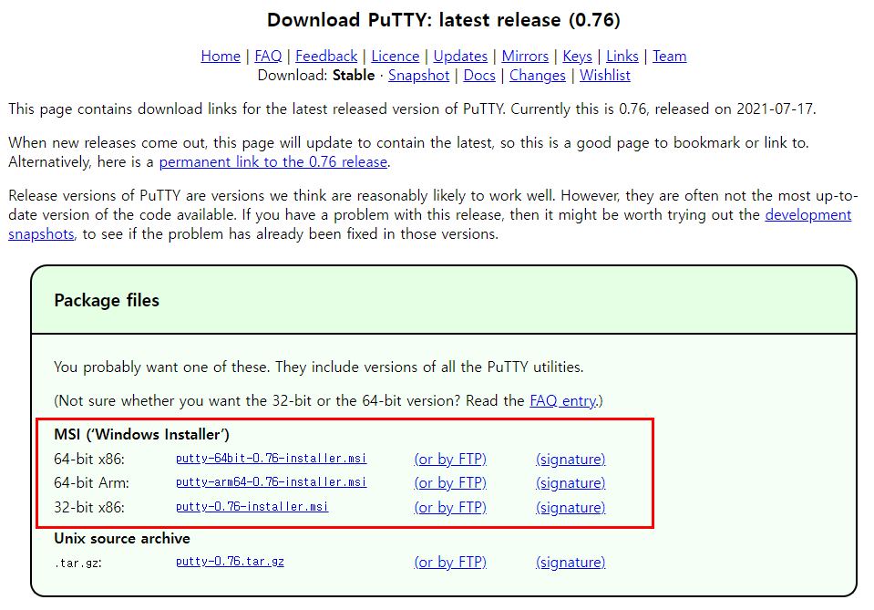

msi 파일을 설치하면 PuTTY.exe 와 PuTTYgen.exe 2개의 파일이 설치된다.

## PuTTYgen.exe 실행

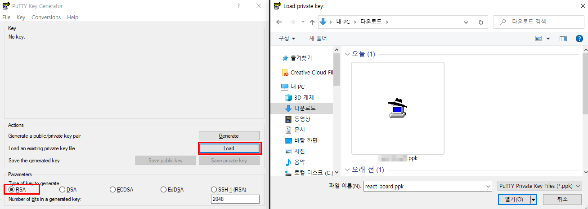

1. asw에서 인스턴스를 생성하면서 만들었던 pem 키를 Load한다.

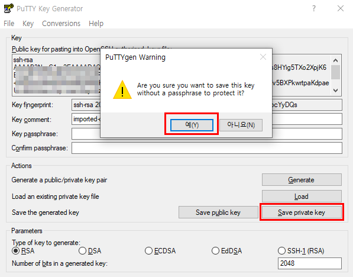

2. Save private key를 눌러 .ppk 파일을 생성한다.

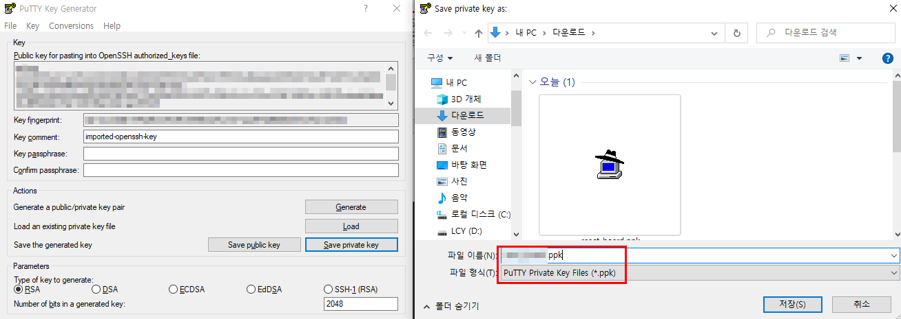

## PuTTY.exe 실행

1. 카테고리 Session에서 Host Name을 설정한다. Host Name은 aws ec2 인스턴스에 연결 페이지에서 확인할 수 있다.

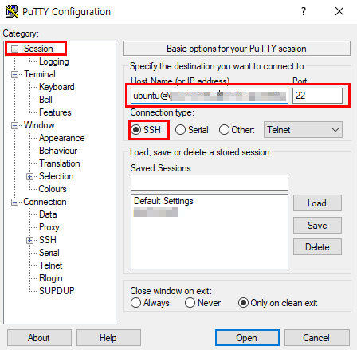
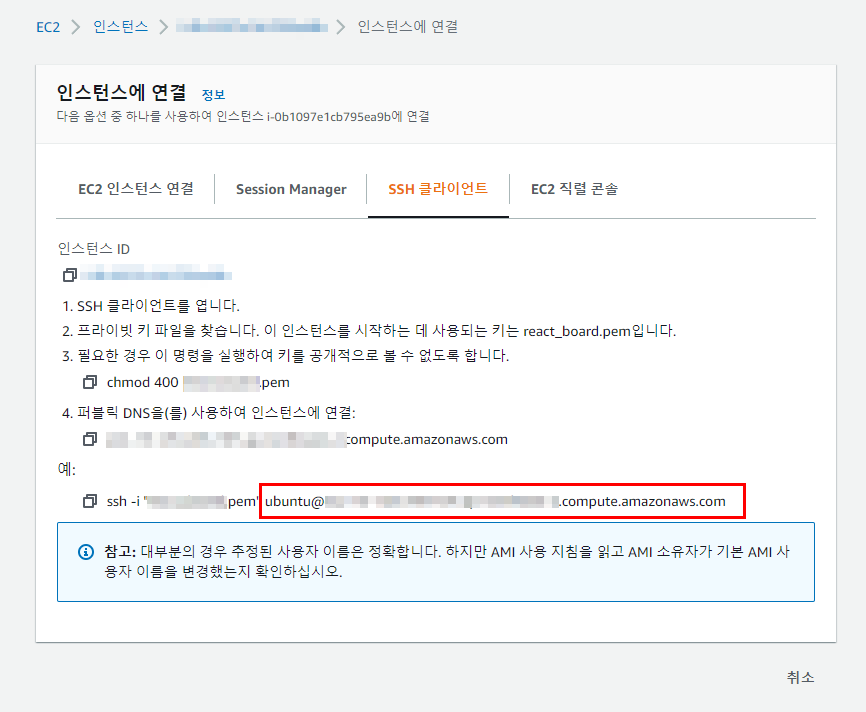

2. 카테고리 Connection → SSH → Auth를 선택하고 PuTTYgen으로 만들었더 ppk 파일을 추가한다.

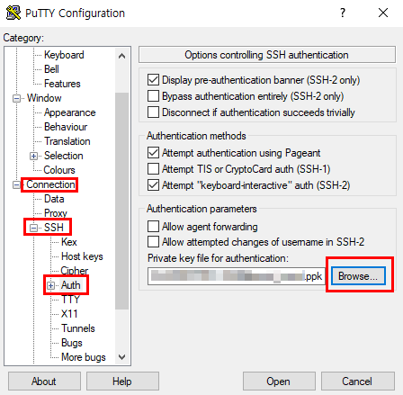

3. 다시 Sesstion으로 돌아온 후 Saved Sessions에 프로젝트 이름을 입력한 후 save한다.

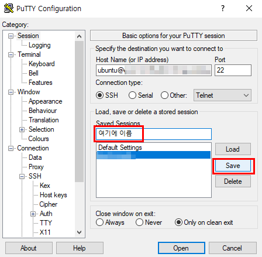

4. 프로젝트를 선택하고 Open을 선택한다.

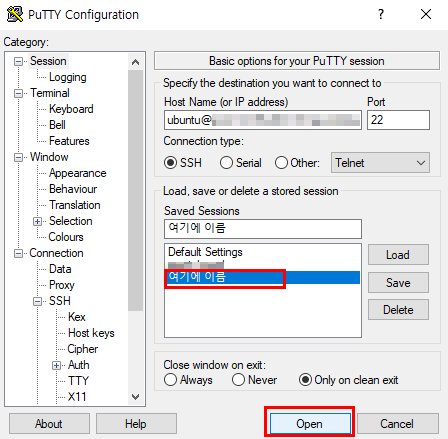

알림창이 나오면 Accept를 선택한다.

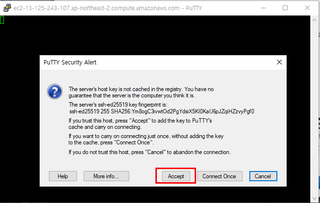

정상적으로 접속이 완료되었다.

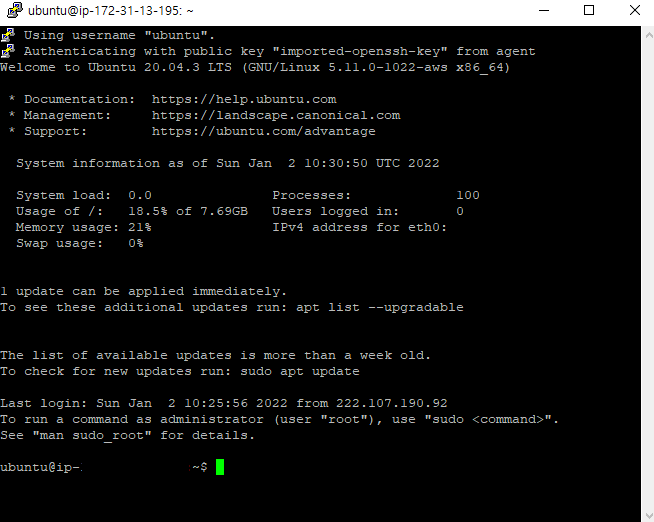

**PuTTY에서 붙여넣기** : `shft + insert` (crtl + s는 작동 x)  
간단한 설정만 거치면 쉽게 접속할 수 있다.
