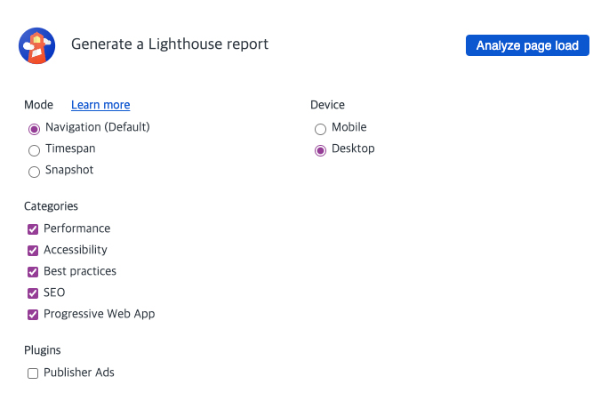
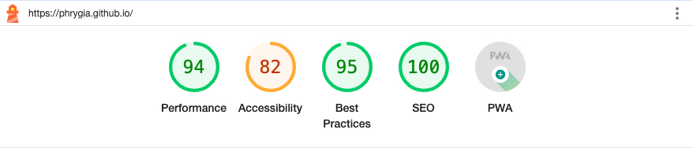
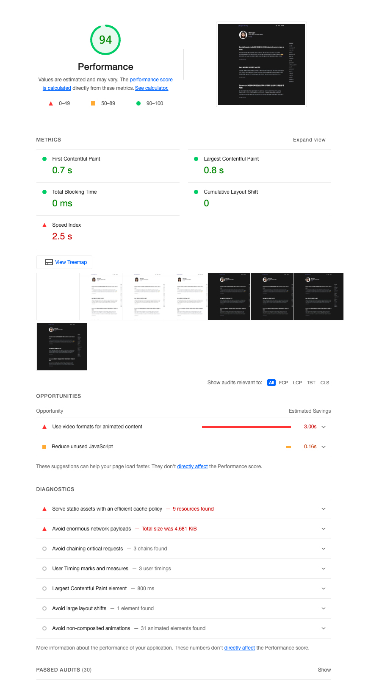
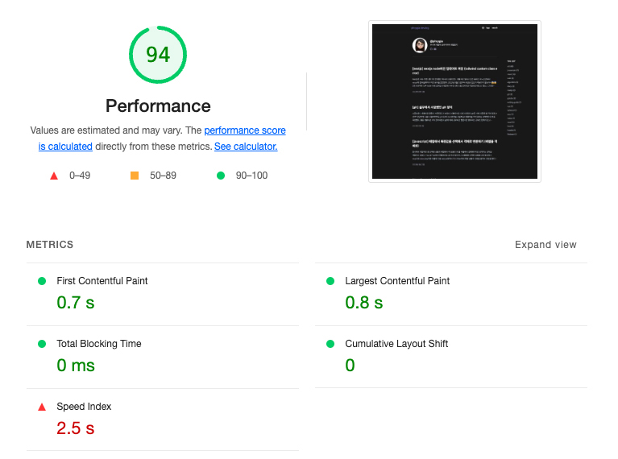
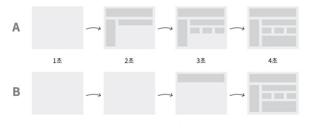
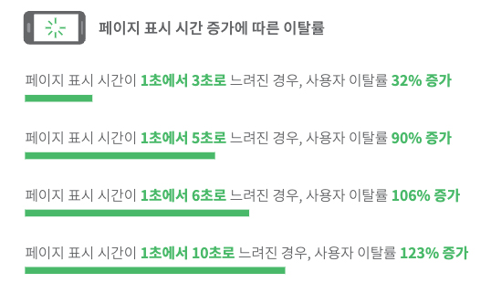
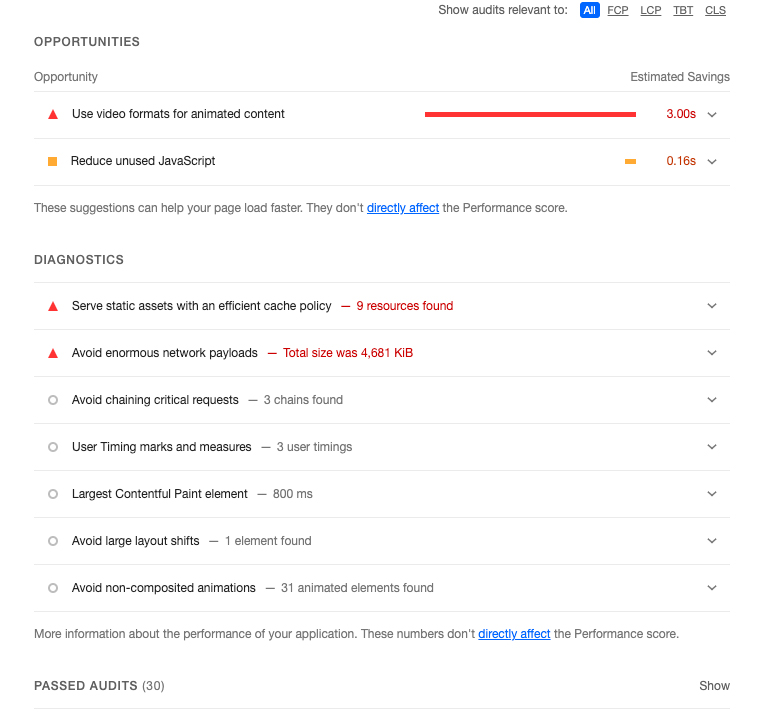

허겁지겁 코드를 작성하고 일정에 쫓겨 디자인을 따라하기에 급급해 성능따위 무시했던 신입 1년..  
최근 개발에 많이 익숙해지면서 성능 및 최적화에 흥미가 생겼습니다.  
그중 제일 쉽게 사용할 수 있는게 구글에서 개발한 크롬 웹사이트 성능 측정 도구인 Lighthouse입니다.  

Lighthouse는 크롬 개발자도구, <a href="https://chromewebstore.google.com/detail/lighthouse/blipmdconlkpinefehnmjammfjpmpbjk" target="_blank">크롬익스텐션</a>, <a href="https://www.npmjs.com/package/lighthouse" target="_blank">npm 라이브러리(node)</a>로 사용할 수 있습니다. 2020년 5월 19일 Lighthouse 개발자 도구에서 Lighthouse를 이용할 수 있게 되면서 별도의 설치없이 쉽게 사용할 수 있게되었기 때문에 여기서는 개발자 도구를 사용한 성능 분석을 해보겠습니다.

## Lighthouse

크롬 개발자 도구 (맥: command + option + i, 윈도우: F12)의 Lighthouse 탭의 모습입니다.

> <strong>Mode</strong>  <strong>· Navigation</strong> : 기본값. 초기 페이지 로딩 시 발생하는 성능 문제를 분석합니다.  <strong>· Timespan</strong> : 사용자가 정의한 시간 동안 발생한 성능 문제를 분석합니다.  <strong>· Snapshop</strong> : 현재 상태의 성능 문제를 분석합니다.  

> <strong>Categories</strong>  <strong>· Performance</strong> : 웹 페이지의 로딩 과정에서 발생하는 성능 문제를 분석합니다.  <strong>· Accessibility</strong> : 서비스의 사용자 접근성 문제를 분석합니다.  <strong>· Best paractices</strong> : 웹사이트의 보안 측면과 웹 개발의 최신 표준에 중점을 두고 분석합니다.  <strong>· SEO</strong> : 검색 엔진에서 얼마나 잘 크롤링되고 검색 결과에 표시되는지 분석합니다.   <strong>· Progressive Web App</strong> : 서비스 워커와 오프라인 동작 등, PWA와 관련된 문제를 분석합니다.  

> <strong>Plugins</strong>  <strong>· Publisher Ads</strong> : 광고 속도와 전반적인 품질을 개선해 주는 도구입니다. (광고 구현 최적화)  <strong>Device</strong>   <strong>· Mobile</strong> <strong>· Desktop</strong>

## Performance 분석하기

제 블로그 https://phrygia.github.io/를 Lighthouse의 기본 선택값+desktop으로 분석한 결과입니다. (\*저는 만들어진 테마를 사용하기 때문에 제가 코딩한건 아닙니다.)

숫자 94는 Lighthouse가 측정한 웹 페이지의 종합 성능 점수 입니다. 이 점수는 METRICS에 보이는 5가지 지표에 가중치를 적용해 평균 낸 점수입니다.

<table class="ph_tbl">
  <tr>
    <th>Audit (검사 항목)</th>
    <th>Weight (가중치)</th>
  </tr>
  <tr>
    <th>
    First Contentful Paint(FCP)
    </th>
    <td>
    10%
    </td>
  </tr>
   <tr>
    <th>
    Largest Contentful Paint(LCP)
    </th>
    <td>
    25%
    </td>
  </tr>
   <tr>
    <th>
    Total Blocking Time(TBT)
    </th>
    <td>
    30%
    </td>
  </tr>
   <tr>
    <th>
    Cumulative Layout Shift(CLS)
    </th>
    <td>
    25%
    </td>
  </tr>
   <tr>
    <th>
    Speed Index(SI)
    </th>
    <td>
    10%
    </td>
  </tr>
</table>

**1. First Contentful Paint(FCP)** : 페이지가 로드될 때 브라우저가 DOM 콘텐츠의 첫 번째 부분을 렌더링 하는데 걸리는 시간에 관한 지표입니다. 제 결과에서 페이지에 진입하여 첫 콘텐츠가 뜨기까지 0.7초가 걸렸습니다.

**2. Largest Contentful Paint(LCP)** : 페이지가 로드될 때 화면 내에 있는 가장 큰 이미지나 텍스트 요소가 렌더링되기까지 걸리는 시간을 나타내는 지표입니다. 제 결과에서 페이지에 진입하여 가장 큰 콘텐츠가 뜨기까지 0.8초가 걸렸습니다.

**3. Total Blocking Time(TBT)** : 페이지가 클릭, 키보드 입력 등의 사용자와 페이지가 상호작용한 경우 해당 요청을 처리하는 시간을 총합한 지표입니다. 응답이 길어지는 경우 (50ms이상) 사용자가 불쾌감을 느끼기 시작합니다.

**4. Cumulative Layout Shift(CLS)** : 페이지 로드 과정에서 발생하는 예기치 못한 레이아웃 이동을 측정한 지표입니다. \*레이아웃 이동 : 화면상에서 요소의 위치나 크기가 순간적으로 변하는 것

**5. Speed Index(SI)** : 페이지 로드중에 콘텐츠가 시각적으로 표시되는 속도를 나타내는 지표로 페이지가 얼마나 빠르게 화면에 채워지는지를 의미합니다.

A페이지와 B페이지를 각각 로드했을때 두 페이지 모두 렌더링까지 4초라는 동일한 시간이 걸렸습니다. A의 경우 일부 콘텐츠가 B페이지도가 먼저 떴으며 이런 경우 B 페이지보다 더 빨리 로드된 것으로 계산되며 더 높은 점수를 받습니다. (B는 4초동안 빈화면이 보일것이므로 사용자 이탈이 일어날 가능성도 큽니다)

실제로 1초에서 3초로 느려진 경우, 사용자 이탈률이 32%로 증가한다고하니 제 블로그 2.5s도 위험하군요.. 🥲 (많이 읽어주세요)

<!-- https://www.youtube.com/watch?v=aO-z9YmxOUk&t=1106s -->

### OPPORTUNITIES / DIAGNOSTICS

5가지 지표 아래쪽의 위치한 섹션으로 웹 페이지의 문제점과 해결 방안 및 이점이 무엇인지 보여줍니다.
**OPPORTUNITIES**: 페이지를 더욱 빨리 로드하는 데 잠재적으로 도움되는 제안들을 보여줍니다.  
**DIAGNOSTICS**: 성능과 관련된 기타 정보를 보여줍니다. (로드 속도와 직접적인 관계X)

해당 섹션의 해결방안을 따라하다보면 사이트의 성능이 좋아질 수 있습니다. (제가 다니는 회사 사이트 성능이 똥망이라 다음에 이걸 해결한 포스팅을 작성해 보면 좋겠네요. 매일 밀려있는 개발일정때문에 성능최적화 시도도 못하고 있는데 내년엔 꼭 개선하는걸 목표로 공부해 보겠습니다.)

<small class="from add">참고 : 프론트엔드 성능 최적화 가이드 (서적) <a href="https://blog.imqa.io/web-performance-index/" target="_blank">https://blog.imqa.io/web-performance-index/</a></small>
